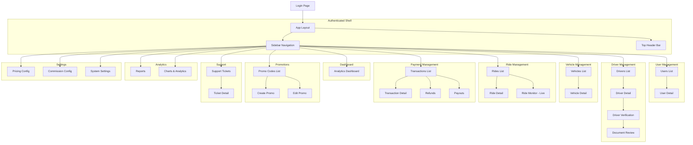
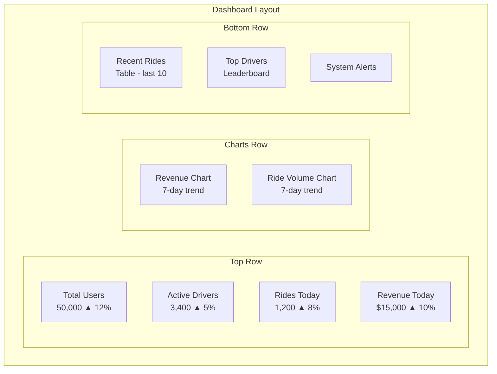

# Admin Dashboard

## 1. Technology Stack

- **Framework:** React 18 + TypeScript
- **UI Library:** Material UI (MUI) or Ant Design
- **State Management:** Redux Toolkit + RTK Query
- **Charts:** Recharts / ApexCharts
- **Table:** AG Grid / MUI Data Grid
- **Form:** React Hook Form + Zod
- **Routing:** React Router 6
- **Build:** Vite
- **Auth:** JWT (same as mobile)

## 2. Page Structure



## 3. Sidebar Navigation

```typescript
const navigationItems = [
  {
    section: 'Overview',
    items: [
      { label: 'Dashboard', icon: DashboardIcon, path: '/admin/dashboard' },
    ]
  },
  {
    section: 'Management',
    items: [
      { label: 'Users', icon: PeopleIcon, path: '/admin/users' },
      { label: 'Drivers', icon: DriveIcon, path: '/admin/drivers' },
      { label: 'Vehicles', icon: CarIcon, path: '/admin/vehicles' },
      { label: 'Rides', icon: RouteIcon, path: '/admin/rides' },
    ]
  },
  {
    section: 'Finance',
    items: [
      { label: 'Transactions', icon: PaymentIcon, path: '/admin/transactions' },
      { label: 'Refunds', icon: RefundIcon, path: '/admin/refunds' },
      { label: 'Payouts', icon: PayoutIcon, path: '/admin/payouts' },
    ]
  },
  {
    section: 'Operations',
    items: [
      { label: 'Support', icon: SupportIcon, path: '/admin/support' },
      { label: 'Promotions', icon: PromoIcon, path: '/admin/promotions' },
      { label: 'Fraud Monitor', icon: FraudIcon, path: '/admin/fraud' },
    ]
  },
  {
    section: 'Analytics',
    items: [
      { label: 'Reports', icon: ReportIcon, path: '/admin/reports' },
      { label: 'Charts', icon: ChartIcon, path: '/admin/analytics' },
    ]
  },
  {
    section: 'Settings',
    items: [
      { label: 'Pricing', icon: PriceIcon, path: '/admin/pricing' },
      { label: 'Commission', icon: PercentIcon, path: '/admin/commission' },
      { label: 'System', icon: SettingsIcon, path: '/admin/settings' },
    ]
  }
];
```

## 4. Dashboard Page

```typescript
// Key metrics displayed at top
interface DashboardMetrics {
  totalUsers: number;
  newUsersToday: number;
  activeUsersNow: number;
  totalDrivers: number;
  activeDriversNow: number;
  onlineDrivers: number;
  totalRides: number;
  ridesToday: number;
  ridesInProgress: number;
  totalRevenue: number;
  revenueToday: number;
  avgRating: number;
  avgDriverAcceptance: number;
  avgWaitTimeMinutes: number;
}

// Charts
interface DashboardCharts {
  revenueChart: ChartData;       // Daily revenue (7/30 days)
  ridesChart: ChartData;         // Ride volume trend
  userGrowthChart: ChartData;    // New users per day
  driverActivityChart: ChartData; // Active drivers over time
  surgeMap: GeoData;            // Real-time surge heatmap
  rideStatusPie: PieData;       // Current ride distribution
}
```

### Dashboard Layout



## 5. User Management

### Users List Page

```
+-----------------------------------------------------------------------+
| Users                                                                 |
+-----------------------------------------------------------------------+
| [Search by name, email, phone]  [Filter: Status]  [Export CSV]       |
+-----------------------------------------------------------------------+
|  Name         | Email           | Phone       | Rides | Status | Date |
|  John Doe     | john@test.com   | +1234567890 | 42    | Active | 03/15|
|  Jane Smith   | jane@test.com   | +1234567891 | 0     | Active | 06/01|
|  Bob Wilson   | bob@test.com    | +1234567892 | 5     | Suspended | 05/20|
+-----------------------------------------------------------------------+
| [< Prev] Page 1 of 25 [Next >]                                        |
+-----------------------------------------------------------------------+
```

### User Detail Page

```
+-----------------------------------------------------------------------+
| User Detail: John Doe                                    [Suspend]    |
+-----------------------------------------------------------------------+
| Profile                   | Activity                    | Stats       |
| Name: John Doe            | Last Ride: 2 hours ago      | Rides: 42   |
| Email: john@test.com      | Last Login: Today 09:30     | Spent: $345 |
| Phone: +1234567890        | Registered: Mar 15, 2025   | Rating: 4.8 |
| Status: Active            | Device: iPhone 15 iOS 18   | Wallet: $50 |
+-----------------------------------------------------------------------+
| Ride History (Last 5)                                                  |
+-----------------------------------------------------------------------+
| Date       | From → To            | Status    | Fare    | Rating     |
| 06/07/2026 | Times Square → ...   | Completed | $7.70   | ★★★★★      |
| 06/06/2026 | Central Park → ...   | Cancelled | $0.00   | -          |
+-----------------------------------------------------------------------+
```

## 6. Driver Verification

### Document Review Interface

```
+-----------------------------------------------------------------------+
| Driver Verification: Jane Driver                        [Approve]     |
|                                                          [Reject]     |
+-----------------------------------------------------------------------+
| Documents Required:                                                    |
|                                                                        |
| ☑ Identity Card (Front) - [View] [Zoom]          Status: APPROVED     |
| ☑ Identity Card (Back) - [View] [Zoom]           Status: APPROVED     |
| ☐ Driver License - [View] [Zoom]                 Status: PENDING      |
| ☑ Vehicle Registration - [View] [Zoom]           Status: APPROVED     |
| ☑ Insurance - [View] [Zoom]                      Status: APPROVED     |
| ☐ Selfie - [View] [Zoom]                         Status: PENDING      |
|                                                                        |
| +-------------------------------------------------------------------+  |
| | Notes:                                                             |  |
| | [___________________________________________________________]     |  |
| | [Submit Review]                                                    |  |
| +-------------------------------------------------------------------+  |
+-----------------------------------------------------------------------+
```

## 7. Ride Monitor (Live)

```typescript
interface LiveRide {
  rideId: string;
  passenger: { name: string; photo: string };
  driver: { name: string; photo: string };
  pickup: string;
  destination: string;
  status: 'searching' | 'accepted' | 'in_progress' | 'completed';
  liveLocation: { lat: number; lng: number };
  timeElapsed: string;
  fare: number;
}
```

Live map view with:
- Real-time ride markers
- Status color coding
- Click to view ride details
- Auto-refresh every 5 seconds

## 8. Permissions Matrix

| Page / Action | Admin | Support | Finance | Analytics |
|---|---|---|---|---|
| View Dashboard | ✅ | ❌ | ❌ | ✅ |
| View Users | ✅ | ✅ | ❌ | ❌ |
| Suspend/Ban Users | ✅ | ❌ | ❌ | ❌ |
| View Drivers | ✅ | ✅ | ❌ | ❌ |
| Verify Documents | ✅ | ✅ | ❌ | ❌ |
| View Rides | ✅ | ✅ | ❌ | ❌ |
| Cancel Rides | ✅ | ❌ | ❌ | ❌ |
| View Transactions | ✅ | ❌ | ✅ | ❌ |
| Process Refunds | ✅ | ❌ | ✅ | ❌ |
| Process Payouts | ✅ | ❌ | ✅ | ❌ |
| Manage Promos | ✅ | ❌ | ❌ | ❌ |
| Manage Pricing | ✅ | ❌ | ❌ | ❌ |
| View Support Tickets | ✅ | ✅ | ❌ | ❌ |
| Respond to Tickets | ✅ | ✅ | ❌ | ❌ |
| View Reports | ✅ | ❌ | ✅ | ✅ |
| Export Data | ✅ | ❌ | ✅ | ✅ |
| View Fraud Flags | ✅ | ❌ | ✅ | ❌ |
| System Settings | ✅ | ❌ | ❌ | ❌ |

## 9. Admin API Endpoints

| Method | URL | Description | Permission |
|---|---|---|---|
| GET | `/api/v1/admin/dashboard` | Dashboard KPIs | ADMIN, ANALYTICS |
| GET | `/api/v1/admin/users` | List all users | ADMIN, SUPPORT |
| GET | `/api/v1/admin/users/{id}` | User detail | ADMIN, SUPPORT |
| PUT | `/api/v1/admin/users/{id}/status` | Update user status | ADMIN |
| GET | `/api/v1/admin/drivers` | List all drivers | ADMIN, SUPPORT |
| GET | `/api/v1/admin/drivers/{id}` | Driver detail | ADMIN, SUPPORT |
| PUT | `/api/v1/admin/drivers/{id}/verify` | Verify driver documents | ADMIN, SUPPORT |
| PUT | `/api/v1/admin/drivers/{id}/status` | Update driver status | ADMIN |
| GET | `/api/v1/admin/rides` | List all rides | ADMIN, SUPPORT |
| GET | `/api/v1/admin/rides/{id}` | Ride detail | ADMIN |
| POST | `/api/v1/admin/rides/{id}/cancel` | Admin cancel ride | ADMIN |
| GET | `/api/v1/admin/transactions` | List transactions | ADMIN, FINANCE |
| POST | `/api/v1/admin/refunds` | Process refund | ADMIN, FINANCE |
| GET | `/api/v1/admin/payouts` | List payouts | ADMIN, FINANCE |
| POST | `/api/v1/admin/payouts/process` | Process pending payouts | ADMIN, FINANCE |
| GET | `/api/v1/admin/promotions` | List promo codes | ADMIN |
| POST | `/api/v1/admin/promotions` | Create promo code | ADMIN |
| PUT | `/api/v1/admin/promotions/{id}` | Update promo code | ADMIN |
| GET | `/api/v1/admin/support/tickets` | List support tickets | ADMIN, SUPPORT |
| GET | `/api/v1/admin/support/tickets/{id}` | Ticket detail | ADMIN, SUPPORT |
| POST | `/api/v1/admin/support/tickets/{id}/respond` | Respond to ticket | ADMIN, SUPPORT |
| GET | `/api/v1/admin/analytics/revenue` | Revenue analytics | ADMIN, ANALYTICS |
| GET | `/api/v1/admin/analytics/rides` | Ride analytics | ADMIN, ANALYTICS |
| GET | `/api/v1/admin/analytics/users` | User analytics | ADMIN, ANALYTICS |
| GET | `/api/v1/admin/analytics/drivers` | Driver analytics | ADMIN, ANALYTICS |
| GET | `/api/v1/admin/reports/{type}` | Generate report CSV | ADMIN, FINANCE, ANALYTICS |
| GET | `/api/v1/admin/fraud/flags` | List fraud flags | ADMIN, FINANCE |
| PUT | `/api/v1/admin/fraud/flags/{id}` | Resolve fraud flag | ADMIN |
| GET | `/api/v1/admin/pricing` | Get pricing config | ADMIN |
| PUT | `/api/v1/admin/pricing` | Update pricing config | ADMIN |
| GET | `/api/v1/admin/commission` | Get commission config | ADMIN |
| PUT | `/api/v1/admin/commission` | Update commission config | ADMIN |

## 10. Real-Time Features

| Feature | Implementation | Refresh |
|---|---|---|
| Dashboard KPIs | Server-Sent Events (SSE) from backend | Every 30s |
| Live Ride Monitor | WebSocket subscription | Real-time |
| System Alerts | WebSocket push | On event |
| Support Ticket Updates | Polling or WebSocket | Every 15s |
| Fraud Alerts | WebSocket push | On event |

## 11. Data Export

```typescript
interface ExportConfig {
  type: 'revenue' | 'rides' | 'users' | 'drivers';
  format: 'csv' | 'xlsx' | 'pdf';
  dateRange: { from: string; to: string };
  filters?: Record<string, string>;
}

// CSV export endpoint: GET /api/v1/admin/reports/revenue?from=2026-06-01&to=2026-06-07&format=csv
// Returns: Content-Type: text/csv with Content-Disposition: attachment
```
