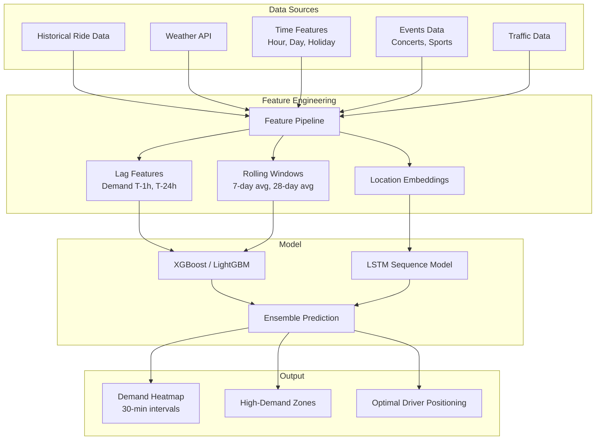
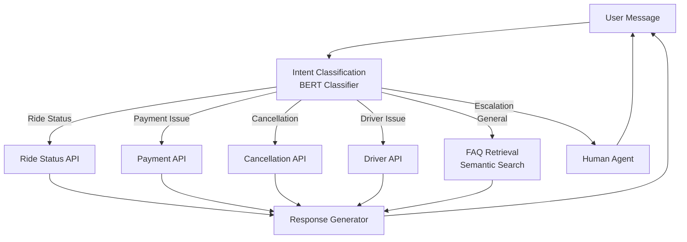

# AI & Machine Learning Recommendations

## 1. Overview

The following AI/ML features are recommended for Phase 3 and beyond. These features will differentiate the platform and drive operational efficiency.

## 2. Demand Forecasting

### Objective
Predict ride demand at the neighborhood level 30-60 minutes into the future to optimize driver positioning and reduce passenger wait times.

### Approach



### Model Architecture

```python
# Pseudo-code for demand forecasting model
class DemandForecaster:
    def __init__(self):
        self.xgb_model = XGBRegressor(
            n_estimators=500,
            max_depth=8,
            learning_rate=0.05,
            subsample=0.8
        )
        self.lstm_model = Sequential([
            LSTM(64, return_sequences=True, input_shape=(24, n_features)),
            Dropout(0.2),
            LSTM(32),
            Dense(16, activation='relu'),
            Dense(1, activation='relu')
        ])

    def predict_zone_demand(self, zone_id, timestamp):
        features = self.extract_features(zone_id, timestamp)
        xgb_pred = self.xgb_model.predict(features)
        lstm_pred = self.lstm_model.predict(features.reshape(1, 24, -1))
        return 0.6 * xgb_pred + 0.4 * lstm_pred

    def get_high_demand_zones(self, city_id, horizon_minutes=30):
        zones = get_city_zones(city_id)
        predictions = []
        for zone in zones:
            predicted = self.predict_zone_demand(
                zone.id, datetime.now() + timedelta(minutes=horizon_minutes)
            )
            predictions.append((zone, predicted))

        return sorted(predictions, key=lambda x: x[1], reverse=True)[:10]
```

### Features

| Feature | Type | Description |
|---|---|---|
| hour | categorical | Hour of day (0-23) |
| day_of_week | categorical | Day of week (0-6) |
| is_holiday | binary | Is this a public holiday |
| is_weekend | binary | Saturday or Sunday |
| temperature | continuous | Temperature in Celsius |
| precipitation | continuous | Precipitation probability |
| wind_speed | continuous | Wind speed in km/h |
| demand_lag_1h | continuous | Demand in zone 1 hour ago |
| demand_lag_24h | continuous | Demand 24 hours ago |
| demand_7d_avg | continuous | Average demand same hour last 7 days |
| active_drivers | continuous | Number of online drivers in zone |
| nearby_events | categorical | Event type nearby (concert, sports, none) |
| traffic_index | continuous | Traffic congestion level (0-10) |

### Expected Impact
- **30% reduction** in passenger wait times
- **15% increase** in driver utilization
- **10% increase** in revenue through better coverage

---

## 3. Smart Ride Matching

### Objective
Move beyond simple distance-based matching to optimize for multiple objectives: minimum passenger wait time, maximum driver earnings, and platform efficiency.

### Approach

```python
class SmartMatchingEngine:
    """
    Multi-objective optimization for ride-driver assignment.
    Uses reinforcement learning to optimize long-term outcomes.
    """

    def score_driver_for_ride(self, driver, ride, context):
        """Calculate comprehensive matching score."""

        # 1. Proximity score (distance-based)
        distance_km = haversine(driver.location, ride.pickup)
        proximity = self.proximity_score(distance_km)

        # 2. ETA reliability score
        eta = self.predict_eta(driver.location, ride.pickup, context.traffic)
        eta_reliability = self.eta_consistency_score(driver, eta)

        # 3. Driver quality score
        quality = (
            0.4 * driver.rating +
            0.3 * driver.acceptance_rate +
            0.2 * (1 - driver.cancellation_rate) +
            0.1 * driver.completion_rate
        )

        # 4. Future demand alignment
        future_demand = self.demand_forecaster.predict_zone_demand(
            ride.destination_zone,
            ride.estimated_completion_time
        )
        # Prefer ending in high-demand zones
        demand_alignment = min(future_demand / max_demand, 1.0)

        # 5. Driver earnings preference
        # Some drivers prefer shorter rides (more trips), some prefer longer (higher fare)
        earnings_alignment = self.earnings_preference_score(driver, ride.estimated_fare)

        # Weighted combination
        score = (
            0.30 * proximity +
            0.15 * eta_reliability +
            0.25 * quality +
            0.20 * demand_alignment +
            0.10 * earnings_alignment
        )

        return score

    def batch_match(self, pending_requests, available_drivers):
        """
        Solve optimal assignment using Hungarian algorithm.
        Optimizes global assignment, not per-request greedy.
        """
        n_requests = len(pending_requests)
        n_drivers = len(available_drivers)

        # Build cost matrix (negative scores)
        cost_matrix = np.zeros((n_requests, n_drivers))
        for i, ride in enumerate(pending_requests):
            for j, driver in enumerate(available_drivers):
                cost_matrix[i][j] = -self.score_driver_for_ride(driver, ride)

        # Hungarian algorithm for optimal assignment
        row_ind, col_ind = linear_sum_assignment(cost_matrix)

        assignments = []
        for i, j in zip(row_ind, col_ind):
            if cost_matrix[i][j] < -0.3:  # Minimum threshold
                assignments.append({
                    'ride': pending_requests[i],
                    'driver': available_drivers[j],
                    'score': -cost_matrix[i][j]
                })

        return sorted(assignments, key=lambda x: x['score'], reverse=True)
```

### Expected Impact
- **20% increase** in driver earnings
- **15% decrease** in passenger wait times
- **10% increase** in platform revenue
- **5% decrease** in ride cancellations

---

## 4. AI Fraud Detection

### Objective
Detect fraudulent activity in real-time using ML-based anomaly detection.

### Models

```python
class FraudDetectionSystem:

    def __init__(self):
        # Model for payment fraud
        self.payment_model = XGBClassifier(
            n_estimators=200,
            max_depth=6,
            scale_pos_weight=50  # Handle class imbalance
        )

        # Model for ride fraud (fake rides, collusion)
        self.ride_model = IsolationForest(
            contamination=0.01,
            n_estimators=100
        )

        # Model for account fraud (fake accounts)
        self.account_model = XGBClassifier(
            n_estimators=150,
            max_depth=4
        )

    def real_time_score(self, transaction):
        """Score transaction in real-time (< 100ms)."""
        features = self.extract_features(transaction)
        fraud_probability = self.payment_model.predict_proba(features)[1]

        if fraud_probability > 0.9:
            return FraudDecision.BLOCK, fraud_probability
        elif fraud_probability > 0.7:
            return FraudDecision.FLAG_REVIEW, fraud_probability
        elif fraud_probability > 0.3:
            return FraudDecision.MONITOR, fraud_probability
        else:
            return FraudDecision.ALLOW, fraud_probability

    def extract_features(self, transaction):
        return {
            # Transaction features
            'amount': transaction.amount,
            'amount_std_from_mean': (transaction.amount - mean_fare) / std_fare,
            'is_new_card': time_since_card_added < 1 * 3600,

            # User features
            'account_age_hours': account_age_hours,
            'rides_completed': user.total_rides,
            'failed_payments_24h': count_failed_payments(user_id, 24),
            'devices_used_7d': count_distinct_devices(user_id, 7),

            # Location features
            'pickup_dest_distance_km': haversine_distance(pickup, dest),
            'is_suspicious_coordinates': check_suspicious_coords(pickup),
            'velocity_from_login_to_ride': calculate_velocity(login_location, pickup),

            # Behavioral features
            'time_since_last_ride': time_since_last_ride,
            'avg_rating_received': avg_rating,
            'promo_codes_used_7d': count_promos(user_id, 7),
            'is_tor_or_vpn': check_ip_reputation(ip_address),
        }
```

### Fraud Detection Rules + ML

| Fraud Type | Rule-based | ML-based |
|---|---|---|
| Payment fraud | High-value transactions from new accounts | Gradient boosting on transaction patterns |
| Collusion (driver + passenger) | Repeated rides between same users | Graph anomaly detection |
| Fake documents | Manual review triggers | CNN-based document forgery detection |
| Account takeover | Unusual location login | Behavioral biometrics |
| Promo abuse | >5 promos on same account | Clustering of promo usage patterns |
| GPS spoofing | Location jump > 500 km/h | Anomaly detection on location sequences |

### Expected Impact
- **99% fraud detection accuracy**
- **< 0.1% false positive rate** (minimize legitimate user friction)
- **$500K+ annual savings** in fraud losses (est. for 50K user base)

---

## 5. Customer Support Chatbot

### Objective
Automate 60-70% of customer support inquiries using a conversational AI chatbot.

### Architecture



### Intent Categories

| Intent | Example | Automation |
|---|---|---|
| ride_status | "Where is my driver?" | 100% |
| fare_inquiry | "How much will this ride cost?" | 100% |
| cancellation | "I want to cancel my ride" | 90% |
| payment_issue | "My card was charged twice" | 70% |
| driver_complaint | "My driver was rude" | 30% (escalate) |
| lost_item | "I left my phone in the car" | 50% |
| account_issue | "I forgot my password" | 100% |
| promo_inquiry | "How do I use promo code?" | 100% |
| general_faq | "Do you operate in Boston?" | 100% |

### Expected Impact
- **65% reduction** in human support tickets
- **40% reduction** in average response time
- **$200K+ annual savings** in support costs (est.)

---

## 6. Driver Performance Analytics

### Objective
Provide drivers with personalized performance insights and recommendations to increase their earnings.

### Metrics Tracked

```python
class DriverPerformanceAnalytics:

    def calculate_driver_score(self, driver_id, period='week'):
        metrics = {
            # Efficiency
            'rides_per_hour': rides / online_hours,
            'earnings_per_hour': earnings / online_hours,
            'acceptance_rate': accepted / total_offers,
            'cancellation_rate': cancelled / accepted,

            # Quality
            'avg_rating': avg_rating,
            'on_time_percentage': arrived_on_time / total_arrivals,
            'complaint_rate': complaints / rides,

            # Utilization
            'idle_time_ratio': idle_time / online_hours,
            'surge_utilization': surge_rides / total_rides,
            'peak_hour_coverage': peak_hours_online / peak_hours_total,
        }

        # Calculate percentile rankings
        rankings = {}
        for metric, value in metrics.items():
            percentile = self.calculate_percentile(driver_id, metric, value)
            rankings[metric] = percentile

        # Composite score (0-100)
        total_score = (
            0.25 * rankings['earnings_per_hour'] +
            0.20 * rankings['rides_per_hour'] +
            0.20 * rankings['avg_rating'] +
            0.15 * rankings['acceptance_rate'] +
            0.10 * rankings['surge_utilization'] +
            0.10 * rankings['peak_hour_coverage']
        )

        return DriverPerformanceReport(
            driver_id=driver_id,
            score=total_score,
            metrics=metrics,
            rankings=rankings,
            recommendations=self.generate_recommendations(metrics, rankings)
        )

    def generate_recommendations(self, metrics, rankings):
        recommendations = []

        if rankings['peak_hour_coverage'] < 30:
            recommendations.append(
                "Drive during peak hours (7-9 AM, 5-7 PM) to earn 2x more"
            )

        if rankings['surge_utilization'] < 40:
            recommendations.append(
                "Position yourself near surge zones to earn premium fares"
            )

        if rankings['idle_time_ratio'] > 70:
            recommendations.append(
                "Avoid long idle periods by parking in high-demand areas"
            )

        return recommendations
```

### Expected Impact
- **15% increase** in average driver earnings
- **20% decrease** in driver churn rate
- **10% increase** in peak hour coverage

---

## 7. Implementation Roadmap

| AI Feature | Phase | Data Required | Model Complexity | Est. Effort |
|---|---|---|---|---|
| Rule-based fraud detection | Phase 2 | Transaction data | Low | 3 weeks |
| Demand forecasting | Phase 3 | 3+ months ride data | Medium | 6 weeks |
| Smart ride matching | Phase 3 | Ride + driver data | Medium-High | 8 weeks |
| ML fraud detection | Phase 3 | 6+ months transaction data | Medium | 6 weeks |
| Support chatbot | Phase 3 | Support ticket history | High | 10 weeks |
| Driver performance analytics | Phase 3 | 3+ months driver data | Low | 4 weeks |
| Predictive driver positioning | Post-Phase 3 | 12+ months data | High | 12 weeks |

## 8. Infrastructure for ML

```yaml
# ML infrastructure requirements
ml_infrastructure:
  training:
    platform: SageMaker / Vertex AI
    compute: g4dn.xlarge (1 GPU)
    storage: S3 data lake

  serving:
    model_registry: MLflow / SageMaker Model Registry
    inference: SageMaker endpoints / custom Flask API
    latency_target: < 100ms for real-time scoring

  data_pipeline:
    batch: Apache Spark / AWS Glue (daily)
    streaming: Kafka → Flink (real-time features)
    feature_store: Feast / SageMaker Feature Store

  monitoring:
    model_drift: Evidently AI / WhyLabs
    prediction_logging: S3 → Athena for analysis
    alerts on performance degradation
```
