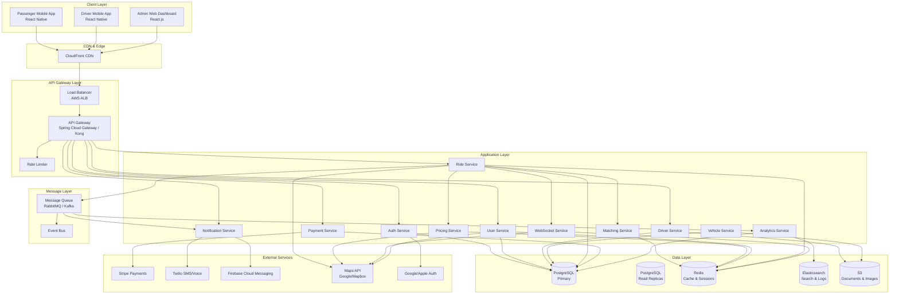
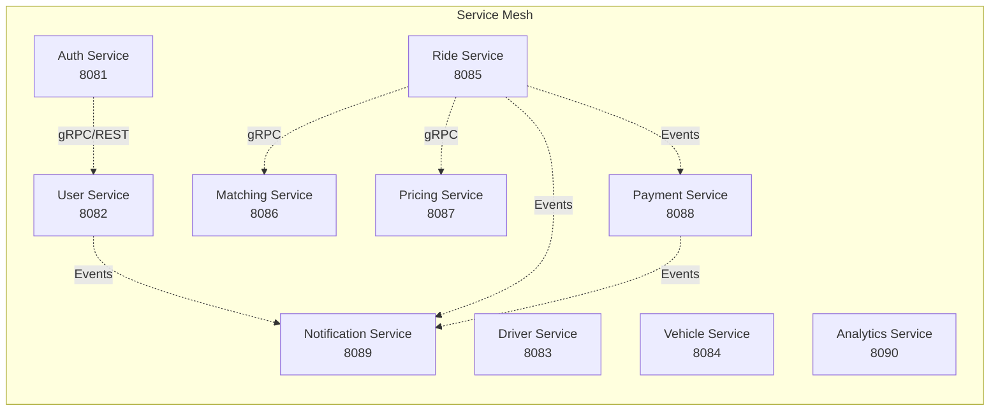
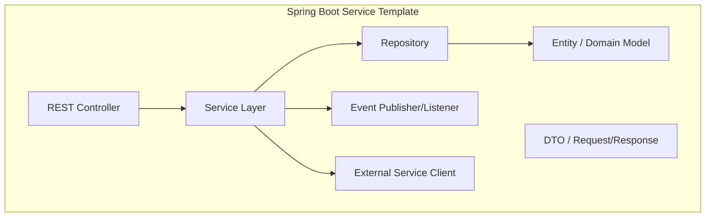
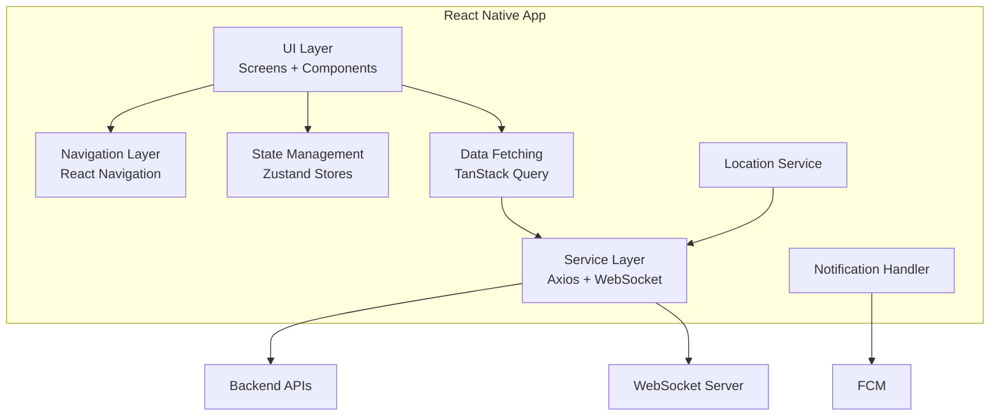
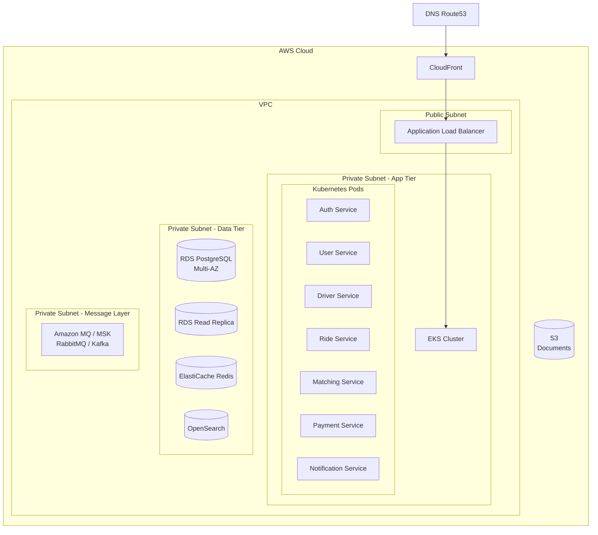
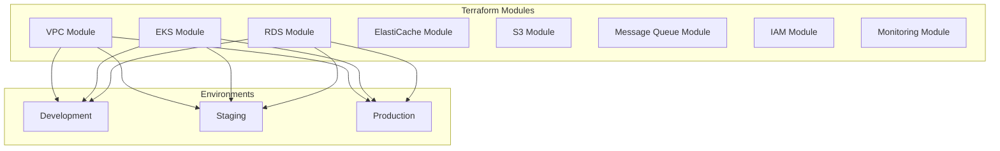
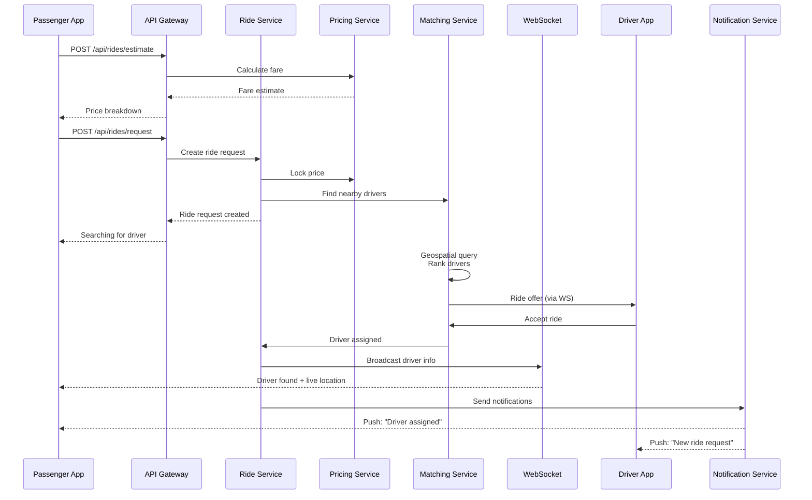

# System Architecture

## 1. High-Level Architecture Overview

## 2. Microservices Architecture

### Service Communication Patterns

| Pattern | Implementation |
|---|---|
| **Synchronous** | REST/gRPC for request-response (API Gateway → Services) |
| **Asynchronous** | Events via RabbitMQ/Kafka for cross-service communication |
| **Real-time** | WebSocket (STOMP over SockJS) for live location updates |
| **Service Discovery** | Kubernetes Services + Eureka/Consul |

## 3. Component Architecture

### 3.1 Backend Component Diagram

### 3.2 Mobile App Component Diagram

## 4. Deployment Architecture

## 5. Infrastructure Architecture (Terraform)

### Infrastructure Specifications

| Component | Specification |
|---|---|
| **Kubernetes** | EKS v1.28+, 3-10 nodes per AZ, c5.xlarge (dev), c5.2xlarge (prod) |
| **PostgreSQL** | RDS Multi-AZ, db.r6g.xlarge (prod), 500GB GP3, auto-scaling storage |
| **Redis** | ElastiCache for Redis, r6g.large (prod), cluster mode enabled |
| **Message Queue** | Amazon MSK (Kafka) or Amazon MQ (RabbitMQ) |
| **Object Storage** | S3 with lifecycle policies, 30-day to Glacier |
| **CDN** | CloudFront with WAF, regional edge caches |
| **Monitoring** | Prometheus operator on EKS, Grafana, CloudWatch |

## 6. Data Flow Architecture

### Ride Request Flow

## 7. Technology Stack Summary

| Layer | Technology |
|---|---|
| **Mobile Framework** | React Native 0.73+, TypeScript |
| **Mobile Navigation** | React Navigation 6 |
| **Mobile State** | Zustand + TanStack Query v5 |
| **Mobile Forms** | React Hook Form + Zod |
| **Mobile Localization** | i18next |
| **Backend Runtime** | Java 21, Spring Boot 3.2+ |
| **Backend Security** | Spring Security, JWT, OAuth2 |
| **Database** | PostgreSQL 16 |
| **Cache** | Redis 7 |
| **Message Queue** | Apache Kafka / RabbitMQ |
| **Search** | Elasticsearch / OpenSearch |
| **API Documentation** | Swagger / OpenAPI 3.0 |
| **Container** | Docker, Docker Compose |
| **Orchestration** | Kubernetes, Helm |
| **Cloud** | AWS (EKS, RDS, ElastiCache, MSK) |
| **CI/CD** | GitHub Actions / GitLab CI |
| **IaC** | Terraform / Pulumi |
| **Monitoring** | Prometheus, Grafana, ELK |
| **APM** | OpenTelemetry + Jaeger |
| **Maps** | Google Maps SDK / Mapbox |
| **Payments** | Stripe Connect |
| **Notifications** | Firebase Cloud Messaging, Twilio |
| **CDN** | AWS CloudFront |
