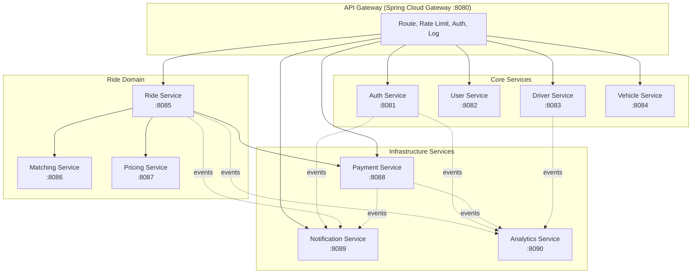
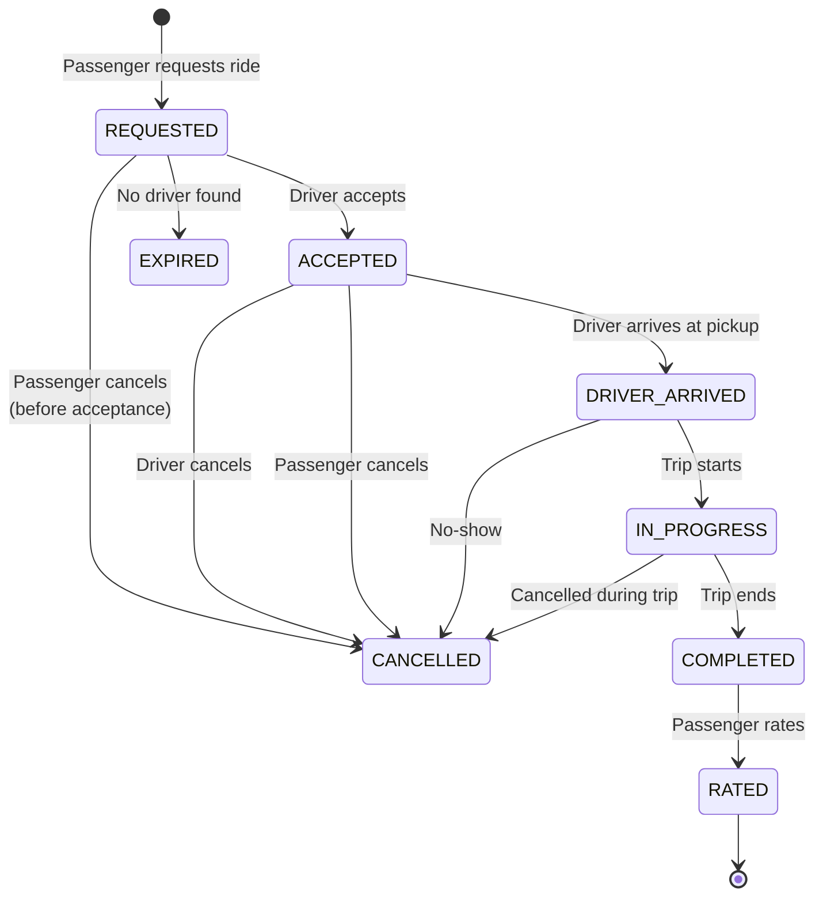

# Backend Architecture

## 1. Service Overview

The backend is composed of 10 microservices, each owning its domain data and communicating via REST/gRPC (synchronous) and events (asynchronous).



---

## 2. Service Details

### 2.1 Authentication Service

**Port:** 8081  
**Database:** `auth_db` (separate schema in shared PostgreSQL)  
**Tech:** Spring Security, JWT, OAuth2 Client

#### Responsibilities
- User registration (email, phone, social)
- Phone OTP generation and verification
- JWT access token + refresh token issuance
- Token refresh and revocation
- Password management (hash, reset, change)
- Social login (Google, Apple)
- Session management

#### API Endpoints

| Method | URL | Description |
|---|---|---|
| POST | `/api/v1/auth/register` | Register new user |
| POST | `/api/v1/auth/register/driver` | Register new driver |
| POST | `/api/v1/auth/login` | Login with email/phone + password |
| POST | `/api/v1/auth/login/social` | Social login (Google/Apple) |
| POST | `/api/v1/auth/otp/send` | Send OTP to phone |
| POST | `/api/v1/auth/otp/verify` | Verify OTP code |
| POST | `/api/v1/auth/refresh` | Refresh access token |
| POST | `/api/v1/auth/logout` | Invalidate refresh token |
| POST | `/api/v1/auth/password/reset` | Request password reset |
| POST | `/api/v1/auth/password/change` | Change password |

#### Database Ownership
- `users` (id, email, phone, password_hash, auth_provider, social_id, status, created_at, updated_at)
- `refresh_tokens` (id, user_id, token_hash, expires_at, revoked, created_at)
- `otp_codes` (id, phone, code, purpose, expires_at, verified, created_at)
- `password_reset_tokens` (id, user_id, token_hash, expires_at, used, created_at)
- `user_sessions` (id, user_id, device_id, fcm_token, last_active_at, created_at)

#### Events Published
- `UserRegistered` → Notification Service (welcome email)
- `UserLoggedIn` → Analytics Service
- `UserLoggedOut` → Analytics Service

#### Events Consumed
- None (Auth Service is an edge service)

---

### 2.2 User Service

**Port:** 8082  
**Database:** `user_db`

#### Responsibilities
- User profile CRUD
- User preferences
- Favorite locations
- Payment methods reference
- User status management (active, suspended, banned)

#### API Endpoints

| Method | URL | Description |
|---|---|---|
| GET | `/api/v1/users/me` | Get current user profile |
| PUT | `/api/v1/users/me` | Update profile |
| PUT | `/api/v1/users/me/photo` | Upload profile photo |
| POST | `/api/v1/users/me/favorites` | Add favorite location |
| GET | `/api/v1/users/me/favorites` | List favorite locations |
| DELETE | `/api/v1/users/me/favorites/{id}` | Delete favorite location |
| PUT | `/api/v1/users/me/settings` | Update app settings |
| DELETE | `/api/v1/users/me` | Delete account (GDPR) |
| POST | `/api/v1/users/me/rate-limits` | Check rate limit status |

#### Database Ownership
- `user_profiles` (id, user_id, full_name, photo_url, email, phone, language, created_at, updated_at)
- `user_preferences` (id, user_id, key, value)
- `user_settings` (id, user_id, notifications_enabled, email_notifications, sms_notifications, created_at, updated_at)
- `favorite_locations` (id, user_id, name, address, latitude, longitude, place_id, created_at)
- `user_devices` (id, user_id, device_id, platform, fcm_token, app_version, last_login_at)

#### Events Published
- `UserProfileUpdated` → Notification Service
- `UserDeleted` → All services (GDPR)

#### Events Consumed
- `UserRegistered` (from Auth Service) → Create user profile

---

### 2.3 Driver Service

**Port:** 8083  
**Database:** `driver_db`

#### Responsibilities
- Driver registration and onboarding
- Document upload and verification tracking
- Driver availability management (online/offline)
- Driver status (pending, approved, suspended, rejected)
- Driver location management
- Driver earnings calculation

#### API Endpoints

| Method | URL | Description |
|---|---|---|
| GET | `/api/v1/drivers/me` | Get driver profile |
| PUT | `/api/v1/drivers/me` | Update driver profile |
| POST | `/api/v1/drivers/me/documents` | Upload document |
| GET | `/api/v1/drivers/me/documents` | List documents with status |
| PUT | `/api/v1/drivers/me/location` | Update driver location |
| POST | `/api/v1/drivers/me/status` | Toggle online/offline |
| GET | `/api/v1/drivers/me/status` | Get current status |
| GET | `/api/v1/drivers/me/earnings` | Get earnings summary |
| GET | `/api/v1/drivers/me/earnings/history` | Earnings breakdown |
| POST | `/api/v1/drivers/me/payout` | Request payout |
| GET | `/api/v1/drivers/me/payouts` | Payout history |
| GET | `/api/v1/drivers/nearby` | Find nearby drivers (internal) |
| POST | `/api/v1/drivers/me/shift` | Start/end shift |

#### Database Ownership
- `drivers` (id, user_id, status, current_latitude, current_longitude, last_location_update, is_online, is_active, shift_start, shift_end, total_earnings, total_rides, rating, created_at, updated_at)
- `driver_documents` (id, driver_id, document_type, file_url, status, rejection_reason, uploaded_at, verified_at)
- `driver_verification` (id, driver_id, identity_verified, license_verified, vehicle_verified, background_check_passed, verified_at, expires_at)
- `driver_shifts` (id, driver_id, start_time, end_time, earnings, rides_completed, status)
- `driver_earnings` (id, driver_id, ride_id, amount, commission, net_amount, date)

#### Events Published
- `DriverStatusChanged` → Matching Service, Ride Service
- `DriverDocumentUploaded` → Notification Service
- `DriverLocationUpdated` → Matching Service (via Redis)
- `DriverEarningsUpdated` → Analytics Service

#### Events Consumed
- `RideCompleted` (from Ride Service) → Update earnings, rating
- `RideAccepted` → Update driver status to busy

---

### 2.4 Vehicle Service

**Port:** 8084  
**Database:** `vehicle_db`

#### Responsibilities
- Vehicle registration and management
- Vehicle document verification
- Vehicle types and ride categories
- Vehicle status tracking

#### API Endpoints

| Method | URL | Description |
|---|---|---|
| POST | `/api/v1/vehicles` | Register vehicle |
| GET | `/api/v1/vehicles/mine` | List my vehicles |
| GET | `/api/v1/vehicles/{id}` | Get vehicle details |
| PUT | `/api/v1/vehicles/{id}` | Update vehicle |
| POST | `/api/v1/vehicles/{id}/documents` | Upload vehicle docs |
| DELETE | `/api/v1/vehicles/{id}` | Remove vehicle |
| GET | `/api/v1/vehicle-types` | List vehicle types |
| GET | `/api/v1/vehicle-types/{type}/pricing` | Get pricing config |

#### Database Ownership
- `vehicles` (id, driver_id, make, model, year, color, license_plate, vehicle_type_id, status, created_at, updated_at)
- `vehicle_documents` (id, vehicle_id, document_type, file_url, status, uploaded_at, verified_at)
- `vehicle_types` (id, name, icon, max_passengers, description, sort_order)
- `vehicle_type_pricing` (id, vehicle_type_id, base_fare, per_km_rate, per_minute_rate, minimum_fare, cancellation_fee, currency)

#### Events Published
- `VehicleAdded` → Driver Service
- `VehicleVerified` → Driver Service

#### Events Consumed
- `DriverApproved` → Check vehicle registration status

---

### 2.5 Ride Service

**Port:** 8085  
**Database:** `ride_db`  
**Message Queue:** RabbitMQ/Kafka

#### Responsibilities
- Ride request lifecycle management
- Ride state machine (REQUESTED → ACCEPTED → ARRIVED → IN_PROGRESS → COMPLETED / CANCELLED)
- Ride scheduling
- Fare locking
- Receipt generation
- Ride history

#### Ride State Machine



#### API Endpoints

| Method | URL | Description |
|---|---|---|
| POST | `/api/v1/rides/estimate` | Get fare estimate |
| POST | `/api/v1/rides/request` | Request a ride |
| GET | `/api/v1/rides/{id}` | Get ride details |
| GET | `/api/v1/rides/current` | Get current active ride |
| POST | `/api/v1/rides/{id}/cancel` | Cancel ride |
| POST | `/api/v1/rides/{id}/status` | Update ride status (driver) |
| GET | `/api/v1/rides/history` | Get ride history (paginated) |
| POST | `/api/v1/rides/{id}/rate` | Rate driver |
| POST | `/api/v1/rides/{id}/tip` | Add tip |
| POST | `/api/v1/rides/{id}/receipt` | Get receipt |
| POST | `/api/v1/rides/schedule` | Schedule future ride |
| GET | `/api/v1/rides/scheduled` | List scheduled rides |

#### Database Ownership
- `rides` (id, passenger_id, driver_id, vehicle_id, ride_type, status, pickup_latitude, pickup_longitude, pickup_address, dest_latitude, dest_longitude, dest_address, estimated_distance, estimated_duration, actual_distance, actual_duration, base_fare, distance_charge, time_charge, surge_multiplier, promo_discount, total_fare, currency, payment_method, payment_status, scheduled_at, requested_at, accepted_at, arrived_at, started_at, completed_at, cancelled_at, cancellation_reason, created_at, updated_at)
- `ride_status_history` (id, ride_id, from_status, to_status, changed_by, reason, created_at)
- `ride_cancellation_reasons` (id, ride_id, cancelled_by, reason_code, reason_text, created_at)
- `scheduled_rides` (id, passenger_id, pickup, destination, scheduled_time, ride_type, status, created_at)

#### Events Published
- `RideRequested` → Matching Service, Notification Service, Analytics Service
- `RideAccepted` → Notification Service, Analytics Service
- `RideStarted` → Notification Service, Analytics Service
- `RideCompleted` → Payment Service, Notification Service, Analytics Service, Driver Service
- `RideCancelled` → Matching Service, Notification Service, Payment Service (refund)

#### Events Consumed
- `DriverLocationUpdated` → Broadcast to passenger via WebSocket
- `PaymentProcessed` → Update ride payment status

---

### 2.6 Matching Service

**Port:** 8086  
**Database:** `matching_db` (mostly Redis + in-memory)

#### Responsibilities
- Find nearby available drivers (geospatial query)
- Driver ranking and scoring
- Ride assignment logic
- Driver acceptance timeout handling
- Fallback driver search with expanding radius
- Geofence-based dispatch

#### API Endpoints

| Method | URL | Description |
|---|---|---|
| POST | `/api/v1/matching/find` | Find nearby drivers (internal) |
| POST | `/api/v1/matching/assign` | Assign ride to driver |
| GET | `/api/v1/matching/drivers/{id}/status` | Get driver matching status |
| POST | `/api/v1/matching/drivers/{id}/accept` | Driver accepts ride |
| POST | `/api/v1/matching/drivers/{id}/reject` | Driver rejects ride |

#### Database Ownership
- Redis: `driver:location:{driverId}` → Geospatial index
- Redis: `driver:status:{driverId}` → Online/Offline/Busy
- Redis: `ride:requests:{rideId}` → Active ride requests
- Redis: `driver:active_requests:{driverId}` → Pending ride offers

#### Events Published
- `DriverMatched` → Ride Service (driver assigned)
- `RideOfferSent` → Notification Service (to driver)
- `DriverAcceptTimeout` → Matching Service (re-queue request)

#### Events Consumed
- `RideRequested` (from Ride Service) → Start matching
- `DriverStatusChanged` (from Driver Service) → Update availability in Redis
- `DriverLocationUpdated` (from Driver Service) → Update geospatial index

---

### 2.7 Pricing Service

**Port:** 8087  
**Database:** `pricing_db` + Redis cache

#### Responsibilities
- Base fare calculation
- Distance-based pricing (per km/mile)
- Time-based pricing (per minute)
- Surge pricing algorithm
- Promo code validation and application
- Dynamic pricing adjustments

#### API Endpoints

| Method | URL | Description |
|---|---|---|
| POST | `/api/v1/pricing/estimate` | Calculate fare estimate |
| GET | `/api/v1/pricing/surge` | Get current surge areas |
| POST | `/api/v1/pricing/lock` | Lock fare for ride |
| POST | `/api/v1/pricing/promo/validate` | Validate promo code |
| GET | `/api/v1/pricing/promo/available` | Get available promos |
| GET | `/api/v1/pricing/config` | Get pricing config (admin) |
| PUT | `/api/v1/pricing/config` | Update pricing config (admin) |

#### Database Ownership
- `pricing_config` (id, vehicle_type_id, base_fare, per_km_rate, per_minute_rate, minimum_fare, cancellation_fee, currency, valid_from, valid_to)
- `surge_zones` (id, name, polygon_geojson, multiplier, start_time, end_time, is_active)
- `surge_history` (id, zone_id, multiplier, demand_level, supply_level, timestamp)
- `promo_codes` (id, code, discount_type, discount_value, max_discount, min_ride_value, max_uses, max_uses_per_user, valid_from, valid_to, is_active, created_at)
- `promo_usages` (id, promo_id, user_id, ride_id, discount_amount, used_at)

#### Events Published
- `FareLocked` → Ride Service
- `PromoApplied` → Analytics Service

#### Events Consumed
- `RideCompleted` → Release promo lock

---

### 2.8 Payment Service

**Port:** 8088  
**Database:** `payment_db`

#### Responsibilities
- Payment method tokenization (via Stripe)
- Payment capture and processing
- Wallet management (top-up, balance, transactions)
- Refund processing
- Driver payout management
- Invoice/receipt generation
- Payment reconciliation

#### API Endpoints

| Method | URL | Description |
|---|---|---|
| POST | `/api/v1/payments/methods` | Add payment method |
| GET | `/api/v1/payments/methods` | List payment methods |
| DELETE | `/api/v1/payments/methods/{id}` | Remove payment method |
| POST | `/api/v1/payments/charge` | Charge for ride |
| POST | `/api/v1/payments/refund` | Process refund |
| GET | `/api/v1/payments/history` | Transaction history |
| GET | `/api/v1/payments/wallet` | Get wallet balance |
| POST | `/api/v1/payments/wallet/topup` | Top up wallet |
| POST | `/api/v1/payments/wallet/withdraw` | Withdraw from wallet |
| GET | `/api/v1/payments/wallet/transactions` | Wallet transactions |
| POST | `/api/v1/payments/payout` | Process driver payout |
| GET | `/api/v1/payments/payouts` | Payout history |
| POST | `/api/v1/payments/webhook/stripe` | Stripe webhook handler |

#### Database Ownership
- `payment_methods` (id, user_id, stripe_payment_method_id, card_last4, card_brand, card_exp_month, card_exp_year, is_default, created_at)
- `transactions` (id, user_id, ride_id, type, amount, currency, status, stripe_payment_intent_id, gateway_response, created_at, updated_at)
- `wallets` (id, user_id, balance, currency, created_at, updated_at)
- `wallet_transactions` (id, wallet_id, transaction_type, amount, reference_type, reference_id, description, created_at)
- `payouts` (id, driver_id, amount, currency, status, stripe_transfer_id, period_start, period_end, paid_at, created_at)
- `refunds` (id, transaction_id, ride_id, amount, reason, status, stripe_refund_id, created_at)

#### Events Published
- `PaymentProcessed` → Ride Service, Notification Service, Analytics Service
- `PaymentFailed` → Ride Service, Notification Service
- `RefundProcessed` → Notification Service
- `PayoutCompleted` → Notification Service, Driver Service

#### Events Consumed
- `RideCompleted` (from Ride Service) → Process payment capture
- `RideCancelled` (from Ride Service) → Process refund if partial

---

### 2.9 Notification Service

**Port:** 8089  
**External:** Firebase Cloud Messaging, Twilio, SendGrid/Amazon SES

#### Responsibilities
- Push notification delivery (FCM)
- SMS notification delivery (Twilio)
- Email notification delivery (SendGrid)
- Notification template management
- Notification preferences
- Notification history

#### API Endpoints

| Method | URL | Description |
|---|---|---|
| POST | `/api/v1/notifications/register` | Register device for push |
| PUT | `/api/v1/notifications/preferences` | Update notification prefs |
| GET | `/api/v1/notifications` | Get notification history |
| PUT | `/api/v1/notifications/{id}/read` | Mark as read |
| PUT | `/api/v1/notifications/read-all` | Mark all as read |
| POST | `/api/v1/notifications/send` | Send notification (admin) |

#### Database Ownership
- `notification_templates` (id, name, type, subject, body, push_title, push_body, sms_text, variables, created_at, updated_at)
- `notifications` (id, user_id, type, title, body, data, channel, status, read, created_at)
- `device_registrations` (id, user_id, device_id, platform, fcm_token, active, created_at, updated_at)
- `notification_preferences` (id, user_id, channel, event_type, enabled)

#### Notification Events & Templates

| Event | Push Title | Push Body | SMS | Email |
|---|---|---|---|---|
| DriverAccepted | "Driver on the way!" | "{driver_name} is heading to your pickup" | No | No |
| DriverArrived | "Driver has arrived" | "Your driver is at the pickup location" | No | No |
| RideStarted | "Trip started" | "Your trip to {destination} has started" | No | No |
| RideCompleted | "Trip complete!" | "Rate your trip to {destination}" | Yes (receipt link) | Yes (receipt) |
| RideCancelled | "Ride cancelled" | "Your ride has been cancelled" | No | No |
| NewRideRequest | "New ride request" | "{pickup} → {destination}" | Yes | No |
| PaymentReceived | "Payment received" | "{amount} credited to wallet" | No | No |
| PayoutProcessed | "Payout processed" | "{amount} sent to your bank account" | No | No |
| DocumentApproved | "Document approved" | "Your {doc_type} has been approved" | No | No |
| DocumentRejected | "Document rejected" | "Your {doc_type} was rejected: {reason}" | Yes | No |
| WelcomeEmail | - | - | No | Yes |

#### Events Published
- `NotificationSent` → Analytics Service
- `NotificationFailed` → Alerting (monitoring)

#### Events Consumed
- All events from Auth, Ride, Payment, Driver Services

---

### 2.10 Analytics Service

**Port:** 8090  
**Database:** Elasticsearch / OpenSearch + PostgreSQL

#### Responsibilities
- Event ingestion and aggregation
- Business metrics calculation
- Report generation
- Data export (CSV)
- Real-time dashboard data

#### API Endpoints

| Method | URL | Description |
|---|---|---|
| GET | `/api/v1/analytics/dashboard` | Get dashboard KPIs |
| GET | `/api/v1/analytics/revenue` | Revenue analytics |
| GET | `/api/v1/analytics/rides` | Ride analytics |
| GET | `/api/v1/analytics/users` | User analytics |
| GET | `/api/v1/analytics/drivers` | Driver analytics |
| GET | `/api/v1/analytics/reports/{type}` | Generate report (CSV) |
| POST | `/api/v1/analytics/events` | Ingest event (internal) |
| GET | `/api/v1/analytics/fraud/flags` | Fraud flags (admin) |
| PUT | `/api/v1/analytics/fraud/flags/{id}` | Resolve fraud flag |

#### Database Ownership
- `analytics_events` (id, event_type, user_id, ride_id, metadata, timestamp)
- `daily_metrics` (id, date, metric_name, metric_value, dimension)
- `fraud_flags` (id, user_id, ride_id, flag_type, severity, description, status, resolved_by, created_at, resolved_at)
- `report_definitions` (id, name, type, query_config, schedule, created_at)

#### Events Published
- `FraudAlertGenerated` → Notification Service (admin alert)

#### Events Consumed
- All events from all services

---

## 3. Cross-Cutting Concerns

### 3.1 API Gateway Configuration

```yaml
spring:
  cloud:
    gateway:
      routes:
        - id: auth-service
          uri: lb://auth-service
          predicates:
            - Path=/api/v1/auth/**
          filters:
            - StripPrefix=1
            - name: RequestRateLimiter
              args:
                redis-rate-limiter.replenishRate: 100
                redis-rate-limiter.burstCapacity: 200

        - id: user-service
          uri: lb://user-service
          predicates:
            - Path=/api/v1/users/**
          filters:
            - StripPrefix=1
            - name: JwtAuthentication

        - id: ride-service
          uri: lb://ride-service
          predicates:
            - Path=/api/v1/rides/**
          filters:
            - StripPrefix=1
            - name: JwtAuthentication
```

### 3.2 Common Module

Each service shares a common library (`commons` module):

```
commons/
├── dto/          # Shared DTOs
├── exception/    # Global exception handler
├── security/     # JWT validation filter
├── config/       # Common configuration
├── event/        # Event definitions and publisher
├── util/         # Utility classes
└── client/       # Feign clients for inter-service calls
```

### 3.3 Inter-Service Communication

```java
// Synchronous: OpenFeign
@FeignClient(name = "pricing-service", path = "/api/v1/pricing")
public interface PricingClient {
    @PostMapping("/estimate")
    FareEstimateResponse estimateFare(@RequestBody FareEstimateRequest request);
}

// Asynchronous: RabbitMQ
@Service
public class RideEventPublisher {
    @Autowired
    private RabbitTemplate rabbitTemplate;

    public void publishRideCompleted(RideCompletedEvent event) {
        rabbitTemplate.convertAndSend("ride.exchange", "ride.completed", event);
    }
}
```

### 3.4 Service Dependencies Matrix

| Service | DB | Cache | MQ | External | Depends On |
|---|---|---|---|---|---|
| Auth | PostgreSQL | Redis | - | Twilio, Google/Apple | - |
| User | PostgreSQL | Redis | RabbitMQ | - | Auth |
| Driver | PostgreSQL | Redis | RabbitMQ | S3 | Auth |
| Vehicle | PostgreSQL | - | - | S3 | Auth, Driver |
| Ride | PostgreSQL | Redis | RabbitMQ | Google Maps | Auth, User, Driver |
| Matching | Redis | Redis | RabbitMQ | - | Ride, Driver |
| Pricing | PostgreSQL | Redis | - | Google Maps | Auth |
| Payment | PostgreSQL | Redis | RabbitMQ | Stripe | Auth, Ride |
| Notification | PostgreSQL | - | RabbitMQ | FCM, Twilio, SES | - |
| Analytics | ES/OpenSearch | - | RabbitMQ | - | - |
