# Database Design

## 1. Entity Relationship Diagram

```mermaid
erDiagram
    %% Users & Auth
    users ||--o| user_profiles : has
    users ||--o{ user_devices : owns
    users ||--o{ refresh_tokens : has
    users ||--o{ otp_codes : requests
    users ||--o{ user_preferences : configures
    users ||--o{ favorite_locations : saves
    users ||--o{ notification_preferences : sets
    users ||--o{ ratings : gives
    users ||--o{ promo_usages : uses
    users ||--o{ payment_methods : owns
    users ||--o| wallets : has
    users ||--o{ wallet_transactions : transacts
    users ||--o{ support_tickets : opens
    users ||--o{ notifications : receives

    %% Drivers
    users ||--o| drivers : is
    drivers ||--o{ driver_documents : uploads
    drivers ||--o{ driver_verification : undergoes
    drivers ||--o{ driver_shifts : works
    drivers ||--o{ driver_earnings : earns
    drivers ||--o{ vehicles : owns
    drivers ||--o{ payouts : receives
    drivers ||--o{ ratings : receives

    %% Vehicles
    vehicles ||--o{ vehicle_documents : has
    vehicle_types ||--o{ vehicles : categorizes
    vehicle_types ||--o{ vehicle_type_pricing : prices
    vehicle_types ||--o{ rides : typed_by

    %% Rides
    users ||--o{ rides : books
    drivers ||--o{ rides : drives
    vehicles ||--o{ rides : uses
    rides ||--o{ ride_status_history : tracks
    rides ||--o{ ride_cancellation_reasons : cancels
    rides ||--o| ratings : has
    rides ||--o{ transactions : generates
    rides ||--o{ refunds : may_have

    %% Payments
    transactions ||--o| refunds : refunded_by
    wallets ||--o{ wallet_transactions : records

    %% Promotions
    promo_codes ||--o{ promo_usages : redeemed

    %% Support
    support_tickets ||--o{ support_ticket_messages : contains

    %% Scheduled Rides
    rides ||--o| scheduled_rides : scheduled_as

    %% Surge Pricing
    surge_zones ||--o{ surge_history : logs

    %% Notifications
    notification_templates ||--o{ notifications : generates
    device_registrations ||--o| users : belongs_to

    %% Fraud
    fraud_flags ||--o| users : flags
    fraud_flags ||--o| rides : references
```



## 2. Table Definitions

### 2.1 users

```sql
CREATE TABLE users (
    id              UUID PRIMARY KEY DEFAULT gen_random_uuid(),
    email           VARCHAR(255) UNIQUE,
    phone           VARCHAR(20) UNIQUE,
    password_hash   VARCHAR(255),
    auth_provider   VARCHAR(20) NOT NULL DEFAULT 'email', -- email, google, apple
    social_id       VARCHAR(255),
    role            VARCHAR(20) NOT NULL DEFAULT 'passenger', -- passenger, driver, admin
    status          VARCHAR(20) NOT NULL DEFAULT 'active', -- active, suspended, banned, deleted
    email_verified  BOOLEAN DEFAULT FALSE,
    phone_verified  BOOLEAN DEFAULT FALSE,
    two_factor_enabled BOOLEAN DEFAULT FALSE,
    last_login_at   TIMESTAMPTZ,
    failed_attempts INT DEFAULT 0,
    locked_until    TIMESTAMPTZ,
    created_at      TIMESTAMPTZ NOT NULL DEFAULT NOW(),
    updated_at      TIMESTAMPTZ NOT NULL DEFAULT NOW()
);

CREATE INDEX idx_users_email ON users(email) WHERE status != 'deleted';
CREATE INDEX idx_users_phone ON users(phone) WHERE status != 'deleted';
CREATE INDEX idx_users_status ON users(status);
CREATE INDEX idx_users_role ON users(role);
```

### 2.2 user_profiles

```sql
CREATE TABLE user_profiles (
    id          UUID PRIMARY KEY DEFAULT gen_random_uuid(),
    user_id     UUID NOT NULL UNIQUE REFERENCES users(id) ON DELETE CASCADE,
    full_name   VARCHAR(100) NOT NULL,
    photo_url   TEXT,
    email       VARCHAR(255),
    phone       VARCHAR(20),
    language    VARCHAR(10) DEFAULT 'en',
    date_of_birth DATE,
    gender      VARCHAR(10),
    created_at  TIMESTAMPTZ NOT NULL DEFAULT NOW(),
    updated_at  TIMESTAMPTZ NOT NULL DEFAULT NOW()
);

CREATE INDEX idx_user_profiles_user_id ON user_profiles(user_id);
```

### 2.3 user_devices

```sql
CREATE TABLE user_devices (
    id              UUID PRIMARY KEY DEFAULT gen_random_uuid(),
    user_id         UUID NOT NULL REFERENCES users(id) ON DELETE CASCADE,
    device_id       VARCHAR(255) NOT NULL,
    platform        VARCHAR(10) NOT NULL, -- ios, android
    fcm_token       TEXT,
    apns_token      TEXT,
    app_version     VARCHAR(20),
    device_name     VARCHAR(255),
    last_login_at   TIMESTAMPTZ,
    created_at      TIMESTAMPTZ NOT NULL DEFAULT NOW()
);

CREATE UNIQUE INDEX idx_user_devices_unique ON user_devices(user_id, device_id);
CREATE INDEX idx_user_devices_fcm ON user_devices(fcm_token);
```

### 2.4 refresh_tokens

```sql
CREATE TABLE refresh_tokens (
    id          UUID PRIMARY KEY DEFAULT gen_random_uuid(),
    user_id     UUID NOT NULL REFERENCES users(id) ON DELETE CASCADE,
    token_hash  VARCHAR(255) NOT NULL,
    device_id   VARCHAR(255),
    expires_at  TIMESTAMPTZ NOT NULL,
    revoked     BOOLEAN DEFAULT FALSE,
    created_at  TIMESTAMPTZ NOT NULL DEFAULT NOW()
);

CREATE INDEX idx_refresh_tokens_user ON refresh_tokens(user_id);
CREATE INDEX idx_refresh_tokens_hash ON refresh_tokens(token_hash);
CREATE INDEX idx_refresh_tokens_expires ON refresh_tokens(expires_at) WHERE revoked = FALSE;
```

### 2.5 otp_codes

```sql
CREATE TABLE otp_codes (
    id          UUID PRIMARY KEY DEFAULT gen_random_uuid(),
    phone       VARCHAR(20) NOT NULL,
    code        VARCHAR(6) NOT NULL,
    purpose     VARCHAR(20) NOT NULL, -- registration, login, password_reset, phone_change
    expires_at  TIMESTAMPTZ NOT NULL,
    verified    BOOLEAN DEFAULT FALSE,
    attempts    INT DEFAULT 0,
    created_at  TIMESTAMPTZ NOT NULL DEFAULT NOW()
);

CREATE INDEX idx_otp_codes_phone ON otp_codes(phone, purpose);
CREATE INDEX idx_otp_codes_cleanup ON otp_codes(expires_at) WHERE verified = FALSE;
```

### 2.6 user_preferences

```sql
CREATE TABLE user_preferences (
    id      UUID PRIMARY KEY DEFAULT gen_random_uuid(),
    user_id UUID NOT NULL REFERENCES users(id) ON DELETE CASCADE,
    key     VARCHAR(50) NOT NULL,
    value   TEXT,
    UNIQUE(user_id, key)
);
```

### 2.7 favorite_locations

```sql
CREATE TABLE favorite_locations (
    id          UUID PRIMARY KEY DEFAULT gen_random_uuid(),
    user_id     UUID NOT NULL REFERENCES users(id) ON DELETE CASCADE,
    name        VARCHAR(50) NOT NULL, -- Home, Work, etc.
    address     TEXT NOT NULL,
    latitude    DOUBLE PRECISION NOT NULL,
    longitude   DOUBLE PRECISION NOT NULL,
    place_id    VARCHAR(255),
    icon        VARCHAR(20),
    sort_order  INT DEFAULT 0,
    created_at  TIMESTAMPTZ NOT NULL DEFAULT NOW()
);

CREATE INDEX idx_favorite_locations_user ON favorite_locations(user_id);
```

### 2.8 drivers

```sql
CREATE TABLE drivers (
    id                  UUID PRIMARY KEY DEFAULT gen_random_uuid(),
    user_id             UUID NOT NULL UNIQUE REFERENCES users(id) ON DELETE CASCADE,
    status              VARCHAR(20) NOT NULL DEFAULT 'pending', -- pending, approved, rejected, suspended
    current_latitude    DOUBLE PRECISION,
    current_longitude   DOUBLE PRECISION,
    last_location_update TIMESTAMPTZ,
    is_online           BOOLEAN DEFAULT FALSE,
    is_busy             BOOLEAN DEFAULT FALSE,
    shift_start         TIMESTAMPTZ,
    shift_end           TIMESTAMPTZ,
    total_earnings      DECIMAL(12,2) DEFAULT 0,
    total_rides         INT DEFAULT 0,
    rating              DECIMAL(3,2) DEFAULT 5.00,
    rating_count        INT DEFAULT 0,
    acceptance_rate     DECIMAL(5,2),
    cancellation_rate   DECIMAL(5,2),
    is_available        BOOLEAN DEFAULT FALSE,
    created_at          TIMESTAMPTZ NOT NULL DEFAULT NOW(),
    updated_at          TIMESTAMPTZ NOT NULL DEFAULT NOW()
);

CREATE INDEX idx_drivers_status ON drivers(status);
CREATE INDEX idx_drivers_online ON drivers(is_online) WHERE is_online = TRUE AND status = 'approved';
CREATE INDEX idx_drivers_location ON drivers(current_latitude, current_longitude);
CREATE INDEX idx_drivers_user ON drivers(user_id);
```

### 2.9 driver_documents

```sql
CREATE TABLE driver_documents (
    id              UUID PRIMARY KEY DEFAULT gen_random_uuid(),
    driver_id       UUID NOT NULL REFERENCES drivers(id) ON DELETE CASCADE,
    document_type   VARCHAR(30) NOT NULL, -- license, identity_card, insurance, registration, background_check, selfie
    file_url        TEXT NOT NULL,
    file_type       VARCHAR(20), -- pdf, jpg, png
    status          VARCHAR(20) NOT NULL DEFAULT 'pending', -- pending, approved, rejected
    rejection_reason TEXT,
    uploaded_at     TIMESTAMPTZ NOT NULL DEFAULT NOW(),
    verified_at     TIMESTAMPTZ,
    expires_at      TIMESTAMPTZ
);

CREATE INDEX idx_driver_documents_driver ON driver_documents(driver_id);
CREATE INDEX idx_driver_documents_status ON driver_documents(status);
```

### 2.10 driver_verification

```sql
CREATE TABLE driver_verification (
    id                      UUID PRIMARY KEY DEFAULT gen_random_uuid(),
    driver_id               UUID NOT NULL UNIQUE REFERENCES drivers(id) ON DELETE CASCADE,
    identity_verified       BOOLEAN DEFAULT FALSE,
    license_verified        BOOLEAN DEFAULT FALSE,
    license_verified_at     TIMESTAMPTZ,
    vehicle_verified        BOOLEAN DEFAULT FALSE,
    background_check_status VARCHAR(20) DEFAULT 'pending', -- pending, cleared, failed
    background_check_at     TIMESTAMPTZ,
    verified_at             TIMESTAMPTZ,
    expires_at              TIMESTAMPTZ,
    verified_by             UUID REFERENCES users(id)
);
```

### 2.11 driver_shifts

```sql
CREATE TABLE driver_shifts (
    id               UUID PRIMARY KEY DEFAULT gen_random_uuid(),
    driver_id        UUID NOT NULL REFERENCES drivers(id) ON DELETE CASCADE,
    start_time       TIMESTAMPTZ NOT NULL,
    end_time         TIMESTAMPTZ,
    earnings         DECIMAL(12,2) DEFAULT 0,
    rides_completed  INT DEFAULT 0,
    status           VARCHAR(20) DEFAULT 'active', -- active, completed, cancelled
    created_at       TIMESTAMPTZ NOT NULL DEFAULT NOW()
);

CREATE INDEX idx_driver_shifts_driver ON driver_shifts(driver_id);
CREATE INDEX idx_driver_shifts_date ON driver_shifts(driver_id, start_time);
```

### 2.12 driver_earnings

```sql
CREATE TABLE driver_earnings (
    id          UUID PRIMARY KEY DEFAULT gen_random_uuid(),
    driver_id   UUID NOT NULL REFERENCES drivers(id) ON DELETE CASCADE,
    ride_id     UUID NOT NULL,
    amount      DECIMAL(12,2) NOT NULL,
    commission  DECIMAL(12,2) DEFAULT 0,
    net_amount  DECIMAL(12,2) NOT NULL,
    tip_amount  DECIMAL(10,2) DEFAULT 0,
    date        DATE NOT NULL,
    created_at  TIMESTAMPTZ NOT NULL DEFAULT NOW()
);

CREATE INDEX idx_driver_earnings_driver ON driver_earnings(driver_id);
CREATE INDEX idx_driver_earnings_date ON driver_earnings(driver_id, date);
```

### 2.13 vehicles

```sql
CREATE TABLE vehicles (
    id              UUID PRIMARY KEY DEFAULT gen_random_uuid(),
    driver_id       UUID NOT NULL REFERENCES drivers(id) ON DELETE CASCADE,
    vehicle_type_id UUID NOT NULL REFERENCES vehicle_types(id),
    make            VARCHAR(50) NOT NULL,
    model           VARCHAR(50) NOT NULL,
    year            INT NOT NULL,
    color           VARCHAR(30),
    license_plate   VARCHAR(20) NOT NULL,
    seats           INT DEFAULT 4,
    status          VARCHAR(20) NOT NULL DEFAULT 'pending', -- pending, approved, rejected, inactive
    is_active       BOOLEAN DEFAULT TRUE,
    created_at      TIMESTAMPTZ NOT NULL DEFAULT NOW(),
    updated_at      TIMESTAMPTZ NOT NULL DEFAULT NOW()
);

CREATE INDEX idx_vehicles_driver ON vehicles(driver_id);
CREATE INDEX idx_vehicles_status ON vehicles(status);
```

### 2.14 vehicle_types

```sql
CREATE TABLE vehicle_types (
    id              UUID PRIMARY KEY DEFAULT gen_random_uuid(),
    name            VARCHAR(50) NOT NULL, -- Economy, Comfort, Premium, XL
    icon            VARCHAR(100),
    max_passengers  INT NOT NULL,
    description     TEXT,
    sort_order      INT DEFAULT 0,
    is_active       BOOLEAN DEFAULT TRUE,
    created_at      TIMESTAMPTZ NOT NULL DEFAULT NOW()
);

INSERT INTO vehicle_types (name, max_passengers, description, sort_order) VALUES
    ('Economy', 4, 'Affordable rides for everyday trips', 1),
    ('Comfort', 4, 'Newer cars with extra legroom', 2),
    ('Premium', 4, 'High-end vehicles for a premium experience', 3),
    ('XL', 6, 'Spacious vehicles for groups up to 6', 4);
```

### 2.15 vehicle_type_pricing

```sql
CREATE TABLE vehicle_type_pricing (
    id              UUID PRIMARY KEY DEFAULT gen_random_uuid(),
    vehicle_type_id UUID NOT NULL REFERENCES vehicle_types(id) ON DELETE CASCADE,
    base_fare       DECIMAL(10,2) NOT NULL,
    per_km_rate     DECIMAL(10,2) NOT NULL,
    per_minute_rate DECIMAL(10,2) NOT NULL,
    minimum_fare    DECIMAL(10,2) NOT NULL,
    cancellation_fee DECIMAL(10,2) DEFAULT 0,
    currency        VARCHAR(3) DEFAULT 'USD',
    valid_from      TIMESTAMPTZ NOT NULL DEFAULT NOW(),
    valid_to        TIMESTAMPTZ,
    UNIQUE(vehicle_type_id, currency)
);
```

### 2.16 vehicle_documents

```sql
CREATE TABLE vehicle_documents (
    id              UUID PRIMARY KEY DEFAULT gen_random_uuid(),
    vehicle_id      UUID NOT NULL REFERENCES vehicles(id) ON DELETE CASCADE,
    document_type   VARCHAR(30) NOT NULL, -- registration, insurance, inspection
    file_url        TEXT NOT NULL,
    status          VARCHAR(20) NOT NULL DEFAULT 'pending',
    rejection_reason TEXT,
    uploaded_at     TIMESTAMPTZ NOT NULL DEFAULT NOW(),
    verified_at     TIMESTAMPTZ,
    expires_at      TIMESTAMPTZ
);

CREATE INDEX idx_vehicle_documents_vehicle ON vehicle_documents(vehicle_id);
```

### 2.17 rides

```sql
CREATE TABLE rides (
    id                  UUID PRIMARY KEY DEFAULT gen_random_uuid(),
    passenger_id        UUID NOT NULL REFERENCES users(id),
    driver_id           UUID REFERENCES drivers(id),
    vehicle_id          UUID REFERENCES vehicles(id),
    ride_type           VARCHAR(20) NOT NULL, -- economy, comfort, premium, xl
    status              VARCHAR(20) NOT NULL DEFAULT 'requested',
    -- Status values: requested, accepted, driver_arrived, in_progress, completed, cancelled, expired

    -- Pickup location
    pickup_latitude     DOUBLE PRECISION NOT NULL,
    pickup_longitude    DOUBLE PRECISION NOT NULL,
    pickup_address      TEXT NOT NULL,
    pickup_place_id     VARCHAR(255),

    -- Destination
    dest_latitude       DOUBLE PRECISION,
    dest_longitude      DOUBLE PRECISION,
    dest_address        TEXT,
    dest_place_id       VARCHAR(255),

    -- Route
    estimated_distance  DECIMAL(10,2), -- in km
    estimated_duration  INT, -- in seconds
    actual_distance     DECIMAL(10,2),
    actual_duration     INT,
    route_polyline      TEXT,

    -- Pricing
    base_fare           DECIMAL(10,2),
    distance_charge     DECIMAL(10,2),
    time_charge         DECIMAL(10,2),
    surge_multiplier    DECIMAL(4,2) DEFAULT 1.00,
    promo_discount      DECIMAL(10,2) DEFAULT 0,
    total_fare          DECIMAL(10,2),
    currency            VARCHAR(3) DEFAULT 'USD',
    payment_method      VARCHAR(20), -- card, wallet, cash
    payment_status      VARCHAR(20) DEFAULT 'pending', -- pending, processing, completed, failed, refunded

    -- Timing
    scheduled_at        TIMESTAMPTZ,
    requested_at        TIMESTAMPTZ NOT NULL DEFAULT NOW(),
    accepted_at         TIMESTAMPTZ,
    arrived_at          TIMESTAMPTZ,
    started_at          TIMESTAMPTZ,
    completed_at        TIMESTAMPTZ,
    cancelled_at        TIMESTAMPTZ,
    cancellation_reason VARCHAR(100),

    -- Metadata
    is_scheduled        BOOLEAN DEFAULT FALSE,
    created_at          TIMESTAMPTZ NOT NULL DEFAULT NOW(),
    updated_at          TIMESTAMPTZ NOT NULL DEFAULT NOW()
);

-- Performance indexes
CREATE INDEX idx_rides_passenger ON rides(passenger_id, status);
CREATE INDEX idx_rides_driver ON rides(driver_id, status);
CREATE INDEX idx_rides_status ON rides(status);
CREATE INDEX idx_rides_created ON rides(created_at DESC);
CREATE INDEX idx_rides_scheduled ON rides(scheduled_at) WHERE is_scheduled = TRUE;
CREATE INDEX idx_rides_active ON rides(passenger_id) WHERE status IN ('requested', 'accepted', 'driver_arrived', 'in_progress');
CREATE INDEX idx_rides_driver_active ON rides(driver_id) WHERE status IN ('accepted', 'driver_arrived', 'in_progress');

-- Partition by month for performance
-- ALTER TABLE rides PARTITION BY RANGE (created_at);
```

### 2.18 ride_status_history

```sql
CREATE TABLE ride_status_history (
    id          UUID PRIMARY KEY DEFAULT gen_random_uuid(),
    ride_id     UUID NOT NULL REFERENCES rides(id) ON DELETE CASCADE,
    from_status VARCHAR(20),
    to_status   VARCHAR(20) NOT NULL,
    changed_by  VARCHAR(20) NOT NULL, -- system, passenger, driver, admin
    reason      TEXT,
    created_at  TIMESTAMPTZ NOT NULL DEFAULT NOW()
);

CREATE INDEX idx_ride_status_history_ride ON ride_status_history(ride_id);
```

### 2.19 ride_cancellation_reasons

```sql
CREATE TABLE ride_cancellation_reasons (
    id              UUID PRIMARY KEY DEFAULT gen_random_uuid(),
    ride_id         UUID NOT NULL REFERENCES rides(id) ON DELETE CASCADE,
    cancelled_by    VARCHAR(20) NOT NULL, -- passenger, driver, admin, system
    reason_code     VARCHAR(50), -- driver_not_moving, too_long_wait, change_of_plans, etc.
    reason_text     TEXT,
    created_at      TIMESTAMPTZ NOT NULL DEFAULT NOW()
);
```

### 2.20 scheduled_rides

```sql
CREATE TABLE scheduled_rides (
    id              UUID PRIMARY KEY DEFAULT gen_random_uuid(),
    passenger_id    UUID NOT NULL REFERENCES users(id),
    pickup_latitude DOUBLE PRECISION NOT NULL,
    pickup_longitude DOUBLE PRECISION NOT NULL,
    pickup_address  TEXT NOT NULL,
    dest_latitude   DOUBLE PRECISION NOT NULL,
    dest_longitude  DOUBLE PRECISION NOT NULL,
    dest_address    TEXT NOT NULL,
    ride_type       VARCHAR(20) NOT NULL,
    scheduled_time  TIMESTAMPTZ NOT NULL,
    status          VARCHAR(20) DEFAULT 'pending', -- pending, processing, completed, cancelled
    ride_id         UUID REFERENCES rides(id),
    created_at      TIMESTAMPTZ NOT NULL DEFAULT NOW(),
    updated_at      TIMESTAMPTZ NOT NULL DEFAULT NOW()
);

CREATE INDEX idx_scheduled_rides_time ON scheduled_rides(scheduled_time) WHERE status = 'pending';
CREATE INDEX idx_scheduled_rides_passenger ON scheduled_rides(passenger_id);
```

### 2.21 ratings

```sql
CREATE TABLE ratings (
    id              UUID PRIMARY KEY DEFAULT gen_random_uuid(),
    ride_id         UUID NOT NULL UNIQUE REFERENCES rides(id) ON DELETE CASCADE,
    rater_id        UUID NOT NULL REFERENCES users(id), -- who gave the rating
    ratee_id        UUID NOT NULL REFERENCES users(id), -- who received it
    rating          SMALLINT NOT NULL CHECK (rating >= 1 AND rating <= 5),
    comment         TEXT,
    tags            TEXT[], -- on_time, friendly, clean, etc.
    created_at      TIMESTAMPTZ NOT NULL DEFAULT NOW()
);

CREATE INDEX idx_ratings_rater ON ratings(rater_id);
CREATE INDEX idx_ratings_ratee ON ratings(ratee_id);
CREATE INDEX idx_ratings_ride ON ratings(ride_id);
```

### 2.22 payment_methods

```sql
CREATE TABLE payment_methods (
    id                      UUID PRIMARY KEY DEFAULT gen_random_uuid(),
    user_id                 UUID NOT NULL REFERENCES users(id) ON DELETE CASCADE,
    stripe_payment_method_id VARCHAR(255) NOT NULL,
    card_last4              VARCHAR(4),
    card_brand              VARCHAR(20),
    card_exp_month          SMALLINT,
    card_exp_year           SMALLINT,
    card_holder_name        VARCHAR(100),
    is_default              BOOLEAN DEFAULT FALSE,
    is_active               BOOLEAN DEFAULT TRUE,
    created_at              TIMESTAMPTZ NOT NULL DEFAULT NOW()
);

CREATE INDEX idx_payment_methods_user ON payment_methods(user_id);
```

### 2.23 transactions

```sql
CREATE TABLE transactions (
    id                      UUID PRIMARY KEY DEFAULT gen_random_uuid(),
    user_id                 UUID NOT NULL REFERENCES users(id),
    ride_id                 UUID REFERENCES rides(id),
    type                    VARCHAR(30) NOT NULL, -- ride_payment, ride_refund, wallet_topup, wallet_withdrawal, driver_payout, promo_credit
    amount                  DECIMAL(12,2) NOT NULL,
    currency                VARCHAR(3) DEFAULT 'USD',
    status                  VARCHAR(20) NOT NULL DEFAULT 'pending', -- pending, processing, completed, failed, refunded
    stripe_payment_intent_id VARCHAR(255),
    stripe_transfer_id      VARCHAR(255),
    gateway_response        JSONB,
    description             TEXT,
    metadata                JSONB,
    created_at              TIMESTAMPTZ NOT NULL DEFAULT NOW(),
    updated_at              TIMESTAMPTZ NOT NULL DEFAULT NOW()
);

CREATE INDEX idx_transactions_user ON transactions(user_id);
CREATE INDEX idx_transactions_ride ON transactions(ride_id);
CREATE INDEX idx_transactions_status ON transactions(status);
CREATE INDEX idx_transactions_created ON transactions(created_at DESC);
CREATE INDEX idx_transactions_stripe ON transactions(stripe_payment_intent_id);
```

### 2.24 wallets

```sql
CREATE TABLE wallets (
    id          UUID PRIMARY KEY DEFAULT gen_random_uuid(),
    user_id     UUID NOT NULL UNIQUE REFERENCES users(id) ON DELETE CASCADE,
    balance     DECIMAL(12,2) NOT NULL DEFAULT 0,
    currency    VARCHAR(3) DEFAULT 'USD',
    created_at  TIMESTAMPTZ NOT NULL DEFAULT NOW(),
    updated_at  TIMESTAMPTZ NOT NULL DEFAULT NOW()
);

CREATE INDEX idx_wallets_user ON wallets(user_id);
```

### 2.25 wallet_transactions

```sql
CREATE TABLE wallet_transactions (
    id              UUID PRIMARY KEY DEFAULT gen_random_uuid(),
    wallet_id       UUID NOT NULL REFERENCES wallets(id) ON DELETE CASCADE,
    transaction_type VARCHAR(20) NOT NULL, -- credit, debit
    amount          DECIMAL(12,2) NOT NULL,
    balance_before  DECIMAL(12,2) NOT NULL,
    balance_after   DECIMAL(12,2) NOT NULL,
    reference_type  VARCHAR(20), -- ride_payment, topup, payout, refund, promo
    reference_id    UUID,
    description     TEXT,
    created_at      TIMESTAMPTZ NOT NULL DEFAULT NOW()
);

CREATE INDEX idx_wallet_transactions_wallet ON wallet_transactions(wallet_id);
CREATE INDEX idx_wallet_transactions_created ON wallet_transactions(wallet_id, created_at DESC);
```

### 2.26 payouts

```sql
CREATE TABLE payouts (
    id                UUID PRIMARY KEY DEFAULT gen_random_uuid(),
    driver_id         UUID NOT NULL REFERENCES drivers(id) ON DELETE CASCADE,
    amount            DECIMAL(12,2) NOT NULL,
    currency          VARCHAR(3) DEFAULT 'USD',
    status            VARCHAR(20) NOT NULL DEFAULT 'pending', -- pending, processing, completed, failed
    stripe_transfer_id VARCHAR(255),
    destination_bank  VARCHAR(255),
    period_start      DATE,
    period_end        DATE,
    paid_at           TIMESTAMPTZ,
    created_at        TIMESTAMPTZ NOT NULL DEFAULT NOW(),
    updated_at        TIMESTAMPTZ NOT NULL DEFAULT NOW()
);

CREATE INDEX idx_payouts_driver ON payouts(driver_id);
CREATE INDEX idx_payouts_status ON payouts(status);
```

### 2.27 refunds

```sql
CREATE TABLE refunds (
    id              UUID PRIMARY KEY DEFAULT gen_random_uuid(),
    transaction_id  UUID NOT NULL REFERENCES transactions(id),
    ride_id         UUID REFERENCES rides(id),
    amount          DECIMAL(12,2) NOT NULL,
    reason          VARCHAR(50) NOT NULL, -- driver_cancelled, passenger_cancelled, payment_error, dispute
    status          VARCHAR(20) NOT NULL DEFAULT 'pending', -- pending, processing, completed, failed
    stripe_refund_id VARCHAR(255),
    processed_by    UUID REFERENCES users(id), -- admin who processed it, NULL if automatic
    created_at      TIMESTAMPTZ NOT NULL DEFAULT NOW(),
    updated_at      TIMESTAMPTZ NOT NULL DEFAULT NOW()
);

CREATE INDEX idx_refunds_transaction ON refunds(transaction_id);
```

### 2.28 promo_codes

```sql
CREATE TABLE promo_codes (
    id                UUID PRIMARY KEY DEFAULT gen_random_uuid(),
    code              VARCHAR(50) UNIQUE NOT NULL,
    description       TEXT,
    discount_type     VARCHAR(20) NOT NULL, -- percentage, fixed
    discount_value    DECIMAL(10,2) NOT NULL, -- 20 for 20%, or 5.00 for $5 off
    max_discount      DECIMAL(10,2), -- max discount for percentage type
    min_ride_value    DECIMAL(10,2) DEFAULT 0,
    max_uses          INT DEFAULT 0, -- 0 = unlimited
    max_uses_per_user INT DEFAULT 1,
    applicable_ride_types VARCHAR(50)[], -- array of ride types
    valid_from        TIMESTAMPTZ NOT NULL,
    valid_to          TIMESTAMPTZ NOT NULL,
    is_active         BOOLEAN DEFAULT TRUE,
    created_by        UUID REFERENCES users(id),
    created_at        TIMESTAMPTZ NOT NULL DEFAULT NOW(),
    updated_at        TIMESTAMPTZ NOT NULL DEFAULT NOW()
);

CREATE INDEX idx_promo_codes_code ON promo_codes(code);
CREATE INDEX idx_promo_codes_active ON promo_codes(is_active) WHERE is_active = TRUE;
```

### 2.29 promo_usages

```sql
CREATE TABLE promo_usages (
    id              UUID PRIMARY KEY DEFAULT gen_random_uuid(),
    promo_id        UUID NOT NULL REFERENCES promo_codes(id),
    user_id         UUID NOT NULL REFERENCES users(id),
    ride_id         UUID REFERENCES rides(id),
    discount_amount DECIMAL(10,2) NOT NULL,
    used_at         TIMESTAMPTZ NOT NULL DEFAULT NOW()
);

CREATE INDEX idx_promo_usages_promo ON promo_usages(promo_id);
CREATE INDEX idx_promo_usages_user ON promo_usages(user_id, promo_id);
```

### 2.30 surge_zones

```sql
CREATE TABLE surge_zones (
    id              UUID PRIMARY KEY DEFAULT gen_random_uuid(),
    name            VARCHAR(100) NOT NULL,
    polygon_geojson JSON NOT NULL, -- GeoJSON polygon defining zone boundaries
    multiplier      DECIMAL(4,2) NOT NULL DEFAULT 1.00,
    is_active       BOOLEAN DEFAULT TRUE,
    start_time      TIMESTAMPTZ,
    end_time        TIMESTAMPTZ,
    trigger_type    VARCHAR(20) DEFAULT 'dynamic', -- dynamic, manual, scheduled
    created_at      TIMESTAMPTZ NOT NULL DEFAULT NOW()
);
```

### 2.31 surge_history

```sql
CREATE TABLE surge_history (
    id              UUID PRIMARY KEY DEFAULT gen_random_uuid(),
    zone_id         UUID NOT NULL REFERENCES surge_zones(id),
    multiplier      DECIMAL(4,2) NOT NULL,
    demand_level    INT, -- 1-10
    supply_level    INT, -- 1-10
    timestamp       TIMESTAMPTZ NOT NULL DEFAULT NOW()
);

CREATE INDEX idx_surge_history_zone ON surge_history(zone_id, timestamp);
```

### 2.32 notifications

```sql
CREATE TABLE notifications (
    id          UUID PRIMARY KEY DEFAULT gen_random_uuid(),
    user_id     UUID NOT NULL REFERENCES users(id) ON DELETE CASCADE,
    type        VARCHAR(50) NOT NULL, -- ride_update, payment, promo, system
    title       VARCHAR(200),
    body        TEXT,
    data        JSONB, -- arbitrary payload for deep linking
    channel     VARCHAR(20) NOT NULL, -- push, sms, email
    status      VARCHAR(20) DEFAULT 'pending', -- pending, sent, delivered, failed
    read        BOOLEAN DEFAULT FALSE,
    read_at     TIMESTAMPTZ,
    created_at  TIMESTAMPTZ NOT NULL DEFAULT NOW()
);

CREATE INDEX idx_notifications_user ON notifications(user_id, created_at DESC);
CREATE INDEX idx_notifications_user_unread ON notifications(user_id) WHERE read = FALSE;
```

### 2.33 notification_templates

```sql
CREATE TABLE notification_templates (
    id          UUID PRIMARY KEY DEFAULT gen_random_uuid(),
    name        VARCHAR(100) UNIQUE NOT NULL,
    type        VARCHAR(10) NOT NULL, -- push, sms, email
    subject     VARCHAR(200), -- email subject
    body        TEXT NOT NULL, -- template with {{variables}}
    variables   TEXT[], -- list of expected variable names
    is_active   BOOLEAN DEFAULT TRUE,
    created_at  TIMESTAMPTZ NOT NULL DEFAULT NOW(),
    updated_at  TIMESTAMPTZ NOT NULL DEFAULT NOW()
);
```

### 2.34 device_registrations

```sql
CREATE TABLE device_registrations (
    id          UUID PRIMARY KEY DEFAULT gen_random_uuid(),
    user_id     UUID NOT NULL REFERENCES users(id) ON DELETE CASCADE,
    device_id   VARCHAR(255) NOT NULL,
    platform    VARCHAR(10) NOT NULL, -- ios, android
    fcm_token   TEXT,
    apns_token  TEXT,
    is_active   BOOLEAN DEFAULT TRUE,
    created_at  TIMESTAMPTZ NOT NULL DEFAULT NOW(),
    updated_at  TIMESTAMPTZ NOT NULL DEFAULT NOW()
);

CREATE UNIQUE INDEX idx_device_registrations_unique ON device_registrations(user_id, device_id);
```

### 2.35 notification_preferences

```sql
CREATE TABLE notification_preferences (
    id          UUID PRIMARY KEY DEFAULT gen_random_uuid(),
    user_id     UUID NOT NULL REFERENCES users(id) ON DELETE CASCADE,
    channel     VARCHAR(20) NOT NULL, -- push, sms, email
    event_type  VARCHAR(50) NOT NULL,
    enabled     BOOLEAN DEFAULT TRUE,
    UNIQUE(user_id, channel, event_type)
);
```

### 2.36 support_tickets

```sql
CREATE TABLE support_tickets (
    id          UUID PRIMARY KEY DEFAULT gen_random_uuid(),
    user_id     UUID NOT NULL REFERENCES users(id),
    ride_id     UUID REFERENCES rides(id),
    subject     VARCHAR(200) NOT NULL,
    category    VARCHAR(50), -- payment, ride_issue, account, technical, other
    priority    VARCHAR(10) DEFAULT 'normal', -- low, normal, high, urgent
    status      VARCHAR(20) DEFAULT 'open', -- open, in_progress, waiting_on_user, resolved, closed
    assigned_to UUID REFERENCES users(id), -- admin
    created_at  TIMESTAMPTZ NOT NULL DEFAULT NOW(),
    updated_at  TIMESTAMPTZ NOT NULL DEFAULT NOW(),
    resolved_at TIMESTAMPTZ
);

CREATE INDEX idx_support_tickets_user ON support_tickets(user_id);
CREATE INDEX idx_support_tickets_status ON support_tickets(status);
CREATE INDEX idx_support_tickets_priority ON support_tickets(priority);
```

### 2.37 support_ticket_messages

```sql
CREATE TABLE support_ticket_messages (
    id          UUID PRIMARY KEY DEFAULT gen_random_uuid(),
    ticket_id   UUID NOT NULL REFERENCES support_tickets(id) ON DELETE CASCADE,
    sender_id   UUID NOT NULL REFERENCES users(id),
    message     TEXT NOT NULL,
    attachments TEXT[], -- file URLs
    is_internal BOOLEAN DEFAULT FALSE, -- internal admin note
    created_at  TIMESTAMPTZ NOT NULL DEFAULT NOW()
);

CREATE INDEX idx_support_messages_ticket ON support_ticket_messages(ticket_id, created_at);
```

### 2.38 fraud_flags

```sql
CREATE TABLE fraud_flags (
    id          UUID PRIMARY KEY DEFAULT gen_random_uuid(),
    user_id     UUID REFERENCES users(id),
    ride_id     UUID REFERENCES rides(id),
    flag_type   VARCHAR(50) NOT NULL, -- suspicious_ride, payment_fraud, fake_driver, multiple_accounts, promo_abuse
    severity    VARCHAR(10) NOT NULL DEFAULT 'medium', -- low, medium, high, critical
    description TEXT,
    metadata    JSONB,
    status      VARCHAR(20) DEFAULT 'open', -- open, investigating, resolved, dismissed
    resolved_by UUID REFERENCES users(id),
    created_at  TIMESTAMPTZ NOT NULL DEFAULT NOW(),
    resolved_at TIMESTAMPTZ
);

CREATE INDEX idx_fraud_flags_status ON fraud_flags(status);
CREATE INDEX idx_fraud_flags_type ON fraud_flags(flag_type);
```

### 2.39 daily_metrics

```sql
CREATE TABLE daily_metrics (
    id            UUID PRIMARY KEY DEFAULT gen_random_uuid(),
    date          DATE NOT NULL,
    metric_name   VARCHAR(100) NOT NULL,
    metric_value  DECIMAL(15,2) NOT NULL,
    dimension     VARCHAR(50), -- city, ride_type, etc.
    dimension_value VARCHAR(100),
    UNIQUE(date, metric_name, dimension, dimension_value)
);

CREATE INDEX idx_daily_metrics_date ON daily_metrics(date DESC);
CREATE INDEX idx_daily_metrics_name ON daily_metrics(metric_name);
```

---

## 3. Indexing Strategy Summary

| Table | Index Type | Columns | Purpose |
|---|---|---|---|
| users | B-tree | email, phone | Login lookup |
| users | Partial | role, status | Admin filtering |
| drivers | Partial | is_online, status | Nearby driver queries |
| drivers | GiST | current_latitude, current_longitude | Geospatial queries |
| rides | B-tree | passenger_id, status | Active ride lookup |
| rides | B-tree | driver_id, status | Driver active ride |
| rides | Partial | scheduled_at | Scheduled ride processing |
| ride_status_history | B-tree | ride_id | Ride audit trail |
| notifications | B-tree | user_id, created_at DESC | Notification history |
| notifications | Partial | user_id, read = FALSE | Unread count |
| transactions | B-tree | user_id | Transaction history |
| transactions | B-tree | stripe_payment_intent_id | Stripe reconciliation |
| promo_codes | B-tree | code | Code lookup |
| promo_usages | B-tree | user_id, promo_id | Usage limit check |

## 4. Partitioning Strategy

For high-volume tables:

```sql
-- Rides: Partition by month
CREATE TABLE rides_partitioned (
    LIKE rides INCLUDING DEFAULTS INCLUDING CONSTRAINTS
) PARTITION BY RANGE (created_at);

CREATE TABLE rides_2026_01 PARTITION OF rides_partitioned
    FOR VALUES FROM ('2026-01-01') TO ('2026-02-01');
CREATE TABLE rides_2026_02 PARTITION OF rides_partitioned
    FOR VALUES FROM ('2026-02-01') TO ('2026-03-01');
-- ... auto-create partitions monthly

-- Transactions: Partition by month
-- Notifications: Partition by month
```

## 5. Connection Pool Configuration

```yaml
spring:
  datasource:
    hikari:
      maximum-pool-size: 20
      minimum-idle: 5
      connection-timeout: 5000
      idle-timeout: 300000
      max-lifetime: 600000
      pool-name: RideHailingPool
```

## 6. Flyway Migrations

```bash
src/main/resources/db/migration/
├── V1__initial_schema.sql
├── V1.1__seed_vehicle_types.sql
├── V2__add_ride_indexes.sql
├── V3__add_partitioning.sql
├── V4__add_fraud_tables.sql
└── V5__add_promo_tables.sql
```
