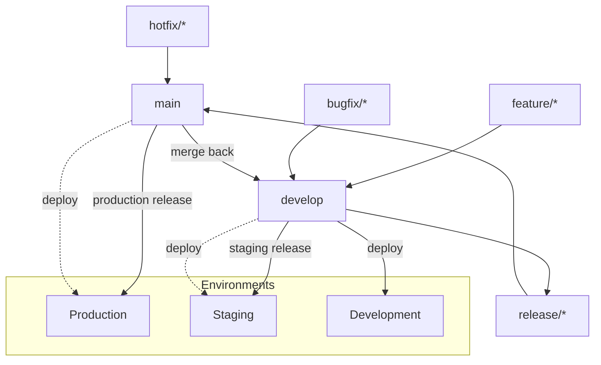

# DevOps Architecture

## 1. Infrastructure as Code

### 1.1 Terraform Structure

```hcl
infrastructure/
├── terraform/
│   ├── modules/
│   │   ├── vpc/
│   │   │   ├── main.tf
│   │   │   ├── variables.tf
│   │   │   └── outputs.tf
│   │   ├── eks/
│   │   │   ├── main.tf
│   │   │   ├── variables.tf
│   │   │   └── outputs.tf
│   │   ├── rds/
│   │   ├── elasticache/
│   │   ├── msk/
│   │   ├── s3/
│   │   ├── iam/
│   │   ├── monitoring/
│   │   └── cicd/
│   ├── environments/
│   │   ├── dev/
│   │   │   ├── main.tf
│   │   │   ├── terraform.tfvars
│   │   │   └── backend.tf
│   │   ├── staging/
│   │   │   ├── main.tf
│   │   │   ├── terraform.tfvars
│   │   │   └── backend.tf
│   │   └── prod/
│   │       ├── main.tf
│   │       ├── terraform.tfvars
│   │       └── backend.tf
│   └── global/
│       ├── iam/
│       └── route53/
```

### 1.2 Environment Specifications

| Resource | Development | Staging | Production |
|---|---|---|---|
| **EKS Node Type** | c5.large (2 nodes) | c5.xlarge (3 nodes) | c5.2xlarge (5-20 nodes) |
| **RDS Instance** | db.t3.medium (1) | db.r6g.large (2 AZ) | db.r6g.2xlarge (Multi-AZ + read replica) |
| **ElastiCache** | cache.t3.micro | cache.r6g.large | cache.r6g.xlarge (cluster mode) |
| **MSK** | kafka.t3.small (1 broker) | kafka.m5.large (2 brokers) | kafka.m5.xlarge (3 brokers) |
| **S3** | Single bucket | Single bucket | Separate buckets per data type |
| **CloudFront** | - | Enabled | Enabled + WAF |

## 2. Docker Strategy

### 2.1 Dockerfile (Spring Boot)

```dockerfile
# Multi-stage build
FROM eclipse-temurin:21-jdk-alpine AS builder
WORKDIR /app
COPY gradlew .
COPY gradle gradle
COPY build.gradle.kts .
COPY settings.gradle.kts .
COPY src src
RUN ./gradlew bootJar -x test

FROM eclipse-temurin:21-jre-alpine
RUN addgroup -S appgroup && adduser -S appuser -G appgroup
WORKDIR /app
COPY --from=builder /app/build/libs/*.jar app.jar
EXPOSE 8080
USER appuser
HEALTHCHECK --interval=30s --timeout=3s --retries=3 \
  CMD wget -qO- http://localhost:8080/actuator/health || exit 1
ENTRYPOINT ["java", "-jar", "app.jar"]
```

### 2.2 Docker Compose (Local Development)

```yaml
version: '3.8'
services:
  postgres:
    image: postgres:16-alpine
    environment:
      POSTGRES_DB: ridesharing
      POSTGRES_USER: rider
      POSTGRES_PASSWORD: rider123
    ports:
      - "5432:5432"
    volumes:
      - postgres_data:/var/lib/postgresql/data

  redis:
    image: redis:7-alpine
    ports:
      - "6379:6379"

  rabbitmq:
    image: rabbitmq:3-management-alpine
    ports:
      - "5672:5672"
      - "15672:15672"
    environment:
      RABBITMQ_DEFAULT_USER: rider
      RABBITMQ_DEFAULT_PASS: rider123

  elasticsearch:
    image: elasticsearch:8.11
    ports:
      - "9200:9200"
    environment:
      - discovery.type=single-node
      - xpack.security.enabled=false

  auth-service:
    build: ./services/auth-service
    ports:
      - "8081:8080"
    environment:
      SPRING_PROFILES_ACTIVE: dev
      DB_URL: jdbc:postgresql://postgres:5432/ridesharing
      REDIS_HOST: redis
      RABBITMQ_HOST: rabbitmq
    depends_on: [postgres, redis, rabbitmq]

  # ... other services

volumes:
  postgres_data:
```

## 3. Kubernetes Deployment

### 3.1 Helm Chart Structure

```yaml
charts/
├── ridesharing/
│   ├── Chart.yaml
│   ├── values.yaml
│   ├── values-dev.yaml
│   ├── values-staging.yaml
│   ├── values-prod.yaml
│   └── templates/
│       ├── _helpers.tpl
│       ├── deployment.yaml
│       ├── service.yaml
│       ├── ingress.yaml
│       ├── configmap.yaml
│       ├── secret.yaml
│       ├── hpa.yaml
│       ├── serviceaccount.yaml
│       ├── pdb.yaml
│       └── tests/
│           └── test-connection.yaml
```

### 3.2 Deployment Template

```yaml
# charts/ridesharing/templates/deployment.yaml
apiVersion: apps/v1
kind: Deployment
metadata:
  name: {{ include "ridesharing.fullname" . }}
  labels:
    {{- include "ridesharing.labels" . | nindent 4 }}
spec:
  replicas: {{ .Values.replicaCount }}
  strategy:
    type: RollingUpdate
    rollingUpdate:
      maxSurge: 1
      maxUnavailable: 0
  selector:
    matchLabels:
      {{- include "ridesharing.selectorLabels" . | nindent 6 }}
  template:
    metadata:
      labels:
        {{- include "ridesharing.selectorLabels" . | nindent 8 }}
      annotations:
        prometheus.io/scrape: "true"
        prometheus.io/port: "8080"
        prometheus.io/path: "/actuator/prometheus"
    spec:
      {{- with .Values.imagePullSecrets }}
      imagePullSecrets:
        {{- toYaml . | nindent 8 }}
      {{- end }}
      serviceAccountName: {{ include "ridesharing.serviceAccountName" . }}
      securityContext:
        {{- toYaml .Values.podSecurityContext | nindent 8 }}
      containers:
        - name: {{ .Chart.Name }}
          securityContext:
            {{- toYaml .Values.securityContext | nindent 12 }}
          image: "{{ .Values.image.repository }}:{{ .Values.image.tag }}"
          imagePullPolicy: {{ .Values.image.pullPolicy }}
          ports:
            - name: http
              containerPort: 8080
              protocol: TCP
          envFrom:
            - configMapRef:
                name: {{ include "ridesharing.fullname" . }}-config
            - secretRef:
                name: {{ include "ridesharing.fullname" . }}-secrets
          livenessProbe:
            httpGet:
              path: /actuator/health/liveness
              port: http
            initialDelaySeconds: 60
            periodSeconds: 10
          readinessProbe:
            httpGet:
              path: /actuator/health/readiness
              port: http
            initialDelaySeconds: 30
            periodSeconds: 5
          resources:
            {{- toYaml .Values.resources | nindent 12 }}
```

### 3.3 Horizontal Pod Autoscaler

```yaml
# charts/ridesharing/templates/hpa.yaml
apiVersion: autoscaling/v2
kind: HorizontalPodAutoscaler
metadata:
  name: {{ include "ridesharing.fullname" . }}
spec:
  scaleTargetRef:
    apiVersion: apps/v1
    kind: Deployment
    name: {{ include "ridesharing.fullname" . }}
  minReplicas: {{ .Values.autoscaling.minReplicas }}
  maxReplicas: {{ .Values.autoscaling.maxReplicas }}
  metrics:
    - type: Resource
      resource:
        name: cpu
        target:
          type: Utilization
          averageUtilization: 70
    - type: Resource
      resource:
        name: memory
        target:
          type: Utilization
          averageUtilization: 80
    - type: Pods
      pods:
        metric:
          name: ride_requests_per_second
        target:
          type: AverageValue
          averageValue: 100
```

### 3.4 Helm Values per Environment

```yaml
# values-prod.yaml
replicaCount: 5

image:
  repository: 123456789.dkr.ecr.us-east-1.amazonaws.com/ride-sharing
  tag: latest
  pullPolicy: Always

resources:
  requests:
    cpu: "500m"
    memory: "1Gi"
  limits:
    cpu: "1000m"
    memory: "2Gi"

autoscaling:
  enabled: true
  minReplicas: 3
  maxReplicas: 20

ingress:
  enabled: true
  annotations:
    kubernetes.io/ingress.class: nginx
    cert-manager.io/cluster-issuer: letsencrypt-prod
  hosts:
    - host: api.ridesharing.com
      paths:
        - /api/v1
        - /ws
  tls:
    - secretName: ridesharing-tls
      hosts:
        - api.ridesharing.com

resources:
  requests:
    cpu: "500m"
    memory: "1Gi"
  limits:
    cpu: "2"
    memory: "4Gi"

nodeSelector:
  eks.amazonaws.com/nodegroup: ridesharing-prod

tolerations:
  - key: "ridesharing/production"
    operator: "Exists"
    effect: "NoSchedule"
```

## 4. CI/CD Pipelines

### 4.1 GitHub Actions Workflow

```yaml
# .github/workflows/deploy.yml
name: Build, Test & Deploy

on:
  push:
    branches: [main, develop]
  pull_request:
    branches: [main]

env:
  AWS_REGION: us-east-1
  ECR_REPOSITORY: ride-sharing
  KUBE_NAMESPACE: ridesharing

jobs:
  test:
    name: Run Tests
    runs-on: ubuntu-latest
    services:
      postgres:
        image: postgres:16-alpine
        env:
          POSTGRES_DB: ridesharing_test
          POSTGRES_USER: rider
          POSTGRES_PASSWORD: rider123
        ports:
          - 5432:5432
      redis:
        image: redis:7-alpine
        ports:
          - 6379:6379

    steps:
      - uses: actions/checkout@v4

      - name: Set up JDK 21
        uses: actions/setup-java@v4
        with:
          java-version: '21'
          distribution: 'temurin'

      - name: Cache Gradle
        uses: actions/cache@v3
        with:
          path: ~/.gradle/caches
          key: ${{ runner.os }}-gradle-${{ hashFiles('**/*.gradle*') }}

      - name: Run Unit Tests
        run: ./gradlew test

      - name: Run Integration Tests
        run: ./gradlew integrationTest
        env:
          DB_URL: jdbc:postgresql://localhost:5432/ridesharing_test
          REDIS_HOST: localhost
          REDIS_PORT: 6379

      - name: Run Security Scanner
        uses: aquasecurity/trivy-action@master
        with:
          scan-type: 'fs'
          scan-ref: '.'
          format: 'sarif'
          output: 'trivy-results.sarif'

  build:
    name: Build & Push Docker Images
    needs: test
    runs-on: ubuntu-latest
    if: github.ref == 'refs/heads/main' || github.ref == 'refs/heads/develop'
    strategy:
      matrix:
        service:
          - auth-service
          - user-service
          - driver-service
          - vehicle-service
          - ride-service
          - matching-service
          - pricing-service
          - payment-service
          - notification-service
          - analytics-service
          - api-gateway

    steps:
      - uses: actions/checkout@v4

      - name: Configure AWS credentials
        uses: aws-actions/configure-aws-credentials@v4
        with:
          aws-access-key-id: ${{ secrets.AWS_ACCESS_KEY_ID }}
          aws-secret-access-key: ${{ secrets.AWS_SECRET_ACCESS_KEY }}
          aws-region: ${{ env.AWS_REGION }}

      - name: Login to Amazon ECR
        id: login-ecr
        uses: aws-actions/amazon-ecr-login@v2

      - name: Build, Tag & Push Image
        env:
          ECR_REGISTRY: ${{ steps.login-ecr.outputs.registry }}
          IMAGE_TAG: ${{ github.sha }}
        run: |
          docker build -t $ECR_REGISTRY/$ECR_REPOSITORY/${{ matrix.service }}:$IMAGE_TAG ./services/${{ matrix.service }}
          docker push $ECR_REGISTRY/$ECR_REPOSITORY/${{ matrix.service }}:$IMAGE_TAG

  deploy:
    name: Deploy to Kubernetes
    needs: build
    runs-on: ubuntu-latest
    if: github.ref == 'refs/heads/main'

    steps:
      - uses: actions/checkout@v4

      - name: Configure AWS credentials
        uses: aws-actions/configure-aws-credentials@v4
        with:
          aws-access-key-id: ${{ secrets.AWS_ACCESS_KEY_ID }}
          aws-secret-access-key: ${{ secrets.AWS_SECRET_ACCESS_KEY }}
          aws-region: ${{ env.AWS_REGION }}

      - name: Update kube config
        run: aws eks update-kubeconfig --region $AWS_REGION --name ridesharing-prod

      - name: Deploy Helm Chart
        run: |
          helm upgrade --install ridesharing ./charts/ridesharing \
            --namespace $KUBE_NAMESPACE \
            --values ./charts/ridesharing/values-prod.yaml \
            --set image.tag=${{ github.sha }} \
            --wait --timeout 10m

      - name: Verify Deployment
        run: |
          kubectl rollout status deployment/ridesharing -n $KUBE_NAMESPACE --timeout=5m
          kubectl get pods -n $KUBE_NAMESPACE -l app.kubernetes.io/name=ridesharing
```

### 4.2 Git Branch Strategy



## 5. Environment Management

| Environment | Git Branch | Purpose | Auto-deploy | DB Snapshot |
|---|---|---|---|---|
| **Development** | develop | Feature development & testing | On push to develop | Fresh daily |
| **Staging** | release/* | Pre-production validation | Manual trigger | Restore from prod (anonymized) |
| **Production** | main | Live user traffic | Manual trigger | Automated daily backup |

## 6. Service Mesh (Istio)

```yaml
apiVersion: networking.istio.io/v1beta1
kind: VirtualService
metadata:
  name: ride-service
spec:
  hosts:
    - ride-service
  http:
    - match:
        - headers:
            x-canary:
              exact: "v2"
      route:
        - destination:
            host: ride-service
            subset: v2
          weight: 100
    - route:
        - destination:
            host: ride-service
            subset: v1
          weight: 90
        - destination:
            host: ride-service
            subset: v2
          weight: 10
```

## 7. Backup & Disaster Recovery

| Component | Backup Strategy | RPO | RTO |
|---|---|---|---|
| **PostgreSQL** | Daily snapshot + WAL streaming to S3 | 5 min | 30 min |
| **Redis** | AOF persistence + daily RDB snapshot | 1 hour | 15 min |
| **S3** | Cross-region replication | 15 min | Automatic |
| **Kubernetes** | Velero backup to S3 daily | 24 hours | 2 hours |
| **Terraform State** | S3 with DynamoDB locking | Real-time | 15 min |

### Disaster Recovery Runbook

```yaml
disaster_recovery:
  failover:
    - trigger: "Primary region unhealthy > 5 min"
    - action: "Route53 failover to us-west-2"
    - steps:
        - "Promote RDS read replica in us-west-2 to primary"
        - "Scale up EKS cluster in us-west-2"
        - "Restore Redis from latest snapshot"
        - "Update Route53 weighted records"
        - "Verify all services healthy"
    - estimated_time: "30 min"

  database_restore:
    - trigger: "Data corruption or accidental deletion"
    - action: "Restore from point-in-time backup"
    - steps:
        - "Identify RPO target timestamp"
        - "Restore RDS to point in time"
        - "Verify data integrity"
        - "Update connection strings"
        - "Replay any missed events from Kafka"
    - estimated_time: "15-60 min depending on data volume"
```

## 8. Secrets Management

```yaml
# AWS Secrets Manager
secrets:
  - name: ridesharing/prod/db
    keys:
      DB_URL: jdbc:postgresql://...
      DB_USERNAME: rider
      DB_PASSWORD: ...

  - name: ridesharing/prod/jwt
    keys:
      JWT_ACCESS_SECRET: ...
      JWT_REFRESH_SECRET: ...

  - name: ridesharing/prod/stripe
    keys:
      STRIPE_SECRET_KEY: sk_live_...
      STRIPE_WEBHOOK_SECRET: whsec_...

  - name: ridesharing/prod/twilio
    keys:
      TWILIO_ACCOUNT_SID: ...
      TWILIO_AUTH_TOKEN: ...

  - name: ridesharing/prod/google
    keys:
      GOOGLE_MAPS_API_KEY: ...
      GOOGLE_CLIENT_ID: ...

# Kubernetes External Secrets Operator
apiVersion: external-secrets.io/v1beta1
kind: ExternalSecret
metadata:
  name: ridesharing-secrets
spec:
  refreshInterval: 1h
  secretStoreRef:
    name: aws-secretstore
    kind: ClusterSecretStore
  target:
    name: ridesharing-secrets
  data:
    - secretKey: DB_URL
      remoteRef:
        key: ridesharing/prod/db
        property: DB_URL
```
