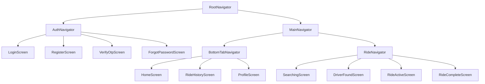
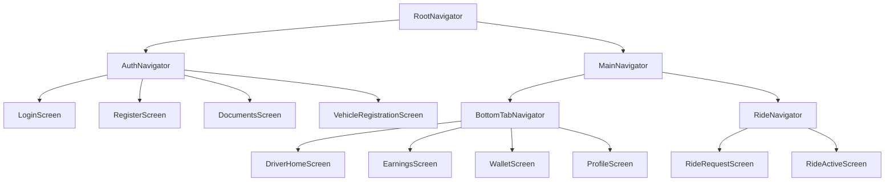
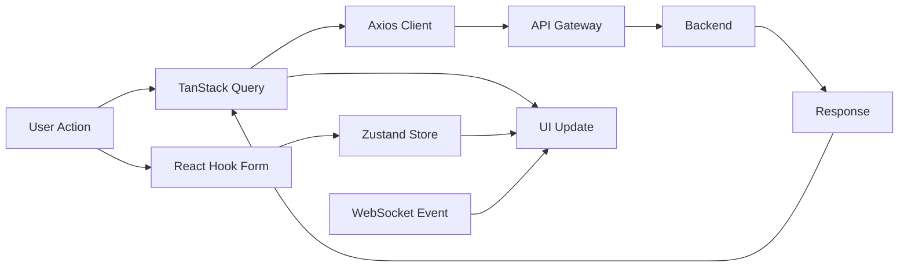
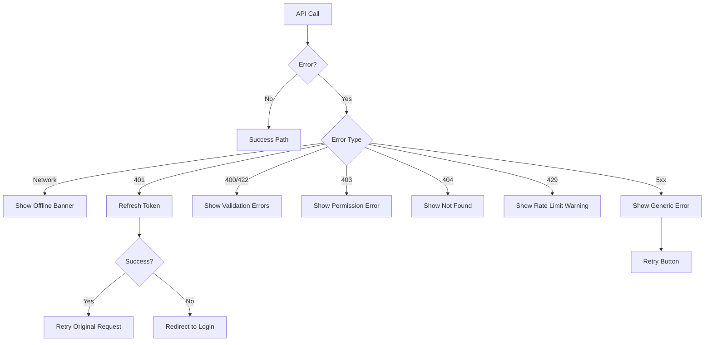

# Mobile Application Architecture

## 1. Overview

Both Passenger and Driver apps share ~60% of the codebase through a shared core library. Each app has its own feature set on top.

## 2. Mono-Repo Structure

```
/mobile-passenger
├── app.json
├── App.tsx
├── babel.config.js
├── index.ts
├── metro.config.js
├── package.json
├── tsconfig.json
├── eas.json
├── src/
│   ├── app/
│   │   ├── App.tsx                    # Root component
│   │   ├── providers.tsx              # Context providers wrapper
│   │   └── navigation/
│   │       ├── RootNavigator.tsx      # Auth vs Main navigator
│   │       ├── AuthNavigator.tsx      # Auth stack
│   │       ├── MainTabNavigator.tsx   # Bottom tab navigator
│   │       └── RideNavigator.tsx      # Ride flow stack
│   │
│   ├── features/
│   │   ├── auth/
│   │   │   ├── screens/
│   │   │   │   ├── LoginScreen.tsx
│   │   │   │   ├── RegisterScreen.tsx
│   │   │   │   ├── VerifyOtpScreen.tsx
│   │   │   │   └── ForgotPasswordScreen.tsx
│   │   │   ├── components/
│   │   │   │   ├── SocialLoginButton.tsx
│   │   │   │   ├── PhoneInput.tsx
│   │   │   │   └── OtpInput.tsx
│   │   │   ├── hooks/
│   │   │   │   ├── useAuth.ts
│   │   │   │   └── usePhoneVerification.ts
│   │   │   ├── services/
│   │   │   │   └── authApi.ts
│   │   │   ├── store/
│   │   │   │   └── authStore.ts
│   │   │   ├── types.ts
│   │   │   └── validation.ts
│   │   │
│   │   ├── home/
│   │   │   ├── screens/
│   │   │   │   └── HomeScreen.tsx
│   │   │   ├── components/
│   │   │   │   ├── MapView.tsx
│   │   │   │   ├── LocationSearchBar.tsx
│   │   │   │   ├── PickupPin.tsx
│   │   │   │   ├── DestinationPin.tsx
│   │   │   │   ├── RideTypeSelector.tsx
│   │   │   │   ├── FareEstimateCard.tsx
│   │   │   │   ├── DriverMarker.tsx
│   │   │   │   └── CurrentLocationButton.tsx
│   │   │   ├── hooks/
│   │   │   │   ├── useCurrentLocation.ts
│   │   │   │   ├── useLocationSearch.ts
│   │   │   │   └── useMapRegion.ts
│   │   │   ├── services/
│   │   │   │   ├── locationApi.ts
│   │   │   │   └── rideApi.ts
│   │   │   ├── store/
│   │   │   │   └── rideStore.ts
│   │   │   └── types.ts
│   │   │
│   │   ├── ride/
│   │   │   ├── screens/
│   │   │   │   ├── SearchingScreen.tsx
│   │   │   │   ├── DriverFoundScreen.tsx
│   │   │   │   ├── RideActiveScreen.tsx
│   │   │   │   └── RideCompleteScreen.tsx
│   │   │   ├── components/
│   │   │   │   ├── DriverInfoCard.tsx
│   │   │   │   ├── RideStatusBar.tsx
│   │   │   │   ├── DriverETA.tsx
│   │   │   │   ├── SOSButton.tsx
│   │   │   │   └── RatingSheet.tsx
│   │   │   ├── services/
│   │   │   │   ├── rideSocket.ts
│   │   │   │   └── rideApi.ts
│   │   │   └── store/
│   │   │       └── activeRideStore.ts
│   │   │
│   │   ├── payment/
│   │   │   ├── screens/
│   │   │   │   ├── PaymentMethodsScreen.tsx
│   │   │   │   ├── AddCardScreen.tsx
│   │   │   │   └── WalletScreen.tsx
│   │   │   ├── components/
│   │   │   │   ├── CardItem.tsx
│   │   │   │   └── PaymentMethodSelector.tsx
│   │   │   ├── services/
│   │   │   │   └── paymentApi.ts
│   │   │   └── store/
│   │   │       └── paymentStore.ts
│   │   │
│   │   ├── profile/
│   │   │   ├── screens/
│   │   │   │   ├── ProfileScreen.tsx
│   │   │   │   ├── EditProfileScreen.tsx
│   │   │   │   ├── FavoriteLocationsScreen.tsx
│   │   │   │   └── SettingsScreen.tsx
│   │   │   ├── services/
│   │   │   │   └── userApi.ts
│   │   │   └── store/
│   │   │       └── userStore.ts
│   │   │
│   │   └── history/
│   │       ├── screens/
│   │       │   ├── RideHistoryScreen.tsx
│   │       │   └── RideDetailScreen.tsx
│   │       ├── components/
│   │       │   └── RideCard.tsx
│   │       ├── services/
│   │       │   └── historyApi.ts
│   │       └── types.ts
│   │
│   ├── shared/
│   │   ├── components/
│   │   │   ├── Button.tsx
│   │   │   ├── TextInput.tsx
│   │   │   ├── LoadingOverlay.tsx
│   │   │   ├── ErrorBoundary.tsx
│   │   │   ├── NetworkStatusBar.tsx
│   │   │   ├── Toast.tsx
│   │   │   ├── BottomSheet.tsx
│   │   │   ├── Avatar.tsx
│   │   │   └── EmptyState.tsx
│   │   ├── hooks/
│   │   │   ├── useNetworkStatus.ts
│   │   │   ├── useDebounce.ts
│   │   │   ├── useAppState.ts
│   │   │   └── useKeyboardHeight.ts
│   │   ├── utils/
│   │   │   ├── formatCurrency.ts
│   │   │   ├── formatDate.ts
│   │   │   ├── formatDistance.ts
│   │   │   ├── formatDuration.ts
│   │   │   ├── validation.ts
│   │   │   └── locationUtils.ts
│   │   ├── types/
│   │   │   ├── api.ts
│   │   │   ├── ride.ts
│   │   │   ├── user.ts
│   │   │   ├── driver.ts
│   │   │   ├── payment.ts
│   │   │   ├── location.ts
│   │   │   └── navigation.ts
│   │   ├── constants/
│   │   │   ├── api.ts
│   │   │   ├── theme.ts
│   │   │   ├── config.ts
│   │   │   └── rideTypes.ts
│   │   └── i18n/
│   │       ├── index.ts
│   │       ├── en.json
│   │       └── ar.json
│   │
│   ├── services/
│   │   ├── api/
│   │   │   ├── client.ts              # Axios instance with interceptors
│   │   │   ├── authInterceptor.ts     # JWT injection + refresh
│   │   │   ├── errorInterceptor.ts    # Global error handling
│   │   │   └── retryInterceptor.ts    # Retry logic
│   │   ├── websocket/
│   │   │   ├── socketClient.ts
│   │   │   ├── locationEmitter.ts
│   │   │   └── rideSubscription.ts
│   │   ├── location/
│   │   │   ├── LocationService.ts
│   │   │   └── PermissionManager.ts
│   │   └── notification/
│   │       ├── NotificationService.ts
│   │       └── handlers.ts
│   │
│   ├── store/
│   │   ├── index.ts
│   │   ├── authStore.ts
│   │   ├── rideStore.ts
│   │   ├── activeRideStore.ts
│   │   ├── paymentStore.ts
│   │   └── uiStore.ts
│   │
│   └── theme/
│       ├── colors.ts
│       ├── spacing.ts
│       ├── typography.ts
│       └── index.ts
```

The Driver app follows an identical structure with its own feature folders (`driver-home`, `earnings`, `wallet`, `documents`, `vehicle`).

## 3. Navigation Architecture

### 3.1 Passenger Navigation



### 3.2 Driver Navigation



### 3.3 Navigation Configuration

```typescript
// Navigation type definitions
type RootStackParamList = {
  Auth: undefined;
  Main: undefined;
};

type AuthStackParamList = {
  Login: undefined;
  Register: undefined;
  VerifyOtp: { phone: string; name?: string };
  ForgotPassword: undefined;
};

type MainTabParamList = {
  Home: undefined;
  History: undefined;
  Profile: undefined;
};

type RideStackParamList = {
  Searching: { rideRequestId: string };
  DriverFound: { rideId: string; driverId: string };
  RideActive: { rideId: string };
  RideComplete: { rideId: string };
};
```

## 4. State Management Architecture

### 4.1 Zustand Stores

| Store | Purpose | Persistence |
|---|---|---|
| `authStore` | Auth tokens, current user, auth state | AsyncStorage |
| `rideStore` | Pickup/destination, ride type, fare estimate, promo code | None |
| `activeRideStore` | Active ride data, driver info, ride status | None |
| `paymentStore` | Payment methods, wallet balance | AsyncStorage |
| `uiStore` | Theme, language, onboarding status | AsyncStorage |

### 4.2 TanStack Query Cache

| Query Key | Data | Stale Time | Cache Time |
|---|---|---|---|
| `['user', 'profile']` | User profile data | 5 min | 30 min |
| `['rides', 'history', {page}]` | Ride history list | 2 min | 10 min |
| `['ride', id]` | Single ride detail | 1 min | 5 min |
| `['payments', 'methods']` | Saved payment methods | 10 min | 1 hour |
| `['locations', 'favorites']` | Favorite locations | 10 min | 1 hour |
| `['wallet', 'balance']` | Wallet balance + transactions | 1 min | 5 min |
| `['promos', 'available']` | Available promo codes | 30 min | 2 hours |
| `['estimate', {pickup, dest, type}]` | Fare estimation | 30 sec | 2 min |

### 4.3 State Flow



## 5. Offline Support Strategy

| Scenario | Strategy |
|---|---|
| **No internet on app start** | Show cached home screen, display "Offline" banner |
| **Ride request fails** | Queue request locally, retry on reconnect |
| **Location updates fail** | Buffer GPS points, batch send on reconnect |
| **Map tiles** | Enable map tile caching (Mapbox offline regions) |
| **Payment methods** | Show cached list, block new additions offline |
| **Ride history** | Display last cached page, refresh on online |

### Offline Queue

```typescript
interface OfflineQueueItem {
  id: string;
  type: 'ride_request' | 'location_update' | 'rating' | 'support_message';
  payload: unknown;
  timestamp: number;
  retryCount: number;
}
```

- Queue stored in AsyncStorage
- Max 50 queued items
- FIFO processing on reconnect
- Exponential backoff (1s, 2s, 4s, 8s, max 30s)
- Dead items discarded after 5 retries with user notification

## 6. Error Handling Strategy

### 6.1 Error Hierarchy

```typescript
// Shared error types
class AppError extends Error {
  constructor(
    message: string,
    public code: string,
    public statusCode?: number,
    public details?: unknown
  ) { super(message); }
}

class NetworkError extends AppError {
  constructor() { super('No internet connection', 'NETWORK_ERROR'); }
}

class AuthError extends AppError {
  constructor() { super('Session expired', 'AUTH_EXPIRED'); }
}

class ValidationError extends AppError {
  constructor(details: unknown) {
    super('Validation failed', 'VALIDATION_ERROR', 400, details);
  }
}

class ServerError extends AppError {
  constructor(statusCode: number) {
    super('Server error', 'SERVER_ERROR', statusCode);
  }
}
```

### 6.2 Error Handling Flow



## 7. Caching Strategy

| Data | Strategy | TTL |
|---|---|---|
| **User Profile** | Write-through cache | 5 min |
| **Fare Estimates** | Cache with location hash key | 30 sec |
| **Map Tiles** | LRU disk cache | 30 days |
| **Static Content** | Bundled in app | Per release |
| **i18n Translations** | Bundled in app | Per release |
| **API Responses** | TanStack Query cache | Per query config |
| **Auth Tokens** | SecureStore (keychain/keystore) | Until refresh |

## 8. API Layer Architecture

### 8.1 Axios Client Configuration

```typescript
// src/services/api/client.ts
const apiClient = axios.create({
  baseURL: Config.API_BASE_URL,
  timeout: 15000,
  headers: {
    'Content-Type': 'application/json',
    'Accept-Language': i18n.language,
  },
});

// Request interceptor: attach JWT
apiClient.interceptors.request.use(async (config) => {
  const token = useAuthStore.getState().accessToken;
  if (token) {
    config.headers.Authorization = `Bearer ${token}`;
  }
  return config;
});

// Response interceptor: handle 401 + token refresh
apiClient.interceptors.response.use(
  (response) => response,
  async (error) => {
    if (error.response?.status === 401) {
      const refreshed = await refreshTokens();
      if (refreshed) {
        return apiClient.request(error.config);
      }
      useAuthStore.getState().logout();
    }
    return Promise.reject(transformError(error));
  }
);
```

## 9. WebSocket Integration

```typescript
// src/services/websocket/socketClient.ts
class WebSocketClient {
  private client: Client;
  private subscriptions: Map<string, Subscription>;

  connect(accessToken: string): void {
    this.client = new Client({
      brokerURL: `${Config.WS_URL}/ws`,
      connectHeaders: { Authorization: `Bearer ${accessToken}` },
      reconnectDelay: 5000,
      heartbeatIncoming: 10000,
      heartbeatOutgoing: 10000,
    });

    this.client.onConnect = () => {
      this.subscribeToRideUpdates();
      this.subscribeToDriverLocation();
    };
  }

  subscribeToRideUpdates(rideId: string): void {
    this.client.subscribe(`/topic/ride/${rideId}`, (message) => {
      const update: RideStatusUpdate = JSON.parse(message.body);
      useActiveRideStore.getState().updateRideStatus(update);
    });
  }

  subscribeToDriverLocation(driverId: string): void {
    this.client.subscribe(`/topic/driver/${driverId}/location`, (message) => {
      const location: LocationUpdate = JSON.parse(message.body);
      useActiveRideStore.getState().updateDriverLocation(location);
    });
  }

  sendLocationUpdate(location: LocationUpdate): void {
    this.client.publish({
      destination: '/app/location/driver',
      body: JSON.stringify(location),
    });
  }
}
```

## 10. Security Measures

| Measure | Implementation |
|---|---|
| **Token Storage** | react-native-keychain (iOS Keychain / Android Keystore) |
| **Certificate Pinning** | react-native-ssl-pinning |
| **App Integrity** | react-native-google-safetynet / iOS DeviceCheck |
| **Jailbreak Detection** | react-native-jailbreak-detection |
| **Input Sanitization** | Zod validation on all forms |
| **Secure HTTP** | HTTPS enforced, HTTP blocked |
| **Deep Link Validation** | Verify origin on OAuth callbacks |
