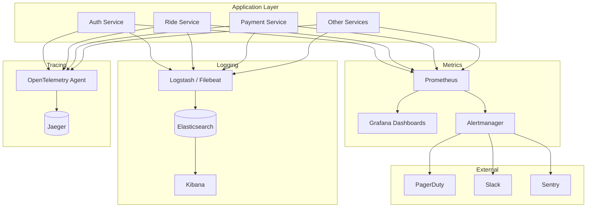

# Monitoring Strategy

## 1. Overview

Monitoring is implemented at four layers: logging, metrics, tracing, and alerting. The stack uses Prometheus + Grafana for metrics, ELK for logging, OpenTelemetry + Jaeger for distributed tracing, and PagerDuty/OpsGenie for alerting.

## 2. Architecture



## 3. Logging Strategy (ELK Stack)

### 3.1 Log Configuration (Spring Boot)

```yaml
# application.yml
logging:
  level:
    com.ridesharing: INFO
    org.springframework: WARN
  pattern:
    console: "%d{yyyy-MM-dd HH:mm:ss.SSS} [%thread] %-5level %logger{36} [%X{traceId}] - %msg%n"

# logback-spring.xml
<configuration>
    <appender name="LOGSTASH" class="net.logstash.logback.appender.LogstashTcpSocketAppender">
        <destination>logstash:5000</destination>
        <encoder class="net.logstash.logback.encoder.LogstashEncoder">
            <includeMdc>true</includeMdc>
        </encoder>
    </appender>

    <appender name="CONSOLE" class="ch.qos.logback.core.ConsoleAppender">
        <encoder>
            <pattern>%d{HH:mm:ss.SSS} [%thread] %-5level %logger{36} [%X{traceId}] - %msg%n</pattern>
        </encoder>
    </appender>

    <root level="INFO">
        <appender-ref ref="CONSOLE"/>
        <appender-ref ref="LOGSTASH"/>
    </root>
</configuration>
```

### 3.2 Log Types

| Log Type | Description | Retention |
|---|---|---|
| Application Logs | Service debug/info/error/warn | 30 days |
| Access Logs | API Gateway request logs | 90 days |
| Audit Logs | User/data change tracking | 1 year |
| Security Logs | Auth attempts, suspicious activity | 1 year |
| Performance Logs | Slow queries, latency data | 14 days |

### 3.3 Structured Logging

```java
// Use structured logging for better searchability
log.info("Ride requested successfully",
    kv("rideId", ride.getId()),
    kv("passengerId", ride.getPassengerId()),
    kv("pickupLat", ride.getPickupLatitude()),
    kv("pickupLng", ride.getPickupLongitude()),
    kv("rideType", ride.getRideType()),
    kv("estimatedFare", ride.getTotalFare())
);

// Error logging with context
log.error("Payment processing failed",
    kv("transactionId", transactionId),
    kv("rideId", rideId),
    kv("amount", amount),
    kv("errorCode", e.getErrorCode()),
    kv("stripeError", e.getStripeError())
);
```

## 4. Metrics (Prometheus + Grafana)

### 4.1 Spring Actuator Configuration

```yaml
management:
  endpoints:
    web:
      exposure:
        include: health,info,metrics,prometheus
  metrics:
    tags:
      application: ${spring.application.name}
    export:
      prometheus:
        enabled: true
  endpoint:
    prometheus:
      enabled: true
    health:
      show-details: always
      probes:
        enabled: true
```

### 4.2 Custom Metrics

```java
@Component
public class RideMetrics {

    private final Counter rideRequestsCounter;
    private final Counter rideCompletedCounter;
    private final Counter rideCancelledCounter;
    private final Gauge activeRidesGauge;
    private final Timer matchingDurationTimer;
    private final DistributionSummary fareDistribution;

    public RideMetrics(MeterRegistry registry) {
        rideRequestsCounter = Counter.builder("rides.requests.total")
            .description("Total ride requests")
            .tag("type", "all")
            .register(registry);

        rideCompletedCounter = Counter.builder("rides.completed.total")
            .description("Total completed rides")
            .register(registry);

        rideCancelledCounter = Counter.builder("rides.cancelled.total")
            .description("Total cancelled rides")
            .tag("cancelled_by", "all")
            .register(registry);

        activeRidesGauge = Gauge.builder("rides.active.current", this,
            RideMetrics::getActiveRideCount)
            .description("Current active rides")
            .register(registry);

        matchingDurationTimer = Timer.builder("rides.matching.duration")
            .description("Time to match driver")
            .publishPercentiles(0.5, 0.95, 0.99)
            .register(registry);

        fareDistribution = DistributionSummary.builder("rides.fare.amount")
            .description("Ride fare distribution")
            .baseUnit("USD")
            .publishPercentiles(0.5, 0.75, 0.95)
            .register(registry);
    }

    @EventListener
    public void handleRideRequested(RideRequestedEvent event) {
        rideRequestsCounter.increment();
    }

    @EventListener
    public void handleRideCompleted(RideCompletedEvent event) {
        rideCompletedCounter.increment();
        activeRidesGauge.decrement();
        fareDistribution.record(event.getFare().doubleValue());
    }
}
```

### 4.3 Key Metrics

| Metric Name | Type | Description | Service |
|---|---|---|---|
| `rides.requests.total` | Counter | Total ride requests received | Ride |
| `rides.completed.total` | Counter | Completed rides | Ride |
| `rides.cancelled.total` | Counter | Cancelled rides (by reason) | Ride |
| `rides.active.current` | Gauge | Currently active rides | Ride |
| `rides.matching.duration` | Timer | Time to find matched driver (P95) | Matching |
| `rides.fare.amount` | Summary | Fare distribution | Pricing |
| `auth.login.total` | Counter | Login attempts (success/failure) | Auth |
| `auth.registration.total` | Counter | New registrations | Auth |
| `payment.processed.total` | Counter | Payments processed | Payment |
| `payment.failed.total` | Counter | Failed payments | Payment |
| `payment.processing.duration` | Timer | Payment processing time | Payment |
| `driver.location.updates` | Counter | Driver location updates/sec | Driver |
| `notification.sent.total` | Counter | Notifications sent by channel | Notification |
| `api.request.duration` | Timer | API response time by endpoint | Gateway |
| `api.request.total` | Counter | Total API requests by path | Gateway |
| `db.query.duration` | Timer | Database query times | All |
| `jvm.memory.used` | Gauge | JVM heap usage | All |
| `system.cpu.usage` | Gauge | CPU utilization | All |

### 4.4 Grafana Dashboards

```json
{
  "dashboard": {
    "title": "Ride Hailing - Platform Overview",
    "panels": [
      {
        "title": "Active Rides",
        "type": "stat",
        "targets": [{
          "expr": "rides.active.current"
        }]
      },
      {
        "title": "Rides per Minute",
        "type": "graph",
        "targets": [{
          "expr": "rate(rides.requests.total[5m])"
        }]
      },
      {
        "title": "Matching Time (P95)",
        "type": "graph",
        "targets": [{
          "expr": "histogram_quantile(0.95, rate(rides.matching.duration_seconds_bucket[5m]))"
        }]
      },
      {
        "title": "API Response Time by Service",
        "type": "graph",
        "targets": [
          { "expr": "histogram_quantile(0.95, rate(api_request_duration_seconds_bucket{service=\"ride-service\"}[5m]))" },
          { "expr": "histogram_quantile(0.95, rate(api_request_duration_seconds_bucket{service=\"payment-service\"}[5m]))" }
        ]
      },
      {
        "title": "Error Rate by Service",
        "type": "graph",
        "targets": [{
          "expr": "rate(api_request_total{status=~\"5..\"}[5m]) / rate(api_request_total[5m]) * 100"
        }]
      },
      {
        "title": "JVM Heap Usage",
        "type": "graph",
        "targets": [{
          "expr": "jvm_memory_used_bytes{area=\"heap\"} / jvm_memory_max_bytes{area=\"heap\"} * 100"
        }]
      }
    ]
  }
}
```

**Dashboards to build:**
1. **Platform Overview** - Rides, revenue, active users, errors
2. **Service Detail** - Per-service: requests, latency, errors, resources
3. **Infrastructure** - EKS, RDS, Redis metrics
4. **Business KPIs** - Revenue, ride volume, driver performance
5. **Real-Time** - Active rides, driver locations, surge zones

## 5. Distributed Tracing (OpenTelemetry + Jaeger)

### 5.1 OpenTelemetry Configuration

```yaml
# application.yml
opentelemetry:
  traces:
    exporter: jaeger
  jaeger:
    endpoint: http://jaeger:14250
    timeout: 10s
  service:
    name: ${spring.application.name}
  propagators: tracecontext, baggage, b3

# Add to JVM args
# -javaagent:opentelemetry-javaagent.jar
# -Dotel.service.name=ride-service
# -Dotel.traces.exporter=jaeger
# -Dotel.exporter.jaeger.endpoint=http://jaeger:14250
```

### 5.2 Tracing Annotations

```java
@Service
public class RideService {

    @WithSpan
    public RideResponse requestRide(RideRequest request) {
        // Create a new span for the complete ride request flow
        Span span = Span.current();
        span.setAttribute("ride.passengerId", request.getPassengerId().toString());
        span.setAttribute("ride.pickupLat", request.getPickupLatitude());

        // Nested span for fare estimation
        try (Scope scope = tracer.spanBuilder("estimateFare").startScopedSpan()) {
            FareEstimate fare = pricingClient.estimateFare(request);
            span.addEvent("Fare estimated", Attributes.of(
                AttributeKey.stringKey("fare"), fare.getTotalFare().toString()
            ));
        }

        // Nested span for driver matching
        try (Scope scope = tracer.spanBuilder("matchDriver").startScopedSpan()) {
            MatchingResult match = matchingClient.findDriver(request);
            span.addEvent("Driver matched", Attributes.of(
                AttributeKey.stringKey("driverId"), match.getDriverId().toString(),
                AttributeKey.longKey("matchingTimeMs"), match.getDurationMs()
            ));
        }

        return response;
    }

    // Trace database calls automatically via JDBC instrumentation
}
```

## 6. Alerting Rules

### 6.1 Prometheus Alert Rules

```yaml
# prometheus-rules.yaml
groups:
  - name: ridesharing-alerts
    rules:
      - alert: HighErrorRate
        expr: rate(api_request_total{status=~"5.."}[5m]) / rate(api_request_total[5m]) > 0.05
        for: 5m
        labels:
          severity: critical
        annotations:
          summary: "High error rate on {{ $labels.service }}"
          description: "Error rate is {{ $value | humanizePercentage }} on {{ $labels.service }}"

      - alert: HighLatency
        expr: histogram_quantile(0.95, rate(api_request_duration_seconds_bucket[5m])) > 1
        for: 5m
        labels:
          severity: warning
        annotations:
          summary: "High latency on {{ $labels.service }}"
          description: "P95 latency is {{ $value }}s on {{ $labels.service }}"

      - alert: ServiceDown
        expr: up{job=~".*-service"} == 0
        for: 1m
        labels:
          severity: critical
        annotations:
          summary: "Service {{ $labels.job }} is down"
          description: "{{ $labels.instance }} has been unavailable for 1 minute"

      - alert: HighRideMatchTime
        expr: histogram_quantile(0.95, rate(rides_matching_duration_seconds_bucket[5m])) > 5
        for: 5m
        labels:
          severity: warning
        annotations:
          summary: "Ride matching taking too long"
          description: "P95 ride matching time is {{ $value }}s"

      - alert: LowDriverAcceptanceRate
        expr: avg(driver_acceptance_rate) < 0.8
        for: 10m
        labels:
          severity: warning
        annotations:
          summary: "Low driver acceptance rate"
          description: "Overall driver acceptance rate is {{ $value | humanizePercentage }}"

      - alert: PaymentFailureRate
        expr: rate(payment_failed_total[30m]) / rate(payment_processed_total[30m]) > 0.1
        for: 5m
        labels:
          severity: critical
        annotations:
          summary: "High payment failure rate"
          description: "Payment failure rate is {{ $value | humanizePercentage }} over last 30 minutes"

      - alert: DatabaseConnectionPoolExhausted
        expr: hikaricp_connections_active / hikaricp_connections_max > 0.9
        for: 2m
        labels:
          severity: critical
        annotations:
          summary: "Database connection pool nearly exhausted"
          description: "{{ $labels.pool }} is at {{ $value | humanizePercentage }} capacity"

      - alert: DiskSpaceLow
        expr: (node_filesystem_avail_bytes / node_filesystem_size_bytes) < 0.1
        for: 5m
        labels:
          severity: critical
        annotations:
          summary: "Low disk space on {{ $labels.instance }}"
          description: "Available disk space is {{ $value | humanizePercentage }}"
```

### 6.2 Alert Routing

```yaml
# alertmanager.yml
route:
  receiver: team-core
  routes:
    - match:
        severity: critical
      receiver: pagerduty-critical
      repeat_interval: 5m
    - match:
        severity: warning
      receiver: slack-warnings
      repeat_interval: 30m

receivers:
  - name: pagerduty-critical
    pagerduty_configs:
      - routing_key: ${PAGERDUTY_ROUTING_KEY}
        severity: critical
        description: '{{ .GroupLabels.alertname }}'

  - name: slack-warnings
    slack_configs:
      - api_url: ${SLACK_WEBHOOK_URL}
        channel: '#alerts-ridesharing'
        title: '[{{ .GroupLabels.severity }}] {{ .GroupLabels.alertname }}'
        text: '{{ .CommonAnnotations.description }}'

  - name: team-core
    slack_configs:
      - api_url: ${SLACK_WEBHOOK_URL}
        channel: '#alerts-ridesharing'
```

## 7. Health Checks

```java
@Component
public class ReadinessHealthIndicator implements HealthIndicator {

    @Autowired
    private DataSource dataSource;

    @Autowired
    private RedisTemplate redisTemplate;

    @Override
    public Health health() {
        try {
            // Check database connectivity
            dataSource.getConnection().isValid(5);

            // Check Redis connectivity
            redisTemplate.opsForValue().get("health:check");

            return Health.up()
                .withDetail("database", "connected")
                .withDetail("redis", "connected")
                .build();
        } catch (Exception e) {
            return Health.down()
                .withDetail("error", e.getMessage())
                .build();
        }
    }
}
```

## 8. Synthetic Monitoring

```yaml
# AWS CloudWatch Synthetics Canary
canaries:
  - name: ride-request-flow
    schedule: rate(5 minutes)
    script: |
      const { CloudWatchSynthetics } = require('Synthetics');
      const step = async function () {
          // 1. Login
          const loginRes = await page.goto('https://api.ridesharing.com/api/v1/auth/login', {
              method: 'POST',
              body: JSON.stringify({
                  email: 'synthetic@ridesharing.com',
                  password: 'synthetic-password'
              })
          });
          const token = JSON.parse(loginRes.body).data.accessToken;

          // 2. Estimate fare
          const estimateRes = await page.goto('https://api.ridesharing.com/api/v1/rides/estimate', {
              method: 'POST',
              headers: { Authorization: `Bearer ${token}` },
              body: JSON.stringify({
                  pickup: { lat: 40.7580, lng: -73.9855 },
                  destination: { lat: 40.7484, lng: -73.9857 },
                  rideType: 'economy'
              })
          });
          // Assert: fare should be returned
          assert(JSON.parse(estimateRes.body).data.estimates.length > 0);
      };
      exports.handler = async () => {
          return await CloudWatchSynthetics.executeStep('ride-check', step);
      };
```

## 9. APM & Error Tracking

```java
// Sentry integration
Sentry.init(options -> {
    options.setDsn("https://key@sentry.io/project");
    options.setEnvironment(environment);
    options.setTracesSampleRate(0.2); // Sample 20% of transactions
    options.setProfilesSampleRate(0.1);
});

// Capture errors
try {
    riskyOperation();
} catch (Exception e) {
    Sentry.captureException(e);
}
```
