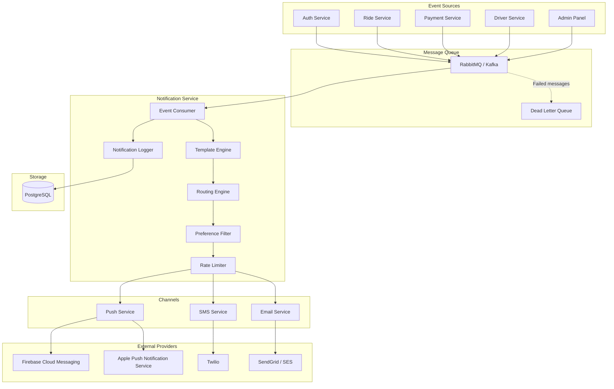
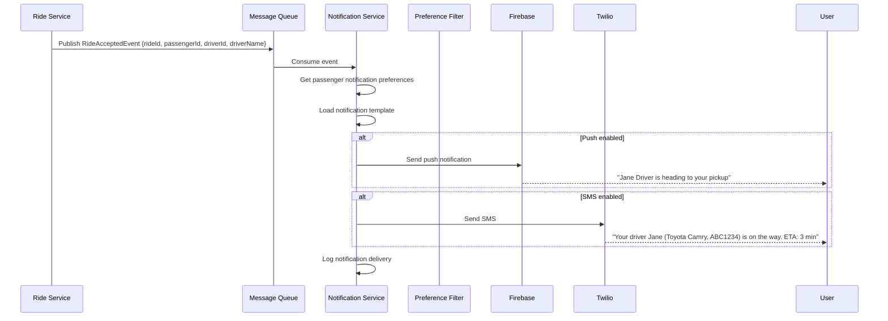

# Notification System

## 1. Overview

The Notification Service handles all communication with users across three channels: push notifications (FCM/APNs), SMS (Twilio), and email (SendGrid/Amazon SES). It follows an event-driven architecture, consuming events from other services and dispatching notifications based on user preferences.

## 2. Architecture



## 3. Event Processing Flow



## 4. Template Engine

### Template Definition

```json
{
  "name": "ride_accepted_passenger",
  "channels": {
    "push": {
      "title": "Driver on the way!",
      "body": "{{driverName}} is heading to your pickup at {{pickupAddress}}",
      "data": {
        "type": "RIDE_ACCEPTED",
        "rideId": "{{rideId}}",
        "deepLink": "ridesharing://ride/{{rideId}}"
      }
    },
    "sms": {
      "body": "{{driverName}} ({{vehicleMake}} {{vehicleModel}}, {{licensePlate}}) is on the way. ETA: {{etaMinutes}} min. Track: {{trackingLink}}"
    },
    "email": {
      "subject": "Your driver {{driverName}} is on the way!",
      "body": "<h2>Your ride is confirmed</h2><p>{{driverName}} is heading to {{pickupAddress}}.</p><p>Vehicle: {{vehicleMake}} {{vehicleModel}} ({{color}})<br/>License Plate: {{licensePlate}}<br/>ETA: {{etaMinutes}} minutes</p><p><a href='{{trackingLink}}'>Track your ride</a></p>"
    }
  },
  "variables": ["driverName", "pickupAddress", "vehicleMake", "vehicleModel", "licensePlate", "etaMinutes", "rideId", "trackingLink"]
}
```

### Template Rendering

```java
@Service
public class TemplateEngine {

    public NotificationContent render(
        String templateName,
        String channel,
        Map<String, String> variables
    ) {
        NotificationTemplate template = templateRepository
            .findByNameAndType(templateName, channel)
            .orElseThrow(() -> new TemplateNotFoundException(templateName));

        String rendered = template.getBody();
        for (Map.Entry<String, String> entry : variables.entrySet()) {
            rendered = rendered.replace("{{" + entry.getKey() + "}}", entry.getValue());
        }

        return new NotificationContent(
            template.getSubject(),
            rendered,
            extractDataVariables(variables)
        );
    }
}
```

## 5. Notification Events & Templates

| Event | Channel | Passenger | Driver |
|---|---|---|---|
| **RideRequested** | Push | - Searching for driver | - New ride request (sound) |
| **RideAccepted** | Push, SMS | Driver name + ETA | - |
| **DriverArrived** | Push | ☑ Driver has arrived | - |
| **RideStarted** | Push | ⏵ Trip started to {dest} | - |
| **RideCompleted** | Push, Email, SMS | ☑ Trip complete! + receipt | ☑ Trip completed! |
| **RideCancelled** | Push | Cancelled (reason) | Ride was cancelled |
| **PaymentProcessed** | Push | Receipt: ${amount} | +${amount} earned |
| **PaymentFailed** | Push, Email | ⚠ Payment failed, update method | - |
| **PayoutProcessed** | Push, SMS | - | ${amount} sent to bank |
| **DriverApproved** | Push, Email | - | ✅ Welcome! Start driving |
| **DriverRejected** | Push, Email | - | Document rejected: {reason} |
| **PromoAvailable** | Push | 🎉 New promo: {code} | - |
| **Welcome** | Email | Welcome to RideSharing! | Welcome to the driver team! |
| **AccountSuspended** | Email | Account suspended | Account suspended |

## 6. Push Notification Service

```java
@Service
public class PushNotificationService {

    @Value("${fcm.server-key}")
    private String fcmServerKey;

    public void sendPush(UUID userId, NotificationContent content, Map<String, String> data) {
        List<DeviceRegistration> devices = deviceRegistrationRepository
            .findByUserIdAndIsActiveTrue(userId);

        for (DeviceRegistration device : devices) {
            try {
                Message message = Message.builder()
                    .setToken(device.getFcmToken())
                    .setNotification(Notification.builder()
                        .setTitle(content.getTitle())
                        .setBody(content.getBody())
                        .build())
                    .putAllData(data)
                    .setAndroidConfig(AndroidConfig.builder()
                        .setPriority(AndroidConfig.Priority.HIGH)
                        .setNotification(AndroidNotification.builder()
                            .setChannelId("ride_updates")
                            .setSound("default")
                            .setClickAction("OPEN_RIDE")
                            .build())
                        .build())
                    .setApnsConfig(ApnsConfig.builder()
                        .setAps(Aps.builder()
                            .setAlert(ApsAlert.builder()
                                .setTitle(content.getTitle())
                                .setBody(content.getBody())
                                .build())
                            .setSound("default")
                            .setContentAvailable(true)
                            .setMutableContent(true)
                            .setCategory("RIDE_UPDATE")
                            .build())
                        .build())
                    .build();

                String response = FirebaseMessaging.getInstance().send(message);
                log.info("Push sent to device {}: {}", device.getId(), response);

            } catch (FirebaseMessagingException e) {
                if (e.getErrorCode() == ErrorCode.UNREGISTERED) {
                    // Token expired, deactivate device
                    device.setIsActive(false);
                    deviceRegistrationRepository.save(device);
                }
                log.error("Failed to send push to device {}: {}", device.getId(), e.getMessage());
            }
        }
    }
}
```

## 7. SMS Service

```java
@Service
public class SmsService {

    @Value("${twilio.phone-number}")
    private String twilioPhoneNumber;

    public void sendSms(String toPhone, String body) {
        try {
            Message message = Message.creator(
                new PhoneNumber(toPhone),
                new PhoneNumber(twilioPhoneNumber),
                body
            ).create();

            log.info("SMS sent to {}: sid={}", toPhone, message.getSid());
        } catch (TwilioException e) {
            log.error("Failed to send SMS to {}: {}", toPhone, e.getMessage());
            throw new SmsDeliveryException(toPhone, e);
        }
    }
}
```

## 8. Email Service

```java
@Service
public class EmailService {

    @Autowired
    private SendGrid sendGrid;

    public void sendEmail(String to, String subject, String htmlBody) {
        Email from = new Email("noreply@ridesharing.com");
        Email toEmail = new Email(to);
        Content content = new Content("text/html", htmlBody);

        Mail mail = new Mail(from, subject, toEmail, content);

        Request request = new Request();
        try {
            request.setMethod(Method.POST);
            request.setEndpoint("mail/send");
            request.setBody(mail.build());

            Response response = sendGrid.api(request);
            log.info("Email sent to {}: status={}", to, response.getStatusCode());
        } catch (IOException e) {
            log.error("Failed to send email to {}: {}", to, e.getMessage());
        }
    }
}
```

## 9. Notification Preferences

```java
@Entity
@Table(name = "notification_preferences", uniqueConstraints = {
    @UniqueConstraint(columnNames = {"user_id", "channel", "event_type"})
})
public class NotificationPreference {
    private UUID id;
    private UUID userId;
    private String channel;    // push, sms, email
    private String eventType;  // ride_update, payment, promo, system
    private boolean enabled;
}

// Default preferences on registration:
// push: ride_update = true, payment = true, promo = true, system = true
// sms: ride_update = false, payment = true, promo = false, system = false
// email: ride_update = false, payment = true, promo = true, system = true
```

## 10. Rate Limiting

```java
@Component
public class NotificationRateLimiter {

    private static final int MAX_PUSH_PER_USER_PER_HOUR = 50;
    private static final int MAX_SMS_PER_USER_PER_DAY = 5;
    private static final int MAX_EMAIL_PER_USER_PER_DAY = 20;

    public boolean isAllowed(String userId, String channel) {
        String key = String.format("notif:rate:%s:%s:%s",
            userId, channel, LocalDate.now().toString());

        Long count = redisTemplate.opsForValue().increment(key);

        if (count == 1) {
            // Set TTL based on channel
            Duration ttl = switch (channel) {
                case "push" -> Duration.ofHours(1);
                case "sms", "email" -> Duration.ofDays(1);
                default -> Duration.ofHours(1);
            };
            redisTemplate.expire(key, ttl);
        }

        int maxLimit = switch (channel) {
            case "push" -> MAX_PUSH_PER_USER_PER_HOUR;
            case "sms" -> MAX_SMS_PER_USER_PER_DAY;
            case "email" -> MAX_EMAIL_PER_USER_PER_DAY;
            default -> 50;
        };

        return count <= maxLimit;
    }
}
```

## 11. Notification History

```sql
-- Create notification record
INSERT INTO notifications (user_id, type, title, body, data, channel, status)
VALUES ('user-uuid', 'ride_accepted', 'Driver on the way!', 'Jane is heading to your pickup',
        '{"rideId": "abc-123", "deepLink": "ridesharing://ride/abc-123"}', 'push', 'sent');
```

## 12. Dead Letter Queue Handling

```java
@Component
public class DeadLetterHandler {

    @RabbitListener(queues = "notification.dlq")
    public void handleDeadLetter(Message message) {
        NotificationEvent event = deserialize(message);

        // Log failed notification
        notificationLogger.logFailure(event, "Max retries exceeded");

        // Alert monitoring
        alertService.sendAlert(new Alert(
            "NOTIFICATION_DELIVERY_FAILED",
            "Notification " + event.getEventType()
                + " failed for user " + event.getUserId()
                + " after max retries"
        ));

        // For critical notifications (payment, security), try alternative channel
        if (event.isCritical()) {
            String alternativeChannel = event.getChannel().equals("push") ? "sms" : "email";
            notificationRouter.sendViaAlternative(event, alternativeChannel);
        }
    }
}
```

## 13. Retry Strategy

| Attempt | Delay | Notes |
|---|---|---|
| 1 | 0s | Immediate |
| 2 | 5s | Brief retry |
| 3 | 30s | Standard retry |
| 4 | 2min | Extended wait |
| 5 | 10min | Long wait |
| 6 | 1hour | Final attempt |
| - | - | Route to DLQ |
