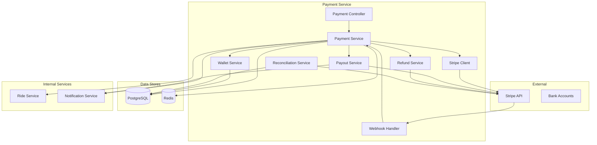
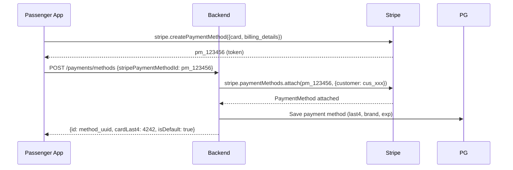
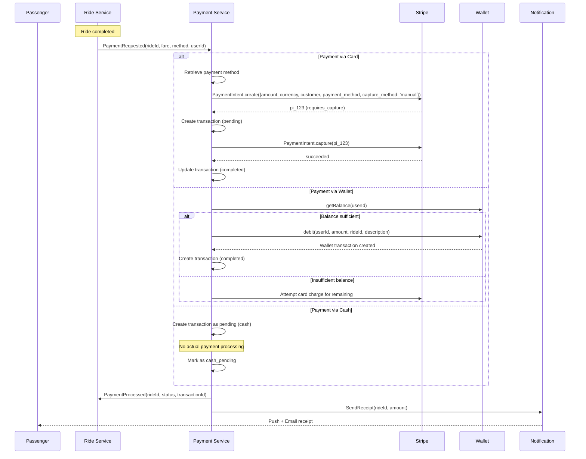
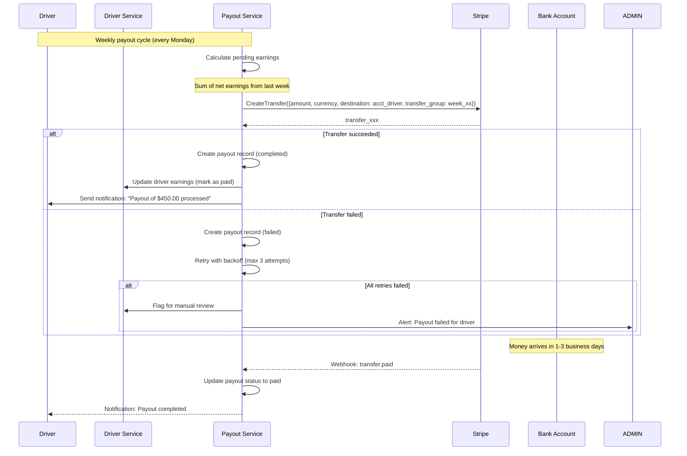

# Payment System

## 1. Overview

The Payment System handles the complete lifecycle of monetary transactions in the platform. It uses Stripe Connect for payment processing, supporting cards, wallets, and cash payments. The system handles passenger payments, driver payouts, refunds, and financial reconciliation.

## 2. Architecture



## 3. Payment Methods

### Supported Methods

| Method | Setup | Processing | Fee |
|---|---|---|---|
| Credit/Debit Card | Stripe Elements | Stripe Payment Intents | 2.9% + $0.30 |
| Wallet | Pre-funded balance | Internal ledger | No fee |
| Cash | No setup | Manual collection | No fee |

### Card Tokenization Flow



## 4. Ride Payment Flow



## 5. Wallet System

### Wallet Operations

```java
@Service
public class WalletService {

    @Transactional
    public WalletTransaction credit(UUID userId, BigDecimal amount, String referenceType, UUID referenceId, String description) {
        Wallet wallet = walletRepository.findByUserIdWithLock(userId)
            .orElseThrow(() -> new WalletNotFoundException(userId));

        BigDecimal balanceBefore = wallet.getBalance();
        wallet.setBalance(balanceBefore.add(amount));
        walletRepository.save(wallet);

        WalletTransaction txn = WalletTransaction.builder()
            .walletId(wallet.getId())
            .transactionType("credit")
            .amount(amount)
            .balanceBefore(balanceBefore)
            .balanceAfter(wallet.getBalance())
            .referenceType(referenceType)
            .referenceId(referenceId)
            .description(description)
            .build();

        return walletTransactionRepository.save(txn);
    }

    @Transactional
    public WalletTransaction debit(UUID userId, BigDecimal amount, String referenceType, UUID referenceId, String description) {
        Wallet wallet = walletRepository.findByUserIdWithLock(userId)
            .orElseThrow(() -> new WalletNotFoundException(userId));

        if (wallet.getBalance().compareTo(amount) < 0) {
            throw new InsufficientBalanceException(wallet.getBalance(), amount);
        }

        BigDecimal balanceBefore = wallet.getBalance();
        wallet.setBalance(balanceBefore.subtract(amount));
        walletRepository.save(wallet);

        WalletTransaction txn = WalletTransaction.builder()
            .walletId(wallet.getId())
            .transactionType("debit")
            .amount(amount.negate())
            .balanceBefore(balanceBefore)
            .balanceAfter(wallet.getBalance())
            .referenceType(referenceType)
            .referenceId(referenceId)
            .description(description)
            .build();

        return walletTransactionRepository.save(txn);
    }
}
```

## 6. Driver Payout Flow



### Payout Calculation

```java
public class PayoutCalculator {

    public PayoutBatch calculateWeeklyPayouts() {
        LocalDate weekStart = LocalDate.now().minusWeeks(1).with(DayOfWeek.MONDAY);
        LocalDate weekEnd = weekStart.plusDays(7);

        List<DriverEarnings> earnings = driverEarningsRepository
            .findUnpaidEarningsBetween(weekStart, weekEnd);

        Map<UUID, BigDecimal> groupedByDriver = earnings.stream()
            .collect(Collectors.groupingBy(
                DriverEarnings::getDriverId,
                Collectors.reducing(
                    BigDecimal.ZERO,
                    DriverEarnings::getNetAmount,
                    BigDecimal::add
                )
            ));

        return new PayoutBatch(groupedByDriver, weekStart, weekEnd);
    }
}
```

## 7. Refund Flow

```java
@Service
public class RefundService {

    @Transactional
    public Refund processRefund(
        UUID rideId,
        BigDecimal amount,
        String reason,
        UUID processedBy
    ) {
        // 1. Find original transaction
        Transaction originalTransaction = transactionRepository
            .findByRideIdAndType(rideId, "ride_payment")
            .orElseThrow(() -> new TransactionNotFoundException(rideId));

        // 2. Process refund via Stripe
        RefundCreateParams params = RefundCreateParams.builder()
            .setPaymentIntent(originalTransaction.getStripePaymentIntentId())
            .setAmount(amount.multiply(BigDecimal.valueOf(100)).longValue()) // cents
            .setReason(RefundCreateParams.Reason.valueOf(reason.toUpperCase()))
            .build();

        StripeRefund stripeRefund = StripeRefund.create(params);

        // 3. Update original transaction
        originalTransaction.setStatus("refunded");
        transactionRepository.save(originalTransaction);

        // 4. Create refund record
        Refund refund = Refund.builder()
            .transactionId(originalTransaction.getId())
            .rideId(rideId)
            .amount(amount)
            .reason(reason)
            .status("completed")
            .stripeRefundId(stripeRefund.getId())
            .processedBy(processedBy)
            .build();

        refund = refundRepository.save(refund);

        // 5. If paid by wallet, credit back
        if ("wallet".equals(originalTransaction.getPaymentMethod())) {
            walletService.credit(originalTransaction.getUserId(), amount,
                "ride_refund", rideId, "Refund for ride " + rideId);
        }

        return refund;
    }
}
```

## 8. Commission Calculation

```java
public class CommissionCalculator {

    private static final BigDecimal DEFAULT_COMMISSION_RATE = new BigDecimal("0.15"); // 15%

    public CommissionBreakdown calculateCommission(Ride ride, BigDecimal totalFare) {
        // Platform commission
        BigDecimal commissionRate = getCommissionRate(ride.getRideType());
        BigDecimal commission = totalFare.multiply(commissionRate);

        // Driver net earnings
        BigDecimal driverNet = totalFare.subtract(commission);

        // Add tips (100% to driver)
        BigDecimal tipAmount = ride.getTipAmount() != null ? ride.getTipAmount() : BigDecimal.ZERO;
        driverNet = driverNet.add(tipAmount);

        return new CommissionBreakdown(
            totalFare,
            commission,
            driverNet,
            commissionRate,
            tipAmount
        );
    }

    private BigDecimal getCommissionRate(String rideType) {
        // Different rates per ride type
        return switch (rideType) {
            case "economy" -> new BigDecimal("0.15");  // 15%
            case "comfort" -> new BigDecimal("0.18");  // 18%
            case "premium" -> new BigDecimal("0.20");  // 20%
            case "xl" -> new BigDecimal("0.17");       // 17%
            default -> DEFAULT_COMMISSION_RATE;
        };
    }
}
```

## 9. Stripe Webhook Handler

```java
@RestController
public class StripeWebhookController {

    @PostMapping("/webhook/stripe")
    public ResponseEntity<String> handleWebhook(
        @RequestBody String payload,
        @RequestHeader("Stripe-Signature") String sigHeader
    ) {
        Event event = Webhook.constructEvent(payload, sigHeader, webhookSecret);

        return switch (event.getType()) {
            case "payment_intent.succeeded" -> handlePaymentSucceeded(event);
            case "payment_intent.payment_failed" -> handlePaymentFailed(event);
            case "transfer.created" -> handleTransferCreated(event);
            case "transfer.paid" -> handleTransferPaid(event);
            case "transfer.failed" -> handleTransferFailed(event);
            default -> ResponseEntity.ok().build();
        };
    }

    private ResponseEntity<String> handlePaymentSucceeded(Event event) {
        PaymentIntent intent = (PaymentIntent) event.getDataObjectDeserializer()
            .getObject().orElseThrow();

        // Update transaction status
        transactionRepository.findByStripePaymentIntentId(intent.getId())
            .ifPresent(txn -> {
                txn.setStatus("completed");
                txn.setGatewayResponse(parseEventData(event));
                transactionRepository.save(txn);
            });

        return ResponseEntity.ok().build();
    }

    private ResponseEntity<String> handlePaymentFailed(Event event) {
        PaymentIntent intent = (PaymentIntent) event.getDataObjectDeserializer()
            .getObject().orElseThrow();

        // Update transaction status
        transactionRepository.findByStripePaymentIntentId(intent.getId())
            .ifPresent(txn -> {
                txn.setStatus("failed");
                txn.setGatewayResponse(parseEventData(event));
                transactionRepository.save(txn);
            });

        // Notify user
        notificationService.sendPaymentFailed(intent.getId());

        return ResponseEntity.ok().build();
    }
}
```

## 10. Receipt Generation

```java
@Service
public class ReceiptService {

    public Receipt generateReceipt(UUID rideId) {
        Ride ride = rideRepository.findById(rideId)
            .orElseThrow(() -> new RideNotFoundException(rideId));

        CommissionBreakdown commission = commissionCalculator
            .calculateCommission(ride, ride.getTotalFare());

        return Receipt.builder()
            .receiptNumber(generateReceiptNumber())
            .rideId(ride.getId())
            .passengerName(ride.getPassenger().getProfile().getFullName())
            .driverName(ride.getDriver().getProfile().getFullName())
            .pickupAddress(ride.getPickupAddress())
            .destAddress(ride.getDestAddress())
            .rideType(ride.getRideType())
            .date(ride.getCompletedAt())
            .distance(ride.getActualDistance())
            .duration(ride.getActualDuration())
            .baseFare(ride.getBaseFare())
            .distanceCharge(ride.getDistanceCharge())
            .timeCharge(ride.getTimeCharge())
            .surgeMultiplier(ride.getSurgeMultiplier())
            .promoDiscount(ride.getPromoDiscount())
            .totalFare(ride.getTotalFare())
            .commission(commission.getCommission())
            .driverPayout(commission.getDriverNet())
            .paymentMethod(ride.getPaymentMethod())
            .paymentStatus(ride.getPaymentStatus())
            .build();
    }
}
```

## 11. Reconciliation

```java
@Scheduled(cron = "0 0 3 * * ?") // Daily at 3 AM
public void reconcileTransactions() {
    LocalDate yesterday = LocalDate.now().minusDays(1);

    // Get all Stripe transactions from yesterday
    List<Transaction> localTxns = transactionRepository
        .findByCreatedAtBetween(yesterday.atStartOfDay(), yesterday.atTime(LocalTime.MAX));

    // Query Stripe balance transactions
    List<BalanceTransaction> stripeTxns = stripeClient
        .getBalanceTransactions(yesterday);

    // Compare
    for (Transaction local : localTxns) {
        boolean matched = stripeTxns.stream()
            .anyMatch(stripe -> stripe.getId().equals(local.getStripePaymentIntentId()));

        if (!matched && !"cash".equals(local.getPaymentMethod())) {
            // Flag for investigation
            reconciliationRepository.save(new ReconciliationFlag(
                local.getId(), "MISSING_IN_STRIPE", local.getAmount()
            ));
        }
    }
}
```

## 12. Database Transaction Isolation

```java
@Transactional(isolation = Isolation.REPEATABLE_READ)
public void processRidePayment(UUID rideId) {
    // All payment operations within single transaction
    // Repeatable read prevents phantom reads on wallet balance
}
```

## 13. Error Handling

| Error | Scenario | Handling |
|---|---|---|
| Insufficient funds | Card declined | Retry with different card, fallback to wallet, notify user |
| Stripe API down | Network/Stripe outage | Queue payment, retry with exponential backoff (max 5) |
| Duplicate payment | Idempotency key collision | Return existing transaction |
| Wallet insufficient | Wallet balance < fare | Attempt card charge, fail if no card |
| Payout failed | Invalid bank account | Flag for manual review, notify driver |
