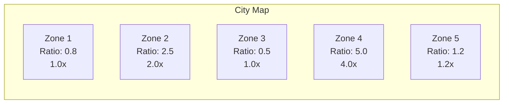
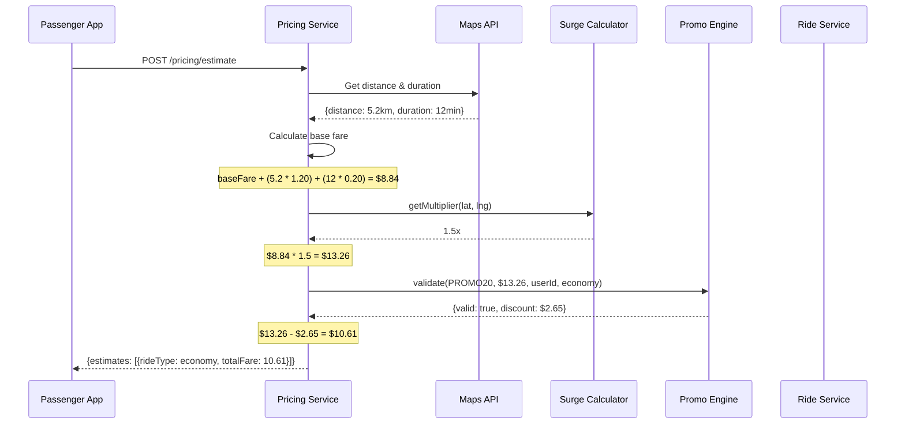

# Pricing Engine

## 1. Overview

The Pricing Engine calculates fares dynamically based on multiple factors: base fare, distance, time, demand/supply (surge), and promotions. It supports multiple ride types with different rate structures.

## 2. Fare Calculation Formula

### Base Formula

```
totalFare = max(minimumFare, baseFare + distanceCharge + timeCharge) × surgeMultiplier - promoDiscount
```

### Component Breakdown

```
distanceCharge = distanceKm × perKmRate
timeCharge = durationMinutes × perMinuteRate
surgeMultiplier = calculateSurgeMultiplier(pickupZone)
promoDiscount = calculatePromoDiscount(promoCode, subtotal)
```

### Per Ride Type Configuration

| Ride Type | Base Fare | Per Km Rate | Per Min Rate | Minimum Fare | Cancellation Fee |
|---|---|---|---|---|---|
| Economy | $2.50 | $1.20/km | $0.20/min | $5.00 | $2.50 |
| Comfort | $4.00 | $1.60/km | $0.25/min | $7.00 | $3.50 |
| Premium | $7.00 | $2.00/km | $0.30/min | $10.00 | $5.00 |
| XL | $5.00 | $1.80/km | $0.25/min | $8.00 | $4.00 |

## 3. Distance & Duration Estimation

```java
public class RouteEstimator {

    @Autowired
    private MapsApiClient mapsClient;

    public RouteEstimate estimateRoute(
        double pickupLat, double pickupLng,
        double destLat, double destLng
    ) {
        // Check cache first
        String cacheKey = String.format("route:%s:%s",
            hashCoordinates(pickupLat, pickupLng),
            hashCoordinates(destLat, destLng));

        RouteEstimate cached = routeCache.get(cacheKey);
        if (cached != null) return cached;

        // Call Google Maps Distance Matrix API
        RouteResponse response = mapsClient.getDistanceMatrix(
            pickupLat + "," + pickupLng,
            destLat + "," + destLng
        );

        RouteEstimate estimate = new RouteEstimate(
            response.getDistanceInKm(),
            response.getDurationInMinutes(),
            response.getPolyline()
        );

        // Cache for 2 minutes (routes don't change quickly)
        routeCache.put(cacheKey, estimate, 2, TimeUnit.MINUTES);

        return estimate;
    }

    private String hashCoordinates(double lat, double lng) {
        // Round to 4 decimal places (~11m precision)
        return String.format("%.4f:%.4f", lat, lng);
    }
}
```

## 4. Fare Calculation Service

```java
@Service
public class PricingService {

    private final Map<String, RideTypePricing> pricingConfigs;

    public FareEstimate calculateEstimate(
        FareEstimateRequest request
    ) {
        // 1. Get route estimate
        RouteEstimate route = routeEstimator.estimateRoute(
            request.getPickupLat(), request.getPickupLng(),
            request.getDestLat(), request.getDestLng()
        );

        // 2. Get pricing config for ride type
        RideTypePricing config = pricingConfigs.get(request.getRideType());

        // 3. Calculate base components
        double baseFare = config.getBaseFare();
        double distanceCharge = route.getDistanceKm() * config.getPerKmRate();
        double timeCharge = route.getDurationMinutes() * config.getPerMinuteRate();

        double subtotal = baseFare + distanceCharge + timeCharge;
        double minimumFare = config.getMinimumFare();
        subtotal = Math.max(subtotal, minimumFare);

        // 4. Apply surge multiplier
        double surgeMultiplier = surgeCalculator.getMultiplier(
            request.getPickupLat(), request.getPickupLng()
        );
        double afterSurge = subtotal * surgeMultiplier;

        // 5. Apply promo code
        PromoResult promo = calculatePromoDiscount(
            request.getPromoCode(),
            afterSurge,
            request.getRideType()
        );

        double totalFare = afterSurge - promo.getDiscountAmount();
        totalFare = Math.max(totalFare, 0);

        // Return estimate
        return FareEstimate.builder()
            .rideType(request.getRideType())
            .baseFare(baseFare)
            .distanceCharge(distanceCharge)
            .timeCharge(timeCharge)
            .surgeMultiplier(surgeMultiplier)
            .promoDiscount(promo.getDiscountAmount())
            .totalFare(roundToCent(totalFare))
            .currency("USD")
            .distanceKm(route.getDistanceKm())
            .durationMinutes(route.getDurationMinutes())
            .etaMinutes(etaCalculator.getDriverETA(request.getPickupLat(), request.getPickupLng()))
            .build();
    }

    private double roundToCent(double value) {
        return Math.round(value * 100.0) / 100.0;
    }
}
```

## 5. Surge Pricing Algorithm

### Surge Detection

```java
@Component
public class SurgeCalculator {

    @Autowired
    private RedisTemplate redisTemplate;

    private static final double BASE_MULTIPLIER = 1.0;
    private static final double MAX_MULTIPLIER = 5.0;
    private static final int SURGE_UPDATE_INTERVAL_SECONDS = 120;

    @Scheduled(fixedRate = 120000) // Every 2 minutes
    public void recalculateSurgeZones() {
        // Divide city into hexagonal zones (~500m each)
        List<SurgeZone> zones = getCityZones();

        for (SurgeZone zone : zones) {
            // Count active ride requests in zone (demand)
            long demand = countRequestsInZone(zone);

            // Count available drivers in zone (supply)
            long supply = countDriversInZone(zone);

            // Calculate ratio
            double ratio = supply > 0 ? (double) demand / supply : demand * 2;

            // Determine multiplier
            double multiplier;
            if (ratio <= 1.0) {
                multiplier = 1.0; // No surge
            } else if (ratio <= 1.5) {
                multiplier = 1.2;
            } else if (ratio <= 2.0) {
                multiplier = 1.5;
            } else if (ratio <= 3.0) {
                multiplier = 2.0;
            } else if (ratio <= 4.0) {
                multiplier = 2.5;
            } else if (ratio <= 5.0) {
                multiplier = 3.0;
            } else if (ratio <= 7.0) {
                multiplier = 4.0;
            } else {
                multiplier = 5.0;
            }

            // Save multiplier to Redis with TTL
            String key = String.format("surge:zone:%s", zone.getId());
            redisTemplate.opsForValue().set(key, multiplier, SURGE_UPDATE_INTERVAL_SECONDS, TimeUnit.SECONDS);

            // Log surge event
            surgeHistoryRepository.save(new SurgeHistory(
                zone.getId(), multiplier, demand, supply
            ));
        }
    }

    public double getMultiplier(double latitude, double longitude) {
        // Find which zone this location falls in
        String zoneId = findZoneId(latitude, longitude);

        // Get multiplier from Redis
        String key = String.format("surge:zone:%s", zoneId);
        Double multiplier = redisTemplate.opsForValue().get(key);

        return multiplier != null ? multiplier : BASE_MULTIPLIER;
    }

    private long countRequestsInZone(SurgeZone zone) {
        // Count ride requests created in last 5 minutes within zone
        String key = "ride:requests:recent";
        return redisTemplate.opsForGeo()
            .radius(key, zone.getCenter(), new Distance(zone.getRadiusKm(), Metrics.KILOMETERS))
            .size();
    }

    private long countDriversInZone(SurgeZone zone) {
        // Count available drivers in zone
        String key = "driver:locations:online";
        return redisTemplate.opsForGeo()
            .radius(key, zone.getCenter(), new Distance(zone.getRadiusKm(), Metrics.KILOMETERS))
            .size();
    }
}
```

### Surge Multiplier Table

| Demand/Supply Ratio | Multiplier | Label |
|---|---|---|
| 0 - 1.0 | 1.0x | Normal |
| 1.0 - 1.5 | 1.2x | Light |
| 1.5 - 2.0 | 1.5x | Moderate |
| 2.0 - 3.0 | 2.0x | High |
| 3.0 - 4.0 | 2.5x | Very High |
| 4.0 - 5.0 | 3.0x | Peak |
| 5.0 - 7.0 | 4.0x | Extreme |
| 7.0+ | 5.0x | Max |

### Surge Geo-Fence Visualization



## 6. Promo Code Engine

```java
public class PromoEngine {

    public PromoResult validateAndApply(
        String code,
        double fare,
        String userId,
        String rideType
    ) {
        // 1. Find promo code
        PromoCode promo = promoCodeRepository
            .findByCodeAndIsActiveTrue(code)
            .orElseThrow(() -> new PromoNotFoundException(code));

        // 2. Validate
        validatePromo(promo, userId, rideType);

        // 3. Calculate discount
        double discountAmount;
        if ("percentage".equals(promo.getDiscountType())) {
            discountAmount = fare * (promo.getDiscountValue() / 100.0);
            // Apply max discount cap for percentage
            if (promo.getMaxDiscount() != null) {
                discountAmount = Math.min(discountAmount, promo.getMaxDiscount());
            }
        } else {
            // Fixed amount
            discountAmount = Math.min(promo.getDiscountValue(), fare);
        }

        return new PromoResult(true, discountAmount, promo.getCode());
    }

    private void validatePromo(PromoCode promo, String userId, String rideType) {
        LocalDateTime now = LocalDateTime.now();

        // Check date validity
        if (now.isBefore(promo.getValidFrom()) || now.isAfter(promo.getValidTo())) {
            throw new PromoExpiredException();
        }

        // Check global usage limit
        if (promo.getMaxUses() > 0) {
            long usageCount = promoUsageRepository.countByPromoId(promo.getId());
            if (usageCount >= promo.getMaxUses()) {
                throw new PromoExhaustedException();
            }
        }

        // Check per-user usage limit
        if (promo.getMaxUsesPerUser() > 0) {
            long userUsage = promoUsageRepository
                .countByPromoIdAndUserId(promo.getId(), userId);
            if (userUsage >= promo.getMaxUsesPerUser()) {
                throw new PromoAlreadyUsedException();
            }
        }

        // Check applicable ride types
        if (promo.getApplicableRideTypes() != null
            && promo.getApplicableRideTypes().length > 0) {
            boolean validType = Arrays.asList(promo.getApplicableRideTypes())
                .contains(rideType);
            if (!validType) {
                throw new PromoNotApplicableException(rideType);
            }
        }
    }
}
```

## 7. Fare Locking

When a passenger books a ride, the fare is locked to prevent surge changes during the matching process.

```java
public class FareLockService {

    private static final long FARE_LOCK_DURATION_MINUTES = 10;

    public FareLock lockFare(FareEstimate estimate, String userId) {
        String lockId = UUID.randomUUID().toString();

        FareLock fareLock = new FareLock(
            lockId,
            estimate.getTotalFare(),
            estimate.getSurgeMultiplier(),
            OffsetDateTime.now().plusMinutes(FARE_LOCK_DURATION_MINUTES)
        );

        // Store in Redis
        String key = "fare:lock:" + lockId;
        redisTemplate.opsForValue().set(key, fareLock, FARE_LOCK_DURATION_MINUTES, TimeUnit.MINUTES);

        return fareLock;
    }

    public FareLock verifyFareLock(String lockId) {
        String key = "fare:lock:" + lockId;
        FareLock lock = redisTemplate.opsForValue().get(key);

        if (lock == null) {
            throw new FareLockExpiredException();
        }

        if (lock.getExpiresAt().isBefore(OffsetDateTime.now())) {
            redisTemplate.delete(key);
            throw new FareLockExpiredException();
        }

        return lock;
    }
}
```

## 8. Pricing API Flow



## 9. Pricing Configuration Table

| Parameter | Description | Update Frequency |
|---|---|---|
| base_fare | Fixed starting fare | Monthly |
| per_km_rate | Cost per kilometer | Monthly |
| per_minute_rate | Cost per minute | Monthly |
| minimum_fare | Minimum charge | Monthly |
| cancellation_fee | Fee for cancelling after acceptance | Monthly |
| surge_max_multiplier | Maximum surge cap | Quarterly |
| surge_update_interval | How often surge recalculates | 2 minutes |
| surge_zone_size | Hex zone radius in km | Configurable |
| fare_lock_duration | How long fare is locked | 10 minutes |
