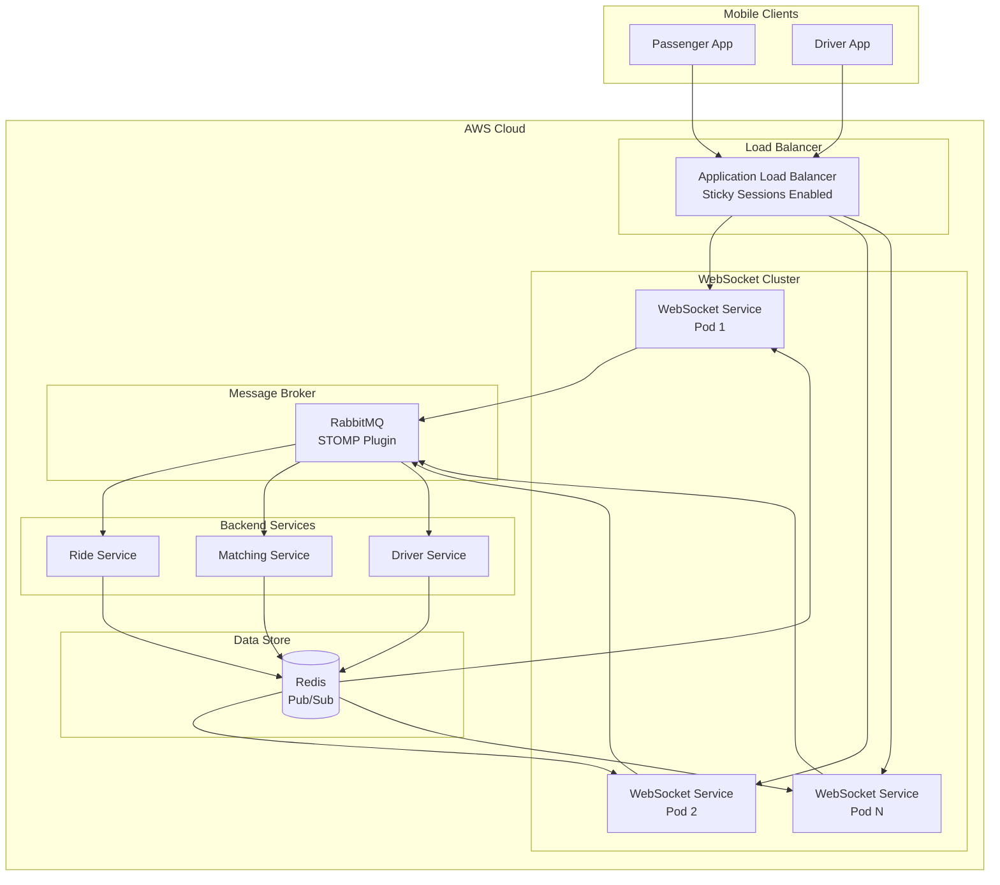
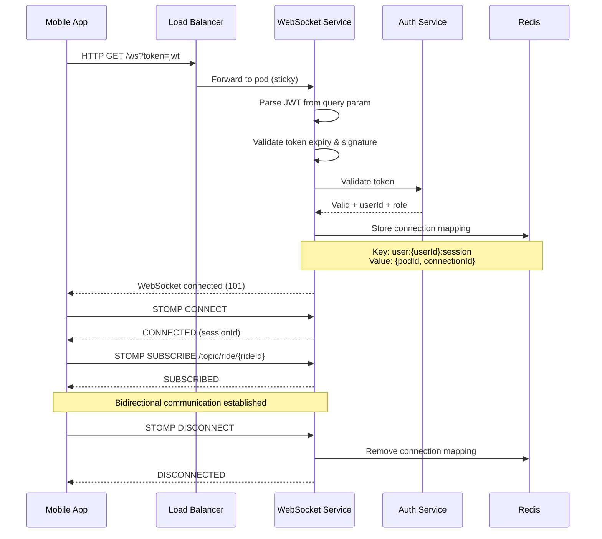
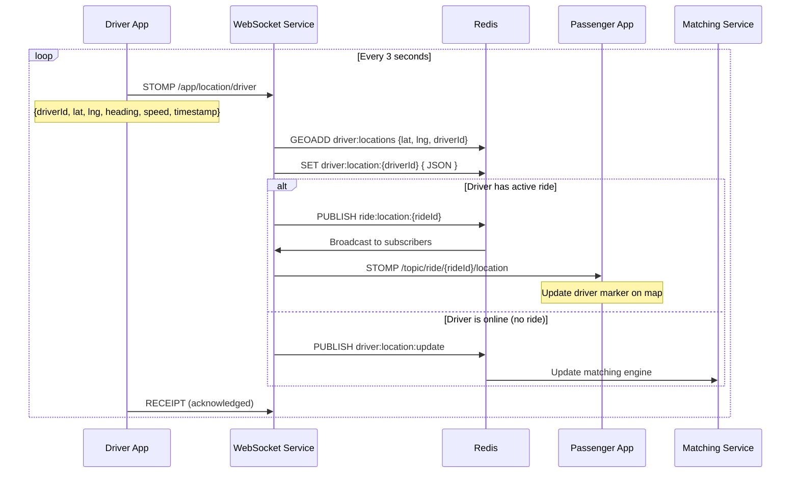
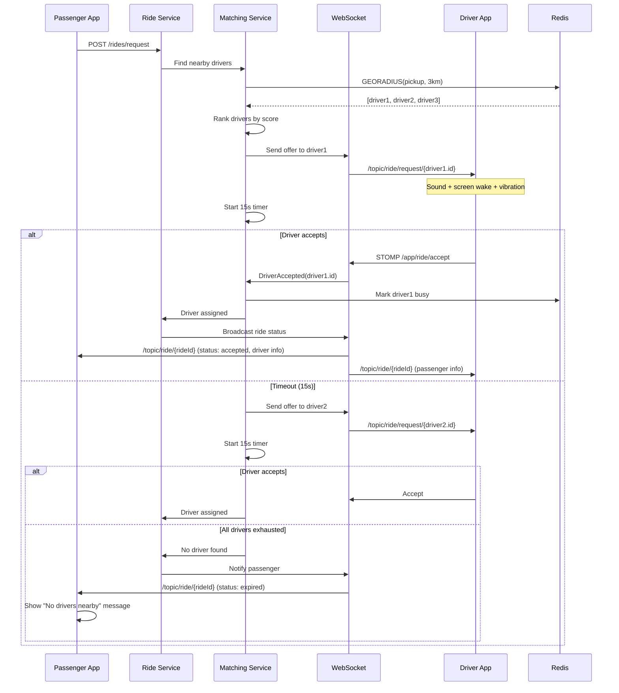

# Real-Time Architecture

## 1. Overview

The real-time system handles driver location updates, passenger tracking, ride status updates, and live ride requests. It uses WebSocket (STOMP over SockJS) for bi-directional communication between mobile apps and the server.

## 2. WebSocket Architecture



## 3. Connection Lifecycle



## 4. Driver Location Update Flow



### Location Update Protocol

| Field | Type | Description | Size |
|---|---|---|---|
| driverId | UUID | Driver identifier | 36 bytes |
| latitude | double | Current latitude | 8 bytes |
| longitude | double | Current longitude | 8 bytes |
| heading | float | Compass heading (0-360) | 4 bytes |
| speed | float | Speed in km/h | 4 bytes |
| accuracy | float | GPS accuracy in meters | 4 bytes |
| timestamp | long | Unix timestamp ms | 8 bytes |

**Total: ~72 bytes per update** (compressed with Protocol Buffers: ~35 bytes)

**Bandwidth calculation:**
- 1 update / 3 seconds per driver
- 10,000 online drivers: ~10,000/3 ≈ 3,333 updates/sec
- 3,333 × 72 bytes = ~240 KB/s inbound
- Broadcast to passenger: ~240 KB/s per active ride
- Active rides (~50%): 5,000 × 1 update/3s × 72B = ~120 KB/s outbound

## 5. Ride Request & Assignment Flow



## 6. WebSocket Implementation

### 6.1 Server Configuration (Spring Boot)

```java
@Configuration
@EnableWebSocketMessageBroker
public class WebSocketConfig implements WebSocketMessageBrokerConfigurer {

    @Override
    public void configureMessageBroker(MessageBrokerRegistry config) {
        // In-app broker for simple topics
        config.enableSimpleBroker("/topic", "/queue");

        // External broker (RabbitMQ) for cross-instance communication
        config.enableStompBrokerRelay("/topic", "/queue")
            .setRelayHost("rabbitmq")
            .setRelayPort(61613)
            .setClientLogin("guest")
            .setClientPasscode("guest");

        // Application destination prefix
        config.setApplicationDestinationPrefixes("/app");
    }

    @Override
    public void registerStompEndpoints(StompEndpointRegistry registry) {
        registry.addEndpoint("/ws")
            .setAllowedOriginPatterns("*")
            .setHandshakeHandler(new AuthenticatedHandshakeHandler())
            .withSockJS()
            .setClientLibraryUrl("https://cdn.jsdelivr.net/npm/sockjs-client@1/dist/sockjs.min.js");
    }

    @Override
    public boolean configureMessageConverters(List<MessageConverter> messageConverters) {
        // Use Jackson for JSON
        messageConverters.add(new MappingJackson2MessageConverter());
        // Use Protocol Buffers for location updates
        messageConverters.add(new ProtobufMessageConverter());
        return false;
    }
}
```

### 6.2 Authentication Handler

```java
public class AuthenticatedHandshakeHandler extends DefaultHandshakeHandler {

    @Autowired
    private JwtTokenProvider tokenProvider;

    @Override
    protected Principal determineUser(
        ServerHttpRequest request,
        WebSocketHandler wsHandler,
        Map<String, Object> attributes
    ) {
        String token = extractToken(request);

        if (token != null && tokenProvider.validateToken(token)) {
            String userId = tokenProvider.getUserId(token);
            String role = tokenProvider.getRole(token);

            // Add to attributes for use in controllers
            attributes.put("userId", userId);
            attributes.put("role", role);

            return new StompPrincipal(userId);
        }

        return null; // Reject connection
    }

    private String extractToken(ServerHttpRequest request) {
        // Extract from query param: /ws?access_token=jwt
        URI uri = request.getURI();
        String query = uri.getQuery();
        if (query != null && query.contains("access_token=")) {
            return query.split("access_token=")[1].split("&")[0];
        }
        return null;
    }
}
```

### 6.3 Location Controller

```java
@Controller
public class LocationController {

    @Autowired
    private RedisTemplate redisTemplate;

    @Autowired
    private SimpMessagingTemplate messagingTemplate;

    @MessageMapping("/location/driver")
    @SendTo("/topic/driver/location")
    public void handleDriverLocation(
        DriverLocationUpdate location,
        SimpMessageHeaderAccessor headerAccessor
    ) {
        String driverId = headerAccessor.getUser().getName();

        // 1. Update Redis geospatial index
        Point point = new Point(location.getLongitude(), location.getLatitude());
        redisTemplate.opsForGeo()
            .add("driver:locations:online", point, driverId);

        // 2. Cache latest location
        String locationKey = "driver:location:" + driverId;
        redisTemplate.opsForValue().set(locationKey, location, 30, TimeUnit.SECONDS);

        // 3. Check if driver has active ride (broadcast to passenger)
        String rideId = getActiveRideId(driverId);
        if (rideId != null) {
            messagingTemplate.convertAndSend(
                "/topic/ride/" + rideId + "/location",
                location
            );
        }
    }
}
```

### 6.4 Ride Status Publisher

```java
@Service
public class RideStatusWebSocketPublisher {

    @Autowired
    private SimpMessagingTemplate messagingTemplate;

    public void publishStatusUpdate(RideStatusUpdate update) {
        // Send to passenger
        messagingTemplate.convertAndSend(
            "/topic/ride/" + update.getRideId(),
            update
        );

        // Send to driver
        messagingTemplate.convertAndSend(
            "/topic/ride/driver/" + update.getRideId(),
            update
        );

        // If status is 'requested', also broadcast to nearby drivers
        if ("requested".equals(update.getStatus())) {
            messagingTemplate.convertAndSend(
                "/topic/ride/request/" + update.getPickupZoneId(),
                update
            );
        }
    }
}
```

## 7. Redis Integration

### 7.1 Pub/Sub for Cross-Instance Communication

```java
@Configuration
public class RedisPubSubConfig {

    @Bean
    public MessageListenerAdapter locationListener(LocationMessageHandler handler) {
        return new MessageListenerAdapter(handler, "handleMessage");
    }

    @Bean
    public RedisMessageListenerContainer container(
        RedisConnectionFactory factory,
        MessageListenerAdapter listener
    ) {
        RedisMessageListenerContainer container = new RedisMessageListenerContainer();
        container.setConnectionFactory(factory);
        container.addMessageListener(listener, new PatternTopic("ride:location:*"));
        return container;
    }
}

@Component
public class LocationMessageHandler {

    @Autowired
    private SimpMessagingTemplate messagingTemplate;

    public void handleMessage(String message, byte[] pattern) {
        String topic = new String(pattern);
        String rideId = topic.substring("ride:location:".length());

        // Broadcast to all WebSocket clients subscribed to this ride
        messagingTemplate.convertAndSend(
            "/topic/ride/" + rideId + "/location",
            message
        );
    }
}
```

## 8. Client Implementation (React Native)

```typescript
// services/websocket/WebSocketClient.ts
import { Client, IMessage } from '@stomp/stompjs';
import Config from '../config';
import { useActiveRideStore } from '../store/activeRideStore';

class WebSocketService {
  private client: Client;
  private subscriptions: Map<string, () => void> = new Map();

  constructor() {
    this.client = new Client({
      brokerURL: Config.WS_URL,
      connectHeaders: {},
      reconnectDelay: 5000,
      heartbeatIncoming: 10000,
      heartbeatOutgoing: 10000,
      onConnect: () => this.onConnected(),
      onDisconnect: () => this.onDisconnected(),
      onStompError: (frame) => this.onError(frame),
    });
  }

  connect(accessToken: string) {
    this.client.connectHeaders = {
      Authorization: `Bearer ${accessToken}`,
    };
    this.client.activate();
  }

  disconnect() {
    this.subscriptions.forEach((unsubscribe) => unsubscribe());
    this.subscriptions.clear();
    this.client.deactivate();
  }

  private onConnected() {
    console.log('WebSocket connected');
  }

  subscribeToRideUpdates(rideId: string) {
    const subscription = this.client.subscribe(
      `/topic/ride/${rideId}`,
      (message: IMessage) => {
        const update = JSON.parse(message.body);
        useActiveRideStore.getState().handleRideUpdate(update);
      }
    );

    this.subscriptions.set(`ride:${rideId}`, () => subscription.unsubscribe());
  }

  subscribeToDriverLocation(rideId: string) {
    const subscription = this.client.subscribe(
      `/topic/ride/${rideId}/location`,
      (message: IMessage) => {
        const location = JSON.parse(message.body);
        useActiveRideStore.getState().updateDriverLocation(location);
      }
    );

    this.subscriptions.set(`location:${rideId}`, () => subscription.unsubscribe());
  }

  sendDriverLocation(location: DriverLocationUpdate) {
    this.client.publish({
      destination: '/app/location/driver',
      body: JSON.stringify(location),
    });
  }

  acceptRide(rideId: string) {
    this.client.publish({
      destination: '/app/ride/accept',
      body: JSON.stringify({ rideId }),
    });
  }

  rejectRide(rideId: string) {
    this.client.publish({
      destination: '/app/ride/reject',
      body: JSON.stringify({ rideId }),
    });
  }

  private onDisconnected() {
    console.log('WebSocket disconnected');
  }

  private onError(frame: any) {
    console.error('WebSocket error:', frame);
  }
}

export const wsService = new WebSocketService();
```

## 9. Performance & Scaling

| Metric | Target |
|---|---|
| Connection capacity per pod | 10,000 concurrent WebSocket connections |
| Location update throughput | 50,000 updates/second per cluster |
| Message latency (P99) | < 100ms |
| Connection establishment | < 500ms |
| Reconnection | < 2s with exponential backoff |
| Pod scaling | HPA at 70% CPU or 8,000 connections |

## 10. WebSocket Event Catalog

| Event | Source | Destination | Payload |
|---|---|---|---|
| `ride.requested` | Server → Driver | `/topic/ride/request/{driverId}` | RideRequestDTO |
| `ride.accepted` | Server → Passenger | `/topic/ride/{rideId}` | RideAcceptedDTO |
| `ride.driver_arrived` | Server → Passenger | `/topic/ride/{rideId}` | StatusUpdateDTO |
| `ride.started` | Server → Passenger | `/topic/ride/{rideId}` | StatusUpdateDTO |
| `ride.completed` | Server → Passenger | `/topic/ride/{rideId}` | RideCompletedDTO |
| `ride.cancelled` | Server → Both | `/topic/ride/{rideId}` | CancelInfoDTO |
| `driver.location` | Server → Passenger | `/topic/ride/{rideId}/location` | LocationDTO |
| `driver.location` | Driver → Server | `/app/location/driver` | LocationDTO |
| `ride.offer` | Server → Driver | `/queue/ride/offers` | RideOfferDTO |
| `ride.accept` | Driver → Server | `/app/ride/accept` | AcceptDTO |
| `ride.reject` | Driver → Server | `/app/ride/reject` | RejectDTO |
