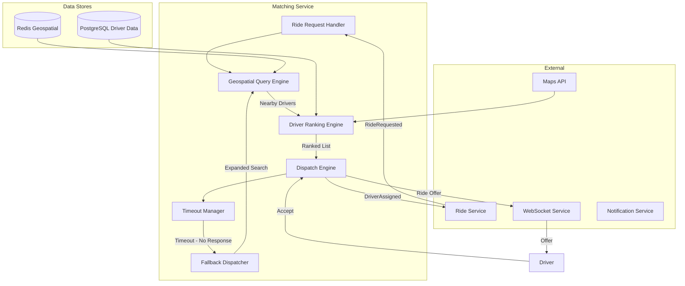
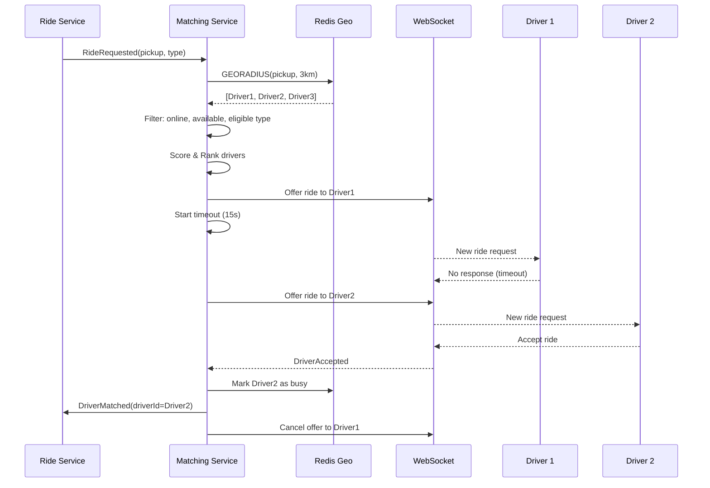
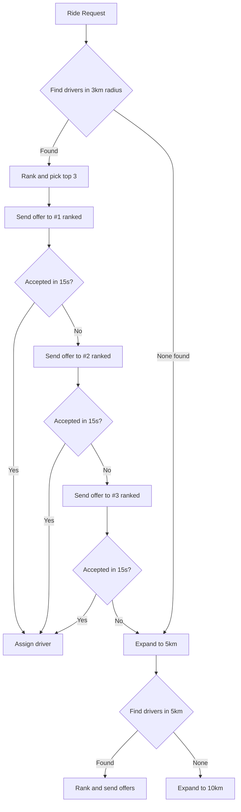

# Ride Matching Engine

## 1. Overview

The Ride Matching Engine is responsible for finding the optimal driver for each ride request. It balances passenger wait time, driver proximity, driver score, and platform efficiency.

## 2. Architecture



## 3. Matching Algorithm

### Step-by-Step Flow



## 4. Geospatial Query

### Redis Geospatial Index

```sql
-- Redis CLI
GEOADD driver:locations:online 13.4050 52.5200 "driver:uuid1"
GEOADD driver:locations:online 13.4100 52.5250 "driver:uuid2"

-- Find nearby drivers
GEORADIUS driver:locations:online 13.4080 52.5220 5 km WITHDIST WITHCOORD ASC COUNT 20
```

### Service Operation

```java
@Service
public class GeospatialQueryEngine {

    private final String GEO_KEY = "driver:locations:online";
    private final String GEO_KEY_BY_TYPE = "driver:locations:type:%s";

    public List<NearbyDriver> findNearbyDrivers(
        double latitude,
        double longitude,
        double radiusKm,
        String rideType,
        int maxResults
    ) {
        // Query by ride type for better performance
        String key = String.format(GEO_KEY_BY_TYPE, rideType);

        Set<RedisGeoCommands.GeoRadiusCommandArgs> args = RedisGeoCommands
            .GeoRadiusCommandArgs
            .newGeoRadiusArgs()
            .includeDistance()
            .includeCoordinates()
            .sortAscending()
            .limit(maxResults);

        return redisTemplate.opsForGeo()
            .radius(key, new Point(longitude, latitude), new Distance(radiusKm, Metrics.KILOMETERS), args)
            .stream()
            .map(this::toNearbyDriver)
            .collect(Collectors.toList());
    }
}
```

## 5. Driver Ranking Algorithm

### Scoring Formula

```
driverScore = (proximityScore × 0.40) + 
              (acceptanceRateScore × 0.20) + 
              (ratingScore × 0.20) + 
              (completionRateScore × 0.10) + 
              (experienceScore × 0.10)
```

### Component Scores

```java
public class DriverRankingEngine {

    public double calculateProximityScore(double distanceKm) {
        // Linear decay: 100 at 0km, 0 at 10km
        return Math.max(0, 100 - (distanceKm * 10));
    }

    public double calculateAcceptanceRateScore(double acceptanceRate) {
        // 100 for >95%, scaled down
        return Math.min(100, acceptanceRate * 1.05);
    }

    public double calculateRatingScore(double rating) {
        // 100 for 5.0, scaled
        return (rating / 5.0) * 100;
    }

    public double calculateCompletionRateScore(double completionRate) {
        return completionRate * 100; // 0-100
    }

    public double calculateExperienceScore(int totalRides) {
        // Logarithmic growth: 0 rides = 0, 100 rides = 50, 1000+ = 100
        return Math.min(100, Math.log10(totalRides + 1) * 33.3);
    }
}
```

### Ranking Execution

```java
public List<RankedDriver> rankDrivers(
    List<NearbyDriver> nearbyDrivers,
    RideRequest request
) {
    return nearbyDrivers.stream()
        .map(driver -> {
            DriverProfile profile = driverProfileCache.get(driver.getDriverId());
            double score = rankingEngine.calculateFinalScore(driver, profile);
            return new RankedDriver(driver, score);
        })
        .sorted(Comparator.comparing(RankedDriver::getScore).reversed())
        .collect(Collectors.toList());
}
```

## 6. Dispatch Algorithm

### Progressive Dispatch



### Dispatch Algorithm Pseudocode

```java
public class DispatchEngine {

    private static final int INITIAL_RADIUS_KM = 3;
    private static final int MAX_RADIUS_KM = 20;
    private static final int DRIVERS_PER_TIER = 3;
    private static final long OFFER_TIMEOUT_SECONDS = 15;
    private static final int MAX_TOTAL_OFFERS = 15;

    public DispatchResult dispatchRide(RideRequest request) {
        int currentRadius = INITIAL_RADIUS_KM;
        int totalOffersSent = 0;

        while (currentRadius <= MAX_RADIUS_KM && totalOffersSent < MAX_TOTAL_OFFERS) {
            List<NearbyDriver> nearbyDrivers = geoEngine.findNearbyDrivers(
                request.getPickupLatitude(),
                request.getPickupLongitude(),
                currentRadius,
                request.getRideType(),
                DRIVERS_PER_TIER
            );

            if (nearbyDrivers.isEmpty()) {
                currentRadius += 2;
                continue;
            }

            List<RankedDriver> rankedDrivers = rankingEngine.rankDrivers(nearbyDrivers, request);

            for (RankedDriver rankedDriver : rankedDrivers) {
                totalOffersSent++;
                OfferResult result = sendOfferAndWait(rankedDriver, request, OFFER_TIMEOUT_SECONDS);

                if (result.isAccepted()) {
                    return DispatchResult.accepted(
                        rankedDriver.getDriverId(),
                        totalOffersSent
                    );
                }

                if (result.isRejected()) {
                    continue; // Try next driver
                }
                // Timeout: continue to next
            }

            currentRadius += 2;
        }

        return DispatchResult.noDriverFound();
    }

    private OfferResult sendOfferAndWait(RankedDriver driver, RideRequest request, long timeoutSecs) {
        // Send WebSocket notification to driver
        websocketService.sendToDriver(
            driver.getDriverId(),
            new RideOfferEvent(request)
        );

        // Wait for response or timeout
        CompletableFuture<OfferResponse> future = offerResponseRegistry.register(driver.getDriverId());

        try {
            OfferResponse response = future.get(timeoutSecs, TimeUnit.SECONDS);
            return response.isAccepted()
                ? OfferResult.accepted()
                : OfferResult.rejected(response.getRejectionReason());
        } catch (TimeoutException e) {
            return OfferResult.timeout();
        }
    }
}
```

## 7. Driver Batch Dispatch (Optimization)

For high-volume scenarios, use batch dispatch:

```java
public class BatchDispatchEngine {
    public void processRideRequests() {
        // Collect pending requests for last 2 seconds
        List<RideRequest> batch = rideRequestBuffer.drainBatch();

        // For each request, find potential drivers
        Map<UUID, List<UUID>> requestToDrivers = new HashMap<>();
        for (RideRequest request : batch) {
            List<NearbyDriver> drivers = geoEngine.findActiveDrivers(
                request.getPickupPoint(), 5.0, null);
            requestToDrivers.put(request.getId(), drivers.stream()
                .map(NearbyDriver::getDriverId)
                .collect(Collectors.toList()));
        }

        // Solve assignment as bipartite matching (Hungarian algorithm)
        Map<UUID, UUID> assignment = solveOptimalAssignment(batch, requestToDrivers);

        // Dispatch
        assignment.forEach((rideId, driverId) -> {
            sendOffer(driverId, rideId);
        });
    }
}
```

## 8. ETA Calculation

```java
public class ETACalculator {

    @Autowired
    private MapsApiClient mapsClient;

    public ETAEstimate calculateETA(
        double driverLat,
        double driverLng,
        double pickupLat,
        double pickupLng
    ) {
        // Use cached result if available
        String cacheKey = String.format("eta:%.4f:%.4f:%.4f:%.4f",
            driverLat, driverLng, pickupLat, pickupLng);

        ETAEstimate cached = redisTemplate.opsForValue().get(cacheKey);
        if (cached != null) return cached;

        // Call Maps API for route-based ETA
        RouteInfo route = mapsClient.getRoute(
            driverLat, driverLng,
            pickupLat, pickupLng
        );

        ETAEstimate estimate = new ETAEstimate(
            route.getDistanceKm(),
            route.getDurationSeconds(),
            route.getPolyline()
        );

        // Cache for 30 seconds
        redisTemplate.opsForValue().set(cacheKey, estimate, 30, TimeUnit.SECONDS);

        return estimate;
    }

    public int calculateArrivalBanner(int durationSeconds) {
        // Round up to nearest minute
        return (int) Math.ceil(durationSeconds / 60.0);
    }
}
```

## 9. Redis Data Structures

| Key | Type | Purpose | TTL |
|---|---|---|---|
| `driver:locations:online` | GeoSet | All online driver locations | Persistent |
| `driver:locations:type:economy` | GeoSet | Economy drivers | Persistent |
| `driver:status:{id}` | String | Online/Busy/Offline | Persistent |
| `driver:active_requests:{id}` | Set | Pending ride offers for driver | 5 min |
| `ride:request:{id}` | Hash | Active ride request details | 10 min |
| `eta:{lat}:{lng}:{lat}:{lng}` | String | Cached ETA | 30 sec |
| `driver:score:{id}` | ZSet | Driver scores by type | 5 min |
| `matching:batch:{batchId}` | Set | Current matching batch | 30 sec |

## 10. Surge-Aware Matching

```java
public class SurgeAwareMatching {
    // During surge, adjust driver ranking to prioritize
    // drivers closer to surge zones
    public List<RankedDriver> rankForSurgeZone(
        RideRequest request,
        SurgeZone surgeZone
    ) {
        List<NearbyDriver> drivers = geoEngine.findNearbyDrivers(
            request, 5.0
        );

        return drivers.stream()
            .map(d -> {
                double baseScore = rankingEngine.calculateScore(d);
                double surgeBonus = isInSurgeZone(d, surgeZone) ? 15.0 : 0;
                return new RankedDriver(d, baseScore + surgeBonus);
            })
            .sorted(Comparator.reverseOrder())
            .collect(Collectors.toList());
    }
}
```

## 11. Performance Targets

| Metric | Target |
|---|---|
| Geospatial query | < 50ms |
| Driver ranking (100 drivers) | < 100ms |
| Ride offer delivery | < 500ms |
| Full match cycle (driver found) | < 3s |
| Max drivers queried per request | 500 |
| Concurrent matching capacity | 1000 req/s per instance |
