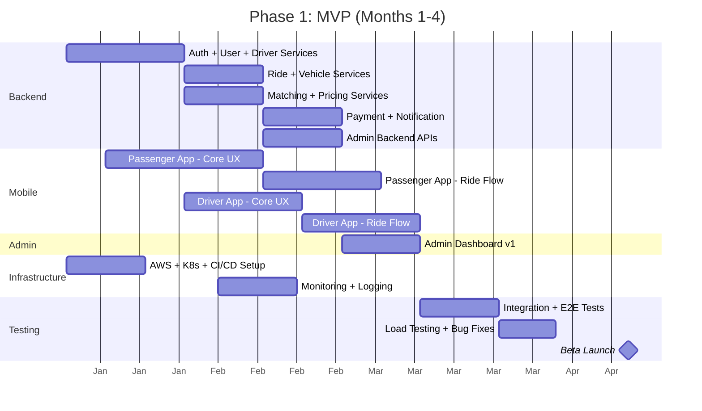
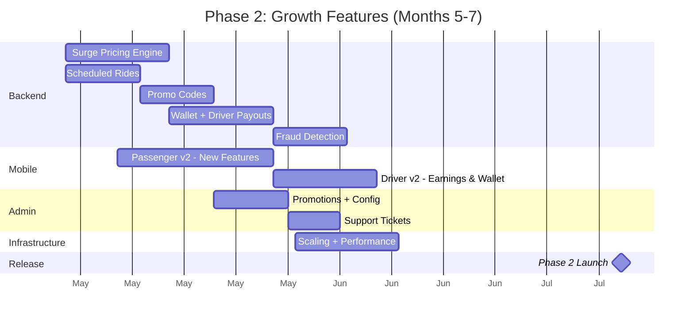
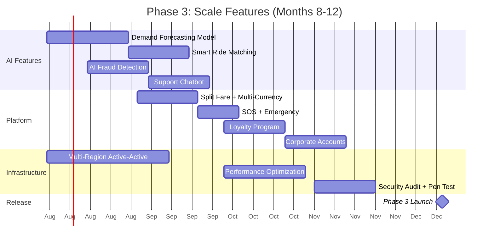
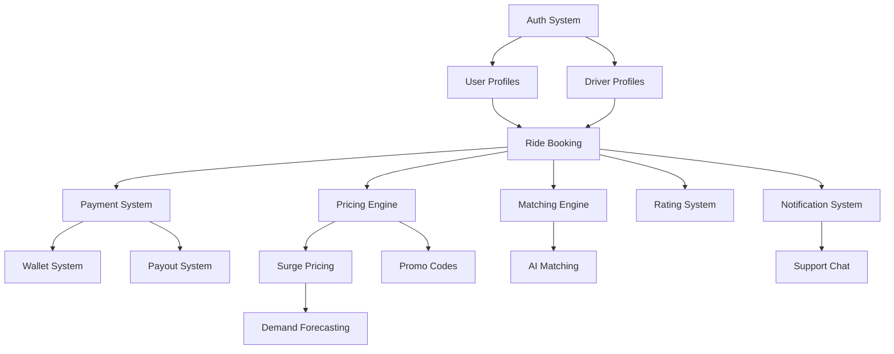
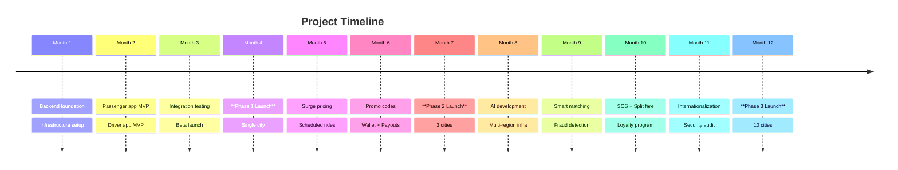

# Development Roadmap

## Overview

The ride-hailing platform will be delivered in three phases over approximately 9-12 months with a team of 12-16 engineers.

## Team Structure

| Role | Count | Phase |
|---|---|---|
| Mobile Engineers (React Native) | 3 | All |
| Backend Engineers (Java/Spring) | 5 | All |
| DevOps Engineer | 1 | All |
| QA Engineer | 2 | All |
| Product Manager | 1 | All |
| UI/UX Designer | 1 | Phase 1 |
| Data Scientist | 1 | Phase 3 |
| Tech Lead / Architect | 1 | All |

---

## Phase 1: MVP (Months 1-4)

### Objectives
- Launch core ride-hailing functionality in a single city
- Prove product-market fit with minimum features
- Support 500 concurrent users, 100 drivers

### Deliverables

| Component | Features | Est. Effort |
|---|---|---|
| **Backend Core** | Auth Service, User Service, Driver Service, Vehicle Service, Ride Service, Basic Pricing | 6 weeks |
| **Matching Engine** | Basic geospatial matching (Redis GEO), driver ranking, ETA | 3 weeks |
| **Payment** | Stripe integration, card payments only, basic wallet | 3 weeks |
| **Notification** | Push notifications (FCM), basic email (SES) | 2 weeks |
| **Passenger App v1** | Registration/login, phone verification, map view, location search, fare estimate, book ride, driver tracking (basic), ride history, rating | 8 weeks |
| **Driver App v1** | Registration, document upload, online/offline, accept/reject rides, basic navigation, ride flow, earnings view | 6 weeks |
| **Admin Dashboard** | Dashboard KPIs, user/driver management, ride view, basic reports | 4 weeks |
| **Infrastructure** | AWS setup, EKS cluster, RDS, Redis, CI/CD pipeline, monitoring | 3 weeks |

### Backend Services for MVP

| Service | MVP Features |
|---|---|
| Auth Service | Register, login, OTP, JWT, social login (Google only) |
| User Service | Profile CRUD, favorites |
| Driver Service | Basic profile, document upload, online/offline |
| Vehicle Service | Vehicle registration, basic types (Economy only) |
| Ride Service | Full ride lifecycle (request → complete/cancel) |
| Matching Service | Redis GEO radius search, basic ETA |
| Pricing Service | Base fare + distance/time, no surge, no promos |
| Payment Service | Card payment via Stripe, basic wallet |
| Notification Service | Push via FCM, email via SES |
| Analytics Service | Basic event logging, dashboard endpoints |

### Timeline (Gantt)

### Risks & Mitigation

| Risk | Impact | Mitigation |
|---|---|---|
| GPS accuracy issues | Poor driver tracking | Use Google Fused Location, Kalman filtering |
| Stripe integration complexity | Delayed payments | Start with Stripe Checkout, upgrade to Elements later |
| Map integration bugs | Broken UX | Prototype map views early, test on real devices |
| Matching latency > 5s | Poor user experience | Optimize Redis queries, pre-compute ETA |
| Regulatory compliance | Legal blockers | Engage legal team in month 1, implement GDPR baseline |

### Success Criteria

- [ ] 500 passenger registrations in first month
- [ ] 100 active drivers onboarded
- [ ] Ride matching time < 3 seconds P95
- [ ] App crash rate < 0.5%
- [ ] Payment success rate > 95%
- [ ] App Store & Play Store approval

---

## Phase 2: Growth Features (Months 5-7)

### Objectives
- Expand ride types and add surge pricing
- Implement scheduled rides and promo codes
- Scale to 5,000 concurrent users, 500 drivers
- Launch in 3 cities

### Deliverables

| Component | Features | Est. Effort |
|---|---|---|
| **Backend** | Scheduled rides, surge pricing engine, promo codes, SMS notifications, admin fraud detection | 5 weeks |
| **Matching** | Surge-aware matching, batch dispatch optimization | 3 weeks |
| **Payment** | Wallet top-up, promo application, multiple payment methods, driver payouts | 3 weeks |
| **Passenger App** | Schedule rides, promo codes, wallet, favorite locations, share trip, multiple ride types (Comfort, Premium, XL) | 4 weeks |
| **Driver App** | Earnings dashboard, wallet, payout requests, destination filter, heat map | 4 weeks |
| **Admin** | Promotions management, pricing configuration, commission settings, support tickets | 3 weeks |
| **Infrastructure** | Auto-scaling tuning, read replicas, CDN setup, multi-region readiness | 2 weeks |

### New Features

| Feature | Description | Priority |
|---|---|---|
| Surge Pricing | Dynamic pricing based on demand/supply ratio | High |
| Scheduled Rides | Book rides up to 7 days in advance | High |
| Promo Codes | Percentage and fixed discounts with usage limits | High |
| Multiple Ride Types | Economy, Comfort, Premium, XL | High |
| Driver Payouts | Weekly automated Stripe transfers | High |
| Wallet System | Pre-funded wallet for faster payments | Medium |
| Share Trip | Real-time trip sharing with contacts | Medium |
| Support Tickets | In-app ticket creation and admin management | Medium |
| Fraud Detection | Rule-based fraud flagging system | Medium |
| Heat Map for Drivers | Show high-demand areas on driver map | Low |

### Timeline

### Success Criteria

- [ ] 5,000 active passengers
- [ ] 500 active drivers
- [ ] 25% increase in revenue from surge pricing
- [ ] 10% ride utilization via promo codes
- [ ] Driver payout satisfaction > 90%
- [ ] Fraud rate < 1% of transactions

---

## Phase 3: Scale Features (Months 8-12)

### Objectives
- AI-powered features (demand forecasting, smart matching)
- Enterprise-grade reliability and performance
- Scale to 50,000 concurrent users, 5,000 drivers
- Expand to 10 cities, internationalization

### Deliverables

| Component | Features | Est. Effort |
|---|---|---|
| **Backend** | AI matching optimization, demand forecasting, analytics pipeline, multi-language support | 8 weeks |
| **Matching** | ML-based driver scoring, predictive driver positioning | 6 weeks |
| **Payment** | Split fare, corporate billing, multi-currency | 4 weeks |
| **Passenger App** | AI recommendations, SOS feature, split fare, loyalty program, corporate accounts | 6 weeks |
| **Driver App** | Gamification, performance analytics, AI route suggestions | 5 weeks |
| **Admin** | Advanced analytics dashboard, AI fraud detection, custom report builder | 5 weeks |
| **Infrastructure** | Multi-region active-active, sharding, performance tuning | 6 weeks |
| **Testing** | Full security audit, penetration testing, chaos engineering | 4 weeks |

### New Features

| Feature | Description | Priority |
|---|---|---|
| AI Demand Forecasting | Predict high-demand areas and times for driver positioning | High |
| Smart Ride Matching | ML-based driver scoring optimizing for ETA and earnings | High |
| AI Fraud Detection | ML anomaly detection for payment and ride fraud | High |
| Split Fare | Multiple passengers split ride cost | Medium |
| SOS/Emergency | Emergency button with real-time alerts to security | Medium |
| Loyalty Program | Points-based rewards system | Medium |
| Corporate Accounts | B2B billing and reporting | Low |
| Multi-Currency | Support for multiple currencies across regions | Low |
| Gamification | Driver badges, challenges, leaderboards | Low |
| Customer Support Chatbot | AI chatbot for common support queries | Medium |

### Timeline

### Success Criteria

- [ ] 50,000 active passengers
- [ ] 5,000 active drivers
- [ ] 99.9% uptime SLA achieved
- [ ] Fraud detection > 99% accuracy
- [ ] App Store rating > 4.5
- [ ] Operations in 10+ cities

---

## Post-Launch Maintenance

| Activity | Frequency |
|---|---|
| Bug fixes & patches | Continuous |
| Performance monitoring | Daily |
| Security updates | Weekly |
| Data model migrations | Quarterly |
| Third-party API updates | As needed |
| Feature A/B testing | Bi-weekly |
| Infrastructure cost optimization | Monthly |

## Budget Estimate (Monthly)

| Item | Phase 1 | Phase 2 | Phase 3 |
|---|---|---|---|
| Engineering Salaries | $180,000 | $200,000 | $240,000 |
| AWS Infrastructure | $8,000 | $15,000 | $40,000 |
| Third-Party Services | $2,000 | $4,000 | $8,000 |
| Tools & Licenses | $3,000 | $4,000 | $5,000 |
| **Total Monthly** | **$193,000** | **$223,000** | **$293,000** |

## Dependency Tree

## Key Milestones

