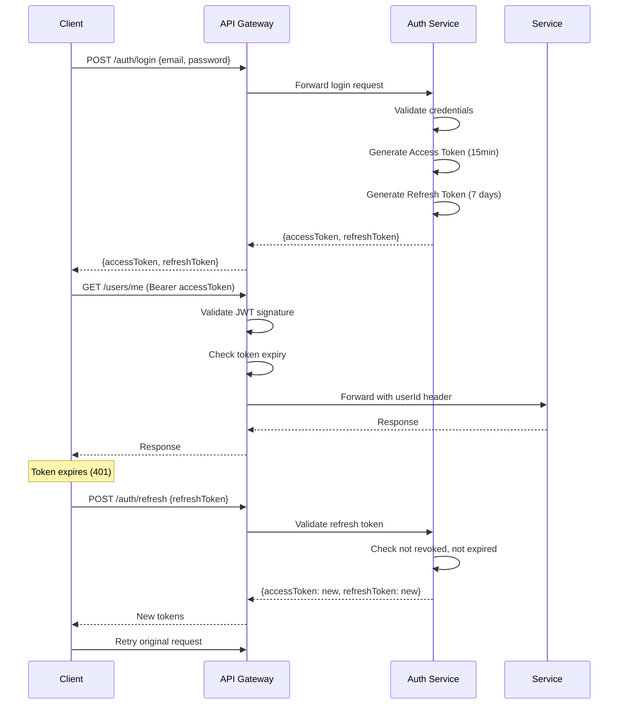

# Security Design

## 1. Authentication Architecture

### 1.1 JWT Token Flow



### 1.2 Token Structure

```json
// Access Token (JWT)
{
  "sub": "user-uuid",
  "role": "passenger",
  "iat": 1717740000,
  "exp": 1717740900,
  "iss": "ridesharing.com",
  "aud": "ridesharing-api",
  "jti": "unique-token-id",
  "deviceId": "device-uuid"
}

// Refresh Token (Opaque)
// Base64 encoded random 256-bit value
// Stored hashed (SHA-256) in database
```

### 1.3 Token Configuration

```yaml
jwt:
  access-token:
    expiration: 900          # 15 minutes
    secret: ${JWT_ACCESS_SECRET}
  refresh-token:
    expiration: 604800       # 7 days
    secret: ${JWT_REFRESH_SECRET}
  issuer: ridesharing.com
  audience: ridesharing-api
```

### 1.4 Password Hashing

```java
@Bean
public PasswordEncoder passwordEncoder() {
    return new BCryptPasswordEncoder(12); // 12 rounds of hashing
}

// Usage
String hash = passwordEncoder.encode("userPassword123!");
boolean matches = passwordEncoder.matches("userPassword123!", hash);
```

## 2. Authorization (RBAC)

### 2.1 Roles and Permissions

| Role | Permissions |
|---|---|
| `passenger` | Read own profile, create rides, manage own payments |
| `driver` | All passenger permissions + update ride status, view earnings |
| `admin` | Full access to all resources |
| `support` | Read users, read/write support tickets |
| `finance` | Read transactions, process refunds, manage payouts |
| `analytics` | Read-only dashboard and reports |

### 2.2 Spring Security Configuration

```java
@Configuration
@EnableWebSecurity
@EnableMethodSecurity
public class SecurityConfig {

    @Bean
    public SecurityFilterChain filterChain(HttpSecurity http) throws Exception {
        http
            .csrf(AbstractHttpConfigurer::disable)
            .sessionManagement(session -> session
                .sessionCreationPolicy(SessionCreationPolicy.STATELESS))
            .authorizeHttpRequests(auth -> auth
                .requestMatchers("/api/v1/auth/**").permitAll()
                .requestMatchers("/api/v1/payments/webhook/**").permitAll()
                .requestMatchers("/ws/**").permitAll()
                .requestMatchers("/swagger-ui/**", "/v3/api-docs/**").permitAll()
                .requestMatchers("/api/v1/admin/**").hasRole("ADMIN")
                .requestMatchers("/api/v1/drivers/**").hasAnyRole("DRIVER", "ADMIN")
                .requestMatchers("/api/v1/rides/**").authenticated()
                .requestMatchers("/api/v1/users/**").authenticated()
                .requestMatchers("/api/v1/payments/**").authenticated()
                .anyRequest().authenticated()
            )
            .oauth2ResourceServer(oauth2 -> oauth2
                .jwt(jwt -> jwt.jwtAuthenticationConverter(jwtAuthConverter())))
            .addFilterBefore(jwtAuthenticationFilter(), UsernamePasswordAuthenticationFilter.class);

        return http.build();
    }

    @Bean
    public JwtDecoder jwtDecoder() {
        return NimbusJwtDecoder.withSecretKey(
            new SecretKeySpec(jwtSecret.getBytes(), "HmacSHA256")
        ).build();
    }
}
```

### 2.3 Method-Level Security

```java
@RestController
@RequestMapping("/api/v1/admin")
public class AdminController {

    @GetMapping("/users")
    @PreAuthorize("hasRole('ADMIN')")
    public Page<UserDto> getUsers(@AuthenticationPrincipal Jwt jwt) {
        return userService.getAllUsers();
    }

    @PutMapping("/drivers/{id}/verify")
    @PreAuthorize("hasRole('ADMIN')")
    public DriverDto verifyDriver(@PathVariable UUID id, @RequestBody VerifyRequest request) {
        return driverService.verifyDriver(id, request);
    }
}
```

## 3. API Security

### 3.1 Rate Limiting

```yaml
# API Gateway rate limiting
spring:
  cloud:
    gateway:
      routes:
        - id: auth-service
          filters:
            - name: RequestRateLimiter
              args:
                redis-rate-limiter.replenishRate: 100  # requests per second
                redis-rate-limiter.burstCapacity: 200   # burst capacity
                redis-rate-limiter.requestedTokens: 1

# Per-endpoint rate limits
# Login: 5 attempts/minute per IP
# OTP: 3 attempts/minute per phone
# General API: 100 requests/minute per user
```

### 3.2 CORS Configuration

```java
@Bean
public CorsConfigurationSource corsConfigurationSource() {
    CorsConfiguration config = new CorsConfiguration();
    config.setAllowedOrigins(Arrays.asList(
        "https://admin.ridesharing.com",
        "https://*.ridesharing.com"
    ));
    config.setAllowedMethods(Arrays.asList("GET", "POST", "PUT", "DELETE", "PATCH"));
    config.setAllowedHeaders(Arrays.asList("*"));
    config.setExposedHeaders(Arrays.asList("Authorization"));
    config.setAllowCredentials(true);
    config.setMaxAge(3600L);

    UrlBasedCorsConfigurationSource source = new UrlBasedCorsConfigurationSource();
    source.registerCorsConfiguration("/**", config);
    return source;
}
```

### 3.3 Request Validation

```java
@Component
public class SecurityFilter {

    // Validate all request inputs
    @Override
    public void doFilter(ServletRequest request, ServletResponse response, FilterChain chain) {
        RequestWrapper wrappedRequest = new RequestWrapper((HttpServletRequest) request);

        // Validate content type
        if (request.getContentType() != null
            && !request.getContentType().startsWith("application/json")
            && !request.getContentType().startsWith("multipart/form-data")) {
            sendError(response, 415, "Unsupported Media Type");
            return;
        }

        // Validate request size
        if (request.getContentLengthLong() > 10_000_000) { // 10MB
            sendError(response, 413, "Request too large");
            return;
        }

        chain.doFilter(wrappedRequest, response);
    }
}
```

## 4. Data Encryption

### 4.1 At Rest

```yaml
# Database encryption (RDS)
# Enable RDS encryption at rest using AWS KMS
storage_encrypted: true
kms_key_id: alias/ridesharing-db-key

# Application-level sensitive data
encryption:
  pii:
    algorithm: AES-256-GCM
    key: ${PII_ENCRYPTION_KEY}
  # Fields encrypted at application level
  fields:
    - user_profiles.full_name
    - user_profiles.email
    - drivers.current_latitude
    - drivers.current_longitude
```

### 4.2 In Transit

```yaml
# TLS Configuration
server:
  ssl:
    enabled: true
    protocol: TLS
    enabled-protocols: [TLSv1.2, TLSv1.3]
    ciphers:
      - TLS_AES_256_GCM_SHA384
      - TLS_ECDHE_RSA_WITH_AES_256_GCM_SHA384

# Require HTTPS
security:
  require-https: true
  hsts:
    max-age: 31536000
    include-subdomains: true
    preload: true
```

## 5. OWASP Mitigations

### 5.1 SQL Injection

```java
// Use JPA/Criteria API (not raw SQL)
@Repository
public interface UserRepository extends JpaRepository<User, UUID> {
    // Parameterized query (safe)
    Optional<User> findByEmail(String email);

    // Native query with parameters (also safe)
    @Query(value = "SELECT * FROM users u WHERE u.email = :email", nativeQuery = true)
    Optional<User> findByEmailNative(@Param("email") String email);
}

// NEVER do this:
// String sql = "SELECT * FROM users WHERE email = '" + email + "'";
```

### 5.2 XSS Prevention

```java
@Component
public class XSSFilter implements Filter {
    @Override
    public void doFilter(ServletRequest request, ServletResponse response, FilterChain chain) {
        chain.doFilter(new XSSRequestWrapper((HttpServletRequest) request), response);
    }
}

class XSSRequestWrapper extends HttpServletRequestWrapper {
    @Override
    public String[] getParameterValues(String parameter) {
        String[] values = super.getParameterValues(parameter);
        if (values == null) return null;
        return Arrays.stream(values)
            .map(this::stripXSS)
            .toArray(String[]::new);
    }

    private String stripXSS(String value) {
        // Remove script tags, event handlers, etc.
        return Jsoup.clean(value, Whitelist.basic());
    }
}
```

### 5.3 CSRF

```java
// For admin web dashboard (cookie-based auth)
http.csrf(csrf -> csrf
    .csrfTokenRepository(CookieCsrfTokenRepository.withHttpOnlyFalse())
    .csrfTokenRequestHandler(new XorCsrfTokenRequestAttributeHandler())
);

// For mobile apps (token-based auth) - CSRF not needed
```

### 5.4 Security Headers

```java
@Bean
public Filter securityHeadersFilter() {
    return (request, response, chain) -> {
        HttpServletResponse res = (HttpServletResponse) response;
        res.setHeader("X-Content-Type-Options", "nosniff");
        res.setHeader("X-Frame-Options", "DENY");
        res.setHeader("X-XSS-Protection", "1; mode=block");
        res.setHeader("Strict-Transport-Security", "max-age=31536000; includeSubDomains");
        res.setHeader("Content-Security-Policy", "default-src 'self'");
        res.setHeader("Referrer-Policy", "strict-origin-when-cross-origin");
        res.setHeader("Permissions-Policy", "geolocation=(self), camera=(self)");
        chain.doFilter(request, response);
    };
}
```

## 6. Fraud Prevention

### 6.1 Fraud Detection Rules

| Rule | Description | Action |
|---|---|---|
| Multiple ride requests same pickup | Same user requesting >3 rides in 5 min | Flag, limit |
| Driver-passenger collusion | Same IP rides repeated with high fare | Flag, investigate |
| Abnormal fare patterns | Fares >3 SD from mean | Flag, review |
| Promo code abuse | Single code used >10x different devices | Block, flag |
| Payment method cycling | Multiple failed cards in short period | Temp block |
| New account fraud | Account <1 hour requesting high-value ride | Require card pre-auth |
| GPS spoofing | Location jump >500km in 1 minute | Flag, cancel ride |
| Fake driver | Account created with stolen documents | Background check fails |

### 6.2 Fraud Detection Service

```java
@Service
public class FraudDetectionService {

    private final List<FraudRule> rules;

    public FraudCheckResult evaluate(RideRequest request) {
        for (FraudRule rule : rules) {
            FraudRuleResult result = rule.evaluate(request);
            if (result.isFlagged()) {
                FraudFlag flag = createFraudFlag(request, result);
                if (result.getSeverity() == Severity.HIGH) {
                    // Block the ride request
                    return FraudCheckResult.blocked(flag, result.getReason());
                }
                return FraudCheckResult.flagged(flag, result.getReason());
            }
        }
        return FraudCheckResult.passed();
    }

    // Rule: New account with high-value ride
    class NewAccountHighValueRule implements FraudRule {
        @Override
        public FraudRuleResult evaluate(RideRequest request) {
            User user = userRepository.findById(request.getPassengerId()).orElseThrow();
            long accountAgeHours = ChronoUnit.HOURS.between(user.getCreatedAt(), Instant.now());

            if (accountAgeHours < 24 && request.getEstimatedFare() > 100) {
                return FraudRuleResult.flagged("NEW_ACCOUNT_HIGH_VALUE", Severity.HIGH,
                    "Account " + request.getPassengerId() + " is " + accountAgeHours + " hours old, ride value $" + request.getEstimatedFare());
            }
            return FraudRuleResult.passed();
        }
    }
}
```

## 7. GDPR Compliance

| Requirement | Implementation |
|---|---|
| **Right to be informed** | Privacy policy at registration, clear data usage |
| **Right of access** | `GET /users/me` returns all personal data |
| **Right to rectification** | `PUT /users/me` allows profile updates |
| **Right to erasure** | `DELETE /users/me` schedules deletion, purges in 30 days |
| **Right to restrict processing** | Settings to disable data processing features |
| **Data portability** | `GET /users/me/export` returns JSON with all user data |
| **Right to object** | Opt-out for marketing, analytics |
| **Automated decision-making** | Passenger can request human review of suspension |

### Data Deletion Flow

```java
@Scheduled(cron = "0 0 2 * * ?") // Daily at 2 AM
@Transactional
public void processDeletionRequests() {
    List<User> usersToDelete = userRepository
        .findByStatusAndMarkedForDeletionBefore("deleted", LocalDateTime.now().minusDays(30));

    for (User user : usersToDelete) {
        // Anonymize personal data
        user.setEmail("deleted-" + user.getId() + "@ridesharing.com");
        user.setPhone(null);
        user.setPasswordHash(null);

        // Delete related data
        userProfileRepository.deleteByUserId(user.getId());
        paymentMethodRepository.deleteByUserId(user.getId());
        deviceRegistrationRepository.deleteByUserId(user.getId());

        // Keep ride data for analytics but anonymize
        rideRepository.anonymizePassenger(user.getId());

        userRepository.save(user);
    }
}
```

## 8. API Key Management

```yaml
# Third-party API keys
stripe:
  secret-key: ${STRIPE_SECRET_KEY}
  webhook-secret: ${STRIPE_WEBHOOK_SECRET}

twilio:
  account-sid: ${TWILIO_ACCOUNT_SID}
  auth-token: ${TWILIO_AUTH_TOKEN}

google:
  maps-api-key: ${GOOGLE_MAPS_API_KEY}
  client-id: ${GOOGLE_CLIENT_ID}
  client-secret: ${GOOGLE_CLIENT_SECRET}

fcm:
  server-key: ${FCM_SERVER_KEY}

# Secrets stored in AWS Secrets Manager / Parameter Store
# Auto-rotated monthly
```

## 9. Audit Logging

```java
@Entity
@Table(name = "audit_logs")
public class AuditLog {
    @Id
    private UUID id;
    private UUID userId;
    private String action;      // CREATE, UPDATE, DELETE, READ
    private String resource;    // User, Driver, Ride, Payment
    private UUID resourceId;
    private String details;     // JSON with change details
    private String ipAddress;
    private String userAgent;
    private LocalDateTime createdAt;
}

// Audit aspect
@Aspect
@Component
public class AuditAspect {
    @AfterReturning("@annotation(auditable)")
    public void logAudit(Auditable auditable, JoinPoint joinPoint) {
        // Log all state-changing operations
        auditLogRepository.save(AuditLog.builder()
            .userId(getCurrentUserId())
            .action(auditable.action())
            .resource(auditable.resource())
            .details(toJson(joinPoint.getArgs()))
            .ipAddress(getClientIp())
            .build());
    }
}
```

## 10. Infrastructure Security

| Layer | Measure |
|---|---|
| **Network** | VPC with private subnets, security groups, NACLs |
| **WAF** | AWS WAF blocking SQLi, XSS, DDoS, IP reputation |
| **DDoS** | AWS Shield Advanced |
| **Container** | ECR image scanning, pod security policies |
| **Secrets** | AWS Secrets Manager with automatic rotation |
| **IAM** | Least privilege roles, no hardcoded credentials |
| **Backup** | Encrypted backups, cross-region replication |
| **Monitoring** | GuardDuty, Security Hub, CloudTrail |
