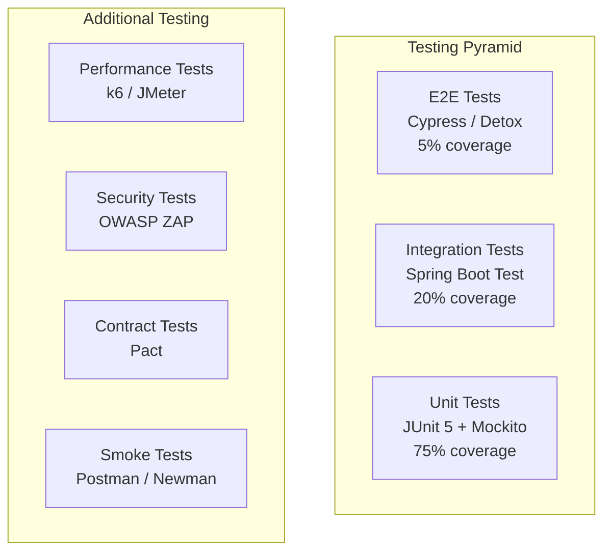

# Testing Strategy

## 1. Testing Pyramid



## 2. Backend Testing

### 2.1 Unit Tests (JUnit 5 + Mockito)

```java
@ExtendWith(MockitoExtension.class)
class PricingServiceTest {

    @Mock
    private RouteEstimator routeEstimator;
    @Mock
    private SurgeCalculator surgeCalculator;
    @Mock
    private PromoEngine promoEngine;

    @InjectMocks
    private PricingService pricingService;

    @Test
    void shouldCalculateFareCorrectly() {
        // Given
        FareEstimateRequest request = FareEstimateRequest.builder()
            .pickupLatitude(40.7580)
            .pickupLongitude(-73.9855)
            .destLatitude(40.7484)
            .destLongitude(-73.9857)
            .rideType("economy")
            .build();

        when(routeEstimator.estimateRoute(anyDouble(), anyDouble(), anyDouble(), anyDouble()))
            .thenReturn(new RouteEstimate(1.2, 8, "polyline"));

        when(surgeCalculator.getMultiplier(anyDouble(), anyDouble()))
            .thenReturn(1.0);

        when(promoEngine.validateAndApply(any(), any(), any(), any()))
            .thenReturn(new PromoResult(false, BigDecimal.ZERO, null));

        // When
        FareEstimate result = pricingService.calculateEstimate(request);

        // Then
        assertThat(result.getBaseFare()).isEqualTo(new BigDecimal("2.50"));
        assertThat(result.getDistanceCharge()).isEqualTo(new BigDecimal("1.44")); // 1.2 * 1.20
        assertThat(result.getTimeCharge()).isEqualTo(new BigDecimal("1.60")); // 8 * 0.20
        assertThat(result.getTotalFare()).isEqualTo(new BigDecimal("5.54")); // 2.50 + 1.44 + 1.60
        assertThat(result.getCurrency()).isEqualTo("USD");
    }

    @Test
    void shouldApplyMinimumFare() {
        // Given
        FareEstimateRequest request = FareEstimateRequest.builder()
            .pickupLatitude(40.7580)
            .pickupLongitude(-73.9855)
            .destLatitude(40.7590)
            .destLongitude(-73.9850)
            .rideType("economy")
            .build();

        when(routeEstimator.estimateRoute(anyDouble(), anyDouble(), anyDouble(), anyDouble()))
            .thenReturn(new RouteEstimate(0.5, 2, "polyline"));

        when(surgeCalculator.getMultiplier(anyDouble(), anyDouble()))
            .thenReturn(1.0);

        when(promoEngine.validateAndApply(any(), any(), any(), any()))
            .thenReturn(new PromoResult(false, BigDecimal.ZERO, null));

        // When
        FareEstimate result = pricingService.calculateEstimate(request);

        // Then
        // Base: 2.50 + (0.5 * 1.20) + (2 * 0.20) = 2.50 + 0.60 + 0.40 = 3.50
        // Minimum: 5.00
        assertThat(result.getTotalFare()).isEqualTo(new BigDecimal("5.00"));
    }

    @Test
    void shouldNotAllowNegativeFareWithPromo() {
        // Given
        FareEstimateRequest request = FareEstimateRequest.builder()
            .rideType("economy")
            .build();

        when(routeEstimator.estimateRoute(anyDouble(), anyDouble(), anyDouble(), anyDouble()))
            .thenReturn(new RouteEstimate(1.0, 5, "polyline"));

        when(surgeCalculator.getMultiplier(anyDouble(), anyDouble()))
            .thenReturn(1.0);

        when(promoEngine.validateAndApply(any(), any(), any(), any()))
            .thenReturn(new PromoResult(true, new BigDecimal("100.00"), "BIGPROMO"));

        // When
        FareEstimate result = pricingService.calculateEstimate(request);

        // Then
        assertThat(result.getTotalFare()).isGreaterThanOrEqualTo(BigDecimal.ZERO);
    }
}
```

### 2.2 Integration Tests

```java
@SpringBootTest(webEnvironment = SpringBootTest.WebEnvironment.RANDOM_PORT)
@AutoConfigureMockMvc
@Testcontainers
class RideServiceIntegrationTest {

    @Container
    static PostgreSQLContainer<?> postgres = new PostgreSQLContainer<>("postgres:16-alpine")
        .withDatabaseName("testdb")
        .withUsername("test")
        .withPassword("test");

    @Container
    static GenericContainer<?> redis = new GenericContainer<>("redis:7-alpine")
        .withExposedPorts(6379);

    @Autowired
    private MockMvc mockMvc;

    @Autowired
    private RideRepository rideRepository;

    @Autowired
    private UserRepository userRepository;

    @DynamicPropertySource
    static void configureProperties(DynamicPropertyRegistry registry) {
        registry.add("spring.datasource.url", postgres::getJdbcUrl);
        registry.add("spring.datasource.username", postgres::getUsername);
        registry.add("spring.datasource.password", postgres::getPassword);
        registry.add("spring.data.redis.host", redis::getHost);
        registry.add("spring.data.redis.port", () -> redis.getMappedPort(6379));
    }

    @Test
    void shouldCreateAndRetrieveRide() throws Exception {
        // Given - create test user
        User user = User.builder()
            .email("test@test.com")
            .phone("+1234567890")
            .role("passenger")
            .build();
        user = userRepository.save(user);

        // Get auth token
        String token = generateTestToken(user);

        // When - request ride
        MvcResult result = mockMvc.perform(post("/api/v1/rides/request")
                .header("Authorization", "Bearer " + token)
                .contentType(MediaType.APPLICATION_JSON)
                .content("""
                    {
                        "pickup": {
                            "latitude": 40.7580,
                            "longitude": -73.9855,
                            "address": "Times Square"
                        },
                        "destination": {
                            "latitude": 40.7484,
                            "longitude": -73.9857,
                            "address": "Empire State Building"
                        },
                        "rideType": "economy",
                        "paymentMethod": "wallet"
                    }
                    """))
            .andExpect(status().isOk())
            .andReturn();

        // Then - verify response
        String responseBody = result.getResponse().getContentAsString();
        assertThat(responseBody).contains("rideId");
        assertThat(responseBody).contains("\"status\":\"requested\"");
    }

    @Test
    void shouldRejectInvalidPickupLocation() throws Exception {
        MvcResult result = mockMvc.perform(post("/api/v1/rides/request")
                .header("Authorization", "Bearer " + token)
                .contentType(MediaType.APPLICATION_JSON)
                .content("""
                    {
                        "pickup": {
                            "latitude": 200.0,
                            "longitude": -73.9855
                        },
                        "destination": {
                            "latitude": 40.7484,
                            "longitude": -73.9857
                        },
                        "rideType": "economy"
                    }
                    """))
            .andExpect(status().isBadRequest())
            .andReturn();

        assertThat(result.getResponse().getContentAsString())
            .contains("INVALID_LOCATION");
    }
}
```

### 2.3 Repository Tests

```java
@DataJpaTest
@AutoConfigureTestDatabase(replace = AutoConfigureTestDatabase.Replace.NONE)
class RideRepositoryTest {

    @Autowired
    private RideRepository rideRepository;

    @Autowired
    private TestEntityManager entityManager;

    @Test
    void shouldFindActiveRideByPassenger() {
        // Given
        User passenger = createTestUser("passenger@test.com");
        Ride ride = Ride.builder()
            .passengerId(passenger.getId())
            .status("in_progress")
            .pickupLatitude(40.7580)
            .pickupLongitude(-73.9855)
            .pickupAddress("Times Square")
            .build();
        entityManager.persist(ride);
        entityManager.flush();

        // When
        Optional<Ride> found = rideRepository
            .findByPassengerIdAndStatusIn(passenger.getId(),
                List.of("requested", "accepted", "in_progress"));

        // Then
        assertThat(found).isPresent();
        assertThat(found.get().getStatus()).isEqualTo("in_progress");
    }
}
```

### 2.4 Contract Tests (Pact)

```java
@ExtendWith(PactConsumerTestExt.class)
@PactTestFor(providerName = "pricing-service", port = "8087")
class RideServiceContractTest {

    @Pact(consumer = "ride-service")
    public V4Pact createEstimatePact(PactDslWithProvider builder) {
        return builder
            .given("A valid fare estimate request")
            .uponReceiving("A request for fare estimate")
                .path("/api/v1/pricing/estimate")
                .method("POST")
                .headers("Content-Type", "application/json")
                .body(newJsonBody(body -> {
                    body.stringType("rideType", "economy");
                }).build())
            .willRespondWith()
                .status(200)
                .headers(Map.of("Content-Type", "application/json"))
                .body(newJsonBody(body -> {
                    body.stringType("rideType", "economy");
                    body.decimalType("baseFare", 2.50);
                    body.decimalType("totalFare", 7.70);
                }).build())
            .toPact();
    }

    @Test
    @PactTestFor(pactMethod = "createEstimatePact")
    void shouldGetFareEstimate(MockServer mockServer) {
        PricingClient client = new PricingClient(mockServer.getUrl());
        FareEstimate estimate = client.estimateFare("economy");
        assertThat(estimate.getTotalFare()).isGreaterThan(BigDecimal.ZERO);
    }
}
```

## 3. Mobile Testing

### 3.1 Unit Tests (Jest)

```typescript
// features/pricing/useFareCalculation.test.ts
import { renderHook } from '@testing-library/react-hooks';
import { useFareCalculation } from './useFareCalculation';

describe('useFareCalculation', () => {
  it('calculates fare correctly for economy ride', () => {
    const { result } = renderHook(() => useFareCalculation());

    const fare = result.current.calculate({
      distance: 5.2,
      duration: 12,
      rideType: 'economy',
      surgeMultiplier: 1.0,
    });

    expect(fare.baseFare).toBe(2.50);
    expect(fare.distanceCharge).toBeCloseTo(6.24, 2);  // 5.2 * 1.20
    expect(fare.timeCharge).toBeCloseTo(2.40, 2);      // 12 * 0.20
    expect(fare.total).toBeCloseTo(11.14, 2);
  });

  it('applies minimum fare for short rides', () => {
    const { result } = renderHook(() => useFareCalculation());

    const fare = result.current.calculate({
      distance: 0.3,
      duration: 1,
      rideType: 'economy',
      surgeMultiplier: 1.0,
    });

    expect(fare.total).toBe(5.00); // minimum fare
  });
});
```

### 3.2 Component Tests (React Native Testing Library)

```typescript
// features/home/components/RideTypeSelector.test.tsx
import { render, fireEvent } from '@testing-library/react-native';
import { RideTypeSelector } from './RideTypeSelector';

describe('RideTypeSelector', () => {
  const rideTypes = [
    { id: 'economy', name: 'Economy', baseFare: 2.50, totalFare: 7.70, eta: 3 },
    { id: 'comfort', name: 'Comfort', baseFare: 4.00, totalFare: 10.80, eta: 5 },
  ];

  it('renders all ride types', () => {
    const { getByText } = render(
      <RideTypeSelector rideTypes={rideTypes} onSelect={() => {}} />
    );

    expect(getByText('Economy')).toBeTruthy();
    expect(getByText('Comfort')).toBeTruthy();
  });

  it('calls onSelect when ride type is pressed', () => {
    const onSelect = jest.fn();
    const { getByText } = render(
      <RideTypeSelector rideTypes={rideTypes} onSelect={onSelect} />
    );

    fireEvent.press(getByText('Economy'));
    expect(onSelect).toHaveBeenCalledWith('economy');
  });

  it('highlights selected ride type', () => {
    const { getByTestId } = render(
      <RideTypeSelector
        rideTypes={rideTypes}
        selectedType="comfort"
        onSelect={() => {}}
      />
    );

    expect(getByTestId('ride-type-comfort')).toHaveStyle({
      backgroundColor: '#000',
    });
  });
});
```

### 3.3 E2E Tests (Detox)

```typescript
// e2e/rideFlow.test.ts
describe('Ride Booking Flow', () => {
  beforeAll(async () => {
    await device.launchApp();
    await element(by.id('login-email')).typeText('test@ridesharing.com');
    await element(by.id('login-password')).typeText('Test123!');
    await element(by.id('login-button')).tap();
    await waitFor(element(by.id('home-screen'))).toBeVisible().withTimeout(5000);
  });

  it('should display nearby drivers on home screen', async () => {
    await expect(element(by.id('map-view'))).toBeVisible();
    await expect(element(by.id('pickup-search-bar'))).toBeVisible();
  });

  it('should set pickup location from current location', async () => {
    await element(by.id('current-location-button')).tap();
    await expect(element(by.id('pickup-address'))).toHaveText('Current Location');
  });

  it('should search and select destination', async () => {
    await element(by.id('destination-search-bar')).tap();
    await element(by.id('search-input')).typeText('Empire State Building');
    await waitFor(element(by.text('Empire State Building, New York')))
      .toBeVisible().withTimeout(5000);
    await element(by.text('Empire State Building, New York')).tap();
  });

  it('should show fare estimates', async () => {
    await waitFor(element(by.id('fare-estimate-card')))
      .toBeVisible().withTimeout(3000);
    await expect(element(by.id('ride-type-economy'))).toBeVisible();
  });

  it('should book a ride', async () => {
    await element(by.id('ride-type-economy')).tap();
    await element(by.id('confirm-ride-button')).tap();
    await waitFor(element(by.id('searching-screen')))
      .toBeVisible().withTimeout(3000);
  });
});
```

## 4. Performance Testing (k6)

```javascript
// k6-scripts/ride-request.js
import http from 'k6/http';
import { sleep, check } from 'k6';
import { SharedArray } from 'k6/data';

const users = new SharedArray('users', function () {
  return JSON.parse(open('./users.json'));
});

export const options = {
  stages: [
    { duration: '2m', target: 100 },  // Ramp up to 100 users
    { duration: '5m', target: 500 },  // Ramp to 500 users
    { duration: '2m', target: 1000 }, // Ramp to 1000 users
    { duration: '5m', target: 1000 }, // Stay at 1000
    { duration: '2m', target: 0 },    // Ramp down
  ],
  thresholds: {
    http_req_duration: ['p(95)<2000'], // 95% of requests < 2s
    http_req_failed: ['rate<0.05'],     // Error rate < 5%
    'ride_requests': ['count>1000'],    // At least 1000 ride requests
  },
};

export default function () {
  const user = users[Math.floor(Math.random() * users.length)];

  // Login
  const loginRes = http.post(
    'https://api.ridesharing.com/api/v1/auth/login',
    JSON.stringify({
      email: user.email,
      password: 'test123',
    }),
    { headers: { 'Content-Type': 'application/json' } }
  );

  check(loginRes, { 'login successful': (r) => r.status === 200 });
  const token = loginRes.json('data.accessToken');

  // Estimate fare
  const estimateRes = http.post(
    'https://api.ridesharing.com/api/v1/rides/estimate',
    JSON.stringify({
      pickup: { latitude: 40.7580, longitude: -73.9855 },
      destination: { latitude: 40.7484, longitude: -73.9857 },
      rideType: 'economy',
    }),
    {
      headers: {
        'Content-Type': 'application/json',
        'Authorization': `Bearer ${token}`,
      },
    }
  );

  check(estimateRes, { 'estimate received': (r) => r.status === 200 });

  // Request ride
  const rideRes = http.post(
    'https://api.ridesharing.com/api/v1/rides/request',
    JSON.stringify({
      pickup: { latitude: 40.7580, longitude: -73.9855, address: 'Times Square' },
      destination: { latitude: 40.7484, longitude: -73.9857, address: 'Empire State Building' },
      rideType: 'economy',
      paymentMethod: 'wallet',
    }),
    {
      headers: {
        'Content-Type': 'application/json',
        'Authorization': `Bearer ${token}`,
      },
      tags: { name: 'ride_requests' },
    }
  );

  check(rideRes, { 'ride requested': (r) => r.status === 200 });

  sleep(1);
}
```

## 5. Load Test Scenarios

| Scenario | Users | Duration | Target |
|---|---|---|---|
| Normal Load | 500 concurrent | 30 min | All endpoints P95 < 500ms |
| Peak Load | 5000 concurrent | 15 min | All endpoints P95 < 2s |
| Surge Event | 10000 concurrent | 5 min | Ride matching < 5s |
| Endurance | 1000 concurrent | 4 hours | No memory leaks, stable response |
| Stress | Ramp to 20000 | 10 min | Identify breaking point |
| Spike | Jump to 8000 | 1 min | Auto-scaling verification |

## 6. Security Testing

| Test Type | Tool | Frequency |
|---|---|---|
| SAST (Static Analysis) | SonarQube, SpotBugs | On every PR |
| DAST (Dynamic Analysis) | OWASP ZAP | Weekly on staging |
| Dependency Scan | OWASP Dependency-Check, Trivy | Daily |
| Container Scan | Trivy, Snyk | On every build |
| Penetration Testing | External firm | Quarterly |
| API Fuzzing | Custom scripts | Monthly |
| Authentication Testing | OWASP ZAP | Monthly |

## 7. Test Automation in CI

```yaml
# CI Pipeline Test Steps
test:
  - name: Unit Tests
    run: ./gradlew test
    coverage: 80% threshold

  - name: Integration Tests
    run: ./gradlew integrationTest
    services: [postgres, redis]

  - name: Contract Tests
    run: ./gradlew pactVerify

  - name: Static Analysis
    run: ./gradlew sonarqube

  - name: Dependency Check
    run: ./gradlew dependencyCheckAnalyze

  - name: Security Scan
    run: trivy fs --severity HIGH,CRITICAL .

  - name: API Smoke Tests
    run: newman run collection.postman_collection.json
```
